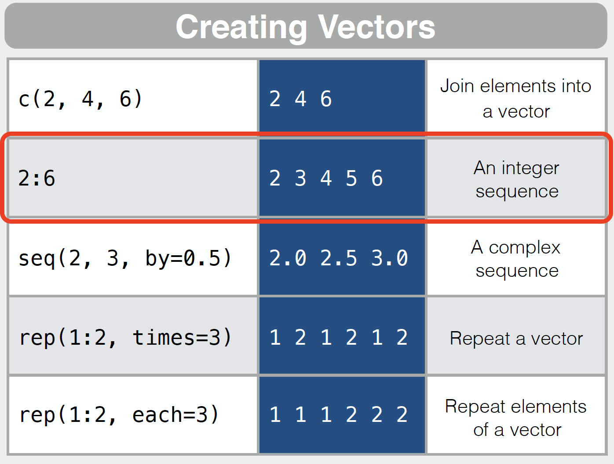
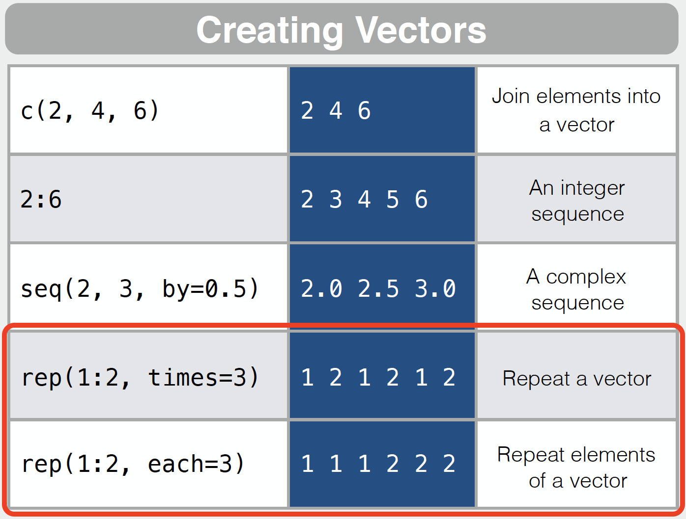
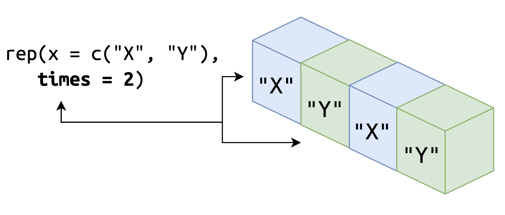
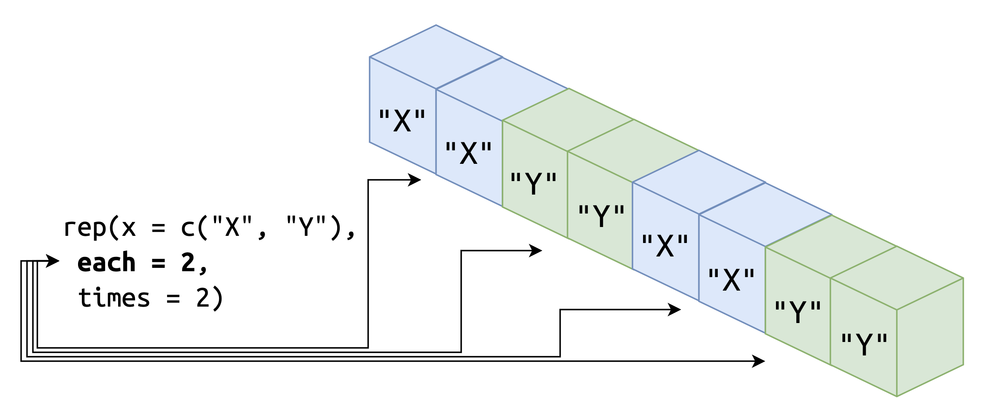

```{r setup, include = FALSE}
library(learnr)
library(rmdformats)
library(tidyverse)
library(skimr)
library(knitr)
library(shiny)
library(gradethis)
knitr::opts_chunk$set(error = TRUE,
                      upload.fun = imgur_upload, 
                      fig.path = "www/",
                      collapse = TRUE,
                      exercise.cap = "Atomic vectors",
                      warning = FALSE, 
                      message = FALSE, 
                      dpi = 320,
                      tibble.max_extra_cols = 6, 
                      tibble.width = 60)
options(scipen = 999999999)
gradethis_setup(exercise.reveal_solution = TRUE)
```

> "*The fundamental data type in R is the vector.*" - THE ART OF R PROGRAMMING, 2011 by Norman Matloff.

## An Overview of Atomic Vectors 

Atomic vectors are covered in the [Base R](https://github.com/rstudio/cheatsheets/blob/main/base-r.pdf) and [Advanced R](https://www.rstudio.com/wp-content/uploads/2016/02/advancedR.pdf) cheatsheets, and they are the basic building block for data objects in R. The 'atomic' refers to, *'of or forming a single irreducible unit or component in a larger system.'* This tutorial is an introduction to the four types of atomic vectors: logical, integer, double, and character.

```{r atomic-vectors, echo=FALSE, fig.align='center', fig.cap="Adapted from Advanced R, 2nd Edition", out.height='100%', out.width='100%'}
knitr::include_graphics(path = "www/atomic-vectors.png")
```

## Outline 

This tutorial will cover the following topics:

1. Creating vectors  
2. Combining vectors (coercion)  
3. Vector types  
4. Vector operations  
5. Recycling  

## Creating vectors 

The first two functions we'll learn about for creating vectors are `c()` and `<-`:

+ `c()` is used to combine (or *concatenate*) a variety of items, or *elements*

+ `<-` is referred to as the assignment operator, and it's used with `c()` to assign elements to a designated object, like so:

```{r how-c-works, eval=FALSE}
object <- c()
```

###


**NOTE:** *R is an [object-oriented, functional programming language](https://www.oreilly.com/library/view/r-in-a/9781449358204/ch10.html#:~:text), so just about everything that isn't an object is a function (and vice versa). For example,* 

```{r everything-is-a-function, echo=TRUE}
class(`<-`) # assignment operator?
class(`c`) # c?
class(`+`) # plus sign?
```

*Yep--all functions!*

### Combine elements with `c()`

```{r create-vectors, echo=FALSE, fig.align='center', fig.cap="from Base R cheatsheet", out.height='70%', out.width='70%'}
knitr::include_graphics("www/create-vectors.png")
```

We can use `c()` to create a vector below by entering elements (`"a"`, `"b"`) inside the parentheses:

```{r create-c, exercise=TRUE, exercise.lines=3}
# enter "a" and "b" below (with quotes)
c(, )
```

```{r create-c-solution}
c("a", "b")
```

```{r create-c-check}
gradethis::grade_this_code()
```

###

The code above simply prints the results to the screen. If we want to store the elements in an object we can access later, we need to use the [assignment operator](https://stat.ethz.ch/R-manual/R-devel/library/base/html/assignOps.html), `<-`. 

### Assign with `<-`

```{r var-assign, echo=FALSE, fig.align='center', fig.cap="from Base R cheatsheet", out.height='70%', out.width='70%'}
knitr::include_graphics("www/var-assign.png")
```

The convention is to assign elements to an object using the syntax below: 

```{r assignment-operator, exercise=TRUE, exercise.lines=2}
# assign the elements to my_vector
____ <- c("a", "b")
```

```{r assignment-operator-solution}
my_vector <- c("a", "b")
```

```{r assignment-operator-check}
gradethis::grade_this_code()
```

However, this also works:

```{r assignment-operator-2, exercise=TRUE, exercise.lines=2}
# assign the elements to my_vector
c("a", "b") -> ____
```

```{r assignment-operator-2-solution}
c("a", "b") -> my_vector
```

```{r assignment-operator-2-check}
gradethis::grade_this_code()
```

###

Much [has been said](https://colinfay.me/r-assignment/) about R's assignment operator, so I won't drone on about it here. The equals sign (`=`) can also be used, but I don't use this method because I like to reserve `=` for function arguments (see examples below). 

The code below makes it clear which bit *creates* `x` and which bit *uses* `x`. 

```{r no-equals-sign, echo=TRUE}
# assign elements to x 
x <- c("a", "b")
# pass x to function 
length(x = x)
```

It's almost never done in real life, but it's possible to assign the elements to `x` *inside* the function before passing the argument.

```{r assignment-inside-function, echo=TRUE}
length(x = # function argument
    x <- c("a", "b") # assignment operator 
  )
```

### Naming vectors  

When creating vectors (or any object in R), we need to assign the object a name (we've done this above with `my_vector`). The naming conventions I'll follow come from the [tidyverse style guide](https://style.tidyverse.org/index.html). It's not required to read the entire guide, but the section on [naming objects](https://style.tidyverse.org/syntax.html#object-names) is relevant to this tutorial. 

We're going to use [`snake_case`](https://en.wikipedia.org/wiki/Snake_case) to create vectors and other objects. 

```{r snakecase, echo=TRUE}
my_vector <- c("a", "b")
my_vector
```

R allows objects to be created using dots (periods), but this is not advised:

```{r periods, echo=TRUE}
my.vector <- c("a", "b")
my.vector
```

###

Names for objects can't start with an underscore (`_my_vector`) or a number (`1my_vector`) or a special character (`?my_vector`). If you try to create an improperly named vector, you'll see an error like the ones below:

```{r name-rules-01, eval=FALSE}
# can't start with underscores
_my_vector <- c("a", "b")
Error: unexpected input in "_"
```

```{r name-rules-02, eval=FALSE}
# can't start with numbers
1my_vector <- c("a", "b")
Error: unexpected symbol in "1my_vector"
```

```{r name-rules-03, eval=FALSE}
# can't start with special characters
^my_vector <- c("a", "b")
Error: unexpected '^' in "^"
```

###

When naming objects, pick something that's brief and informative (i.e, the name tells you something about what the object contains). Sometimes you'll see code with objects assigned to ambiguous names like `x`, or `df`, but it's best to avoid this whenever possible. Short names also don't give you the ability to use [RStudio's tab completion ](https://support.rstudio.com/hc/en-us/articles/205273297-Code-Completion-in-the-RStudio-IDE) (a topic we'll touch on in future tutorials).

### Creating logical vectors 

Logical vectors can only take three elements: `TRUE`, `FALSE` and `NA` (missing).  

In the code block below, create a logical vector below 

1. Assign the elements  `TRUE`, `FALSE`, `TRUE`, `FALSE`, `FALSE`  to `vec_log`  
2. Print `vec_log` on the follow line  

```{r vec_log, exercise=TRUE}
 <- c(____, ____, ____, ____, ____)

```

```{r vec_log-solution}
vec_log <- c(TRUE, FALSE, TRUE, FALSE, FALSE)
vec_log
```

```{r vec_log-check}
gradethis::grade_this_code()
```

### Creating integer vectors

Integer vectors contain whole numbers, and need to be created with an `L` behind each number. 

In the code block below, 

1. Create `vec_int` with the following elements: `4L`, `21L`, `2L`, `3L`, `10L`  
2. Print `vec_int` on the follow line   

```{r integer, exercise=TRUE}
____ <- c(____, ____, ____, ____, ____)

```

```{r integer-solution}
vec_int <- c(4L, 21L, 2L, 3L, 10L)
vec_int
```

```{r integer-check}
gradethis::grade_this_code()
```

### Creating integer sequences

```{r create-seq-png, echo=FALSE, fig.cap="from Base R cheatsheet", out.height='70%', out.width='70%', fig.align='center'}

```


We can also create an integer vector by providing an index (`x:y`), where `x` and `y` are lowest and highest element values. 

```{r index}
# numbers 1 through 5
1:5
```

In the code block below, 

1. Create `vec_int` with the numbers `1` through `8`  
2. Print `vec_int` on the follow line   

```{r integer_index, exercise=TRUE}
____ <- c(____:____)

```

```{r integer_index-solution}
vec_int <- c(1:8)
vec_int
```

```{r integer_index-check}
gradethis::grade_this_code()
```


### Creating double vectors 

Double vectors contain numbers with decimals *and* whole numbers. 

In the code block below, 

1. Create `vec_doub` with the following elements: `3.5`, `0.7`, `29`, `4`, `6.78`  
2. Print `vec_doub` on the follow line   

```{r vec_doub, exercise=TRUE}
____ <- c(____, ____, ____, ____, ____)

```

```{r vec_doub-solution}
vec_doub <- c(3.5, 0.7, 29, 4, 6.78)
vec_doub
```

```{r vec_doub-check}
gradethis::grade_this_code()
```

Just like with integer vectors, we can create an double vector by providing an index (`x:y`), but `x` and `y` are the lowest and highest *double* element values (i.e. with decimals). 

In the code block below, 

1. Create `vec_doub` with the numbers `1.5` through `5.5`  
2. Print `vec_doub` on the follow line   

```{r double_index, exercise=TRUE}
____ <- c(____:____)

```

```{r double_index-solution}
vec_doub <- c(1.5:5.5)
vec_doub
```

```{r double_index-check}
gradethis::grade_this_code()
```

### Creating character vectors 

Character vectors are built using elements in quotes (or strings), and can contain things like words, terms, or discrete categories.  

In the code block below, 

1. Create `vec_chr` with the following elements: `"hat"`, `"chair"`, `"cat"`, `"dog"`, `"book"`  
2. Print `vec_chr` on the follow line   

```{r vec_chr, exercise=TRUE}
____ <- c(____, ____, ____, ____, ____)

```

```{r vec_chr-solution}
vec_chr <- c("hat", "chair", "cat", "dog", "book")
vec_chr
```

```{r vec_chr-check}
gradethis::grade_this_code()
```

### `rep()` and `seq()`

Creating vectors by hand can be time-consuming. Fortunately, R has quite a few functions for generating values. We'll cover two in this tutorial: 

1. `rep(x, ...)`: replicate the values in `x`  
2. `seq(from, to, by)`: generate sequences 

### `rep()`

```{r rep-png, echo=FALSE, fig.align='center', fig.cap="from Base R cheatsheet", out.height='70%', out.width='70%'}

```

`rep()` takes a value `x` and replicates it either according the number given to the `each` or `times` argument. 

In the code bock below: 

1. Use `rep()` to generate a vector with three `B`s and store it in `three_bs`  
2. Print `three_bs` to the screen  

```{r rep_01, exercise=TRUE, exercise.lines=4}
# replicate the letter "B" three times 
three_bs <- rep(x = ____, times = ____)
# print three_bs

```

```{r rep_01-solution}
three_bs <- rep(x = "B", times = 3)

three_bs
```

```{r rep_01-check}
gradethis::grade_this_code()
```

###

`rep()` isn't limited to single values, either. We can provide a multiple elements as a vector or within `c()`. 

In the code block below: 

1. The `three_bs` vector has been loaded  
2. Replicate the combination of `three_bs` with `"C"` and `"D"` using `c()`  

```{r prepare-rep, echo=FALSE}
three_bs <- rep(x = "B", times = 3)
```

```{r rep_02, exercise=TRUE, exercise.lines=2, exercise.setup="prepare-rep"}
rep(x = c(three_bs, ____, ____), times = ____)

```

```{r rep_02-solution}
rep(x = c(three_bs, "C", "D"), times = 3)
```

```{r rep_02-check}
gradethis::grade_this_code()
```

###

As we can see, `rep()` replicated all three elements three times, but it treated `three_bs` as a single element. 

The `rep()` function also has an `each` argument, which tells `rep()` how many times each "*element of `x` is repeated*". We will demonstrate how many this works with a simple example vector (`xy_vec`):

```{r xy_vec}
xy_vec <- c("X", "Y")
xy_vec
```

In the code block below: 

1. Use `rep()` to replicate the `xy_vec` two `times`    
2. Use `rep()` to repeat `each` element in `xy_vec` twice and replicate `xy_vec` two `times`.

```{r prepare_rep_each, echo=FALSE}
xy_vec <- c("X", "Y")
```

```{r rep_each, exercise.setup="prepare_rep_each", exercise=TRUE, exercise.lines=4}
# repeat the xy_vec twice 
rep(x = ____, times = ____)
# repeat the xy_vec twice, and each element two times each
rep(x = ____, each = ____, times = ____)
```

```{r rep_each-solution}
rep(x = xy_vec, times = 2)

rep(x = xy_vec, each = 2, times = 2)
```

```{r rep_each-check}
gradethis::grade_this_code()
```

###

When we tell `rep()` to replicate the vector two `times`, we see the pattern of (`"X" "Y"`) gets *replicated* twice.   

```{r rep-times, echo=FALSE, out.width='100%', out.height='100%'}

```

###

When we add the `each` argument, we can see `each` element is *repeated* twice, and then the new pattern (`"X" "X" "Y" "Y"`) is *replicated* two `times`.  

```{r rep-each, echo=FALSE, out.width='100%', out.height='100%'}

```

### `seq()`

```{r seq-png, echo=FALSE, fig.align='center', fig.cap="from Base R cheatsheet", out.width='70%', out.height='70%'}
knitr::include_graphics("www/seq.png")
```

`seq()` creates sequences of numbers. Additional arguments passed to this function include `from`, `to` and `by`. We'll demonstrate how to use `seq()` to generate a number sequence from `2` to `10` by `2`s. 

```{r example-seq, echo=TRUE}
seq_vec <- seq(from = 2, to = 10, by = 2)
seq_vec
```

We get an `seq_vec`, an integer vector of five elements, which we should expect, because `2` / `10` = `5`.  

*What happens when we provide a `by` argument that isn't a multiple of the `from` and `to`?* Let's try it and see. 

###

In the code block below: 

1. Create a sequence of integers from two to nine by five, store the output in `seq_vec`  
2. Print `seq_vec` to the screen  

```{r seq_vec_01, exercise=TRUE, exercise.lines=4}
# create sequence 
seq_vec <- seq(from = ____, to = ____, by = ____)
# print seq_vec to the screen 
seq_vec
```

```{r seq_vec_01-solution}
# create sequence 
seq_vec <- seq(from = 2, to = 9, by = 5)
# print seq_vec to the screen 
seq_vec
```

```{r seq_vec_01-check}
gradethis::grade_this_code()
```

###

The output automatically returns the `from` value, then it adds the `by` value until it exceeds the `to` value (in this case, that value is seven). 

*What happens when the `by` argument is larger than __both__ the `from` and `to` values?* Let's try it and see.

###

In the code block below: 

1. Create a sequence of integers from one to five by ten, store the output in `seq_vec`  
2. Print `seq_vec` to the screen  

```{r seq_vec_02, exercise=TRUE, exercise.lines=4}
# create sequence 
seq_vec <- seq(from = ____, to = ____, by = ____)
# print seq_vec to the screen 
seq_vec
```

```{r seq_vec_02-solution}
# create sequence 
seq_vec <- seq(from = 1, to = 5, by = 10)
# print seq_vec to the screen 
seq_vec
```

```{r seq_vec_02-check}
gradethis::grade_this_code()
```

###

As we can see, the output is `1` (the start of the sequence).

## Combining vectors (coercion)

You may have noticed all the elements in the vectors we created above were all the same (i.e. logical, character, integer, etc.)--**this a key feature of atomic vectors.** 

All objects in R have a mode (accessed with `typeof()`) and a class (accessed with `class()`). To ensure all the elements of atomic vectors remain the same mode (or type), they adhere to some underlying 'coercion' rules.

###

The rules of vector coercion are below: 

`logical` < `integer` < `double` < `character`

###
 
If we combine vectors of the same mode, no coercion takes place. 

```{r test-coercion-01, echo=TRUE}
# combine logical with logical 
typeof(x = 
    c(TRUE, # logical 
      FALSE) # logical
    )
class(x = 
    c(TRUE, # logical 
      FALSE) # logical
    )
# combine integer with integer 
typeof(x = 
    c(4L, # integer 
      17L) # integer
    )
class(x = 
    c(4L, # integer 
      17L) # integer
    )
```

 
###

But if we combine a logical element (`TRUE`) with an integer (`10L`), we'll get an integer: 

```{r test-coercion-02, echo=TRUE}
# combine logical and integer 
typeof(x = 
    c(TRUE, # logical 
      10L) # integer 
    )
class(x = 
    c(TRUE, # logical 
      10L) # integer 
    )
```

###

Below are some exercises that will help you understand coercion: 

### Vector coercion

1. Combine the elements below into the `test_vector` 
2. Print `test_vector` in the line below  
3. Check the mode with `typeof()` and class with `class()`  

*What do you think the resulting type will be?*

```{r log_log, exercise=TRUE, exercise.lines=8}
____ <- c(TRUE, FALSE)
# print the test_vector
test_vector
# check the mode
____(x = test_vector)
# check the class
____(x = test_vector)
```

```{r log_log-solution}
test_vector <- c(TRUE, FALSE)
# print the test_vector
test_vector
# check the mode
typeof(x = test_vector)
# check the class
class(x = test_vector)
```

```{r log_log-check}
gradethis::grade_this_code()
```

###

`test_vector` preservers the mode because both elements are logical.

### Logical + integer coercion 

Let's see what happens when we combine a logical element with an integer. 

1. Combine the elements below into the `test_vector` 
2. Print `test_vector` in the line below   
3. Check the mode with `typeof()` and class with `class()`

*What do you think the resulting type will be?*

```{r log_int, exercise=TRUE, exercise.lines=8}
____ <- c(FALSE, 5L)
# print the test_vector
test_vector
# check the type
____(x = test_vector)
# check the class
____(x = test_vector)
```

```{r log_int-solution}
test_vector <- c(FALSE, 5L)
# print the test_vector
test_vector
# check the mode
typeof(x = test_vector)
# check the class
class(x = test_vector)
```

```{r log_int-check}
gradethis::grade_this_code()
```

### Integer + double coercion

The previous example coerced `FALSE` and `5L` into an integer, because the next mode in our list of coercion rules is integer: 

`logical` < **`integer`** < `double` < `character`

Let's try a more complicated example. What happens if we combine logical elements with integers and the number `8`?

1. Combine the elements below into the `test_vector` 
2. Print `test_vector` in the line below   
3. Check the mode with `typeof()` and class with `class()`  

*What do you think the resulting type will be?*

```{r log_doub, exercise=TRUE, exercise.lines=8}
____ <- c(FALSE, TRUE, 27L, 5L, 8)
# print the test_vector
test_vector
# check the mode
____(x = test_vector)
# check the class
____(x = test_vector)
```

```{r log_doub-solution}
test_vector <- c(FALSE, TRUE, 27L, 5L, 8)
# print the test_vector
test_vector
# check the mode
typeof(x = test_vector)
# check the class
class(x = test_vector)
```

```{r log_doub-check}
gradethis::grade_this_code()
```

###

Here we can see the `test_vector` is coerced into a double vector, even though none of the number elements have a decimal (*recall that integer elements have to be created with the `L`*)

Hopefully you can see the pattern emerging--combining vectors of two different types will automatically convert them to the 'highest' type in the rules below:

`logical` < `integer` < **`double`** < `character`

### Character coercion 

For this final example, what do you think will happen if we try to combine logical, integer, double, and character elements?

1. Combine the elements below into the `test_vector` 
2. Print `test_vector` in the line below   
3. Check the mode with `typeof()` and the class with `class()`

```{r log_chr-01, exercise=TRUE, exercise.lines=8}
____ <- c(FALSE, TRUE, 27L, 5L, 8.0, "15")
# print the test_vector
test_vector
# check the mode
____(x = test_vector)
# check the class
____(x = test_vector)
```

```{r log_chr-01-solution}
test_vector <- c(FALSE, TRUE, 27L, 5L, 8.0, "15")
# print the test_vector
test_vector
# check the type
typeof(x = test_vector)
# check the class
class(x = test_vector)
```

```{r log_chr-01-check}
gradethis::grade_this_code()
```

###

The result is a character vector, because if we combine *any* of the three 'lower-level' atomic vectors with a character vector, they're automatically converted into a character vector:

`logical` < `integer` < `double` < **`character`**

### Missing values (`NA`)

```{r prepare-missing_coercion, echo=FALSE}
vec_log <- c(TRUE, FALSE, TRUE, FALSE, FALSE)
vec_doub <- c(3.5, 0.7, 29, 4, 6.78)
vec_int <- c(4L, 21L, 2L, 3L, 10L)
vec_chr <- c("hat", "chair", "cat", "dog", "book")
```

We're going to take a look at how R deals with missing values. We mentioned above that logical vectors can three values: `TRUE`, `FALSE`, or `NA`. 

```{r class-logical, echo=TRUE}
# check the class of logical elements
class(
  c(TRUE, FALSE, NA)
)
```

If you recall our conversion rules, logical vectors can be coerced into any other atomic vector, 

**`logical`** < `integer` < `double` < `character`

###

`NA` can be combined with other vector types, but you should try to pair vector elements with their appropriate missing values. For example, if we want to check which kind of missing value, we can check this with `typeof()`:

```{r class-real, echo=TRUE}
typeof(NA_real_)
typeof(NA_integer_)
typeof(NA_character_)
```

###

`NA` constants are also reserved words, meaning we can't use them as object names.  

```{r no-na-names, eval=FALSE, echo=TRUE}
NA <- "some value"
Error in NA <- "some value" : 
  invalid (do_set) left-hand side to assignment
```


### NA coercion 

Missing constants are treated like elements of that particular type (and follow the same coercion rules). For example, 

1. Combine the logical elements with `NA_character_` and check it's mode:

```{r na_conversion, exercise=TRUE}
typeof(x = 
    c(TRUE, FALSE, TRUE, FALSE, FALSE, ____))
```

```{r na_conversion-solution, echo=FALSE}
typeof(x = 
    c(TRUE, FALSE, TRUE, FALSE, FALSE, NA_character_))
```

```{r na_conversion-check, echo=FALSE}
gradethis::grade_this_code()
```

###

*What mode was the vector coerced into?*

`NA` is the logical constant (so it will be coerced into whatever atomic vector mode it's combined with).

```{r test-all-na-conversions, echo=TRUE}
typeof(x = 
    c(3.5, 0.7, 29, 4, 6.78, NA))
typeof(x = 
    c(4L, 21L, 2L, 3L, 10L, NA))
typeof(x = 
    c("hat", "chair", "cat", "dog", "book", NA))
```


We'll come back to missing values in future exercises. 

## Vector types  

R also has functions for creating (`as.<type>()`) or testing (`is.<type>()`) each atomic vector. These functions give us some control over how a vector is coerced (and check the resulting type). Both `is.<type>()` and `as.<type>()` functions *create or test for objects* of a given type (or mode). 

###

### `is.<type>()` & `as.<type>()`

<br>

The functions used to test the type of an atomic vector have an `is.` prefix:

+ `is.logical()`, `is.integer()`, `is.double()`, and `is.character()`

The functions used to create an atomic vector of a specific type have an `as.` prefix:

+ `as.logical()`, `as.integer()`, `as.double()`, and `as.character()`

The `as.<type>()` group of functions can be used to manually coerce elements to a different type.

### Testing character vectors 

In the code block below: 

1. Create a character vector with `as.character()` using the elements below  
2. Test to see if `vec_chr` is a character vector using `is.character()` 


```{r is_as_character, exercise=TRUE, exercise.lines=3}
____ <- as.character("hat", "chair", "cat", "dog", "book")
is.____(vec_chr)
```

```{r is_as_character-solution}
vec_chr <- as.character("hat", "chair", "cat", "dog", "book")
is.character(vec_chr)
```

```{r is_as_character-check}
gradethis::grade_this_code()
```

###

The example above is no different than using `c()` to create `vec_chr`. Below is an example of numeric elements in quotes (as you'll sometimes encounter when importing data into R from other sources). 

### Converting types 
 
In the code block below: 

1. Use `as.double()` to coerce the character elements into a double vector (`vec_doub`) 

2. Test the resulting vector with `is.double()`  

```{r prepare-double-coercion, echo=FALSE}
vec_log <- c(TRUE, FALSE, TRUE, FALSE, FALSE)
vec_doub <- c(3.5, 0.7, 29, 4, 6.78)
vec_int <- c(4L, 21L, 2L, 3L, 10L)
vec_chr <- c("hat", "chair", "cat", "dog", "book")
```

```{r is_as_double, exercise=TRUE, exercise.lines=3}
____ <- as.double(x = c("3.5", "0.7", "29", "4", "6.78"))
# test vec_doub
is.____(vec_doub)
```

```{r is_as_double-solution}
vec_doub <- as.double(x = c("3.5", "0.7", "29", "4", "6.78"))
# test vec_doub
is.double(vec_doub)
```

```{r is_as_double-check}
gradethis::grade_this_code()
```

###

What do you think happens if we try to create a vector with elements that can't be coerced into the specified type? 

In the code block below: 

1. Use `as.integer()` to coerce the character elements into an integer vector (`vec_int`)  
2. Print the vec_int vector on the following line  

```{r is_as_integer, exercise=TRUE, exercise.lines=3, warning=TRUE}
____ <- as.integer("A", "B", "C")
# print vec_int
____
```

```{r is_as_integer-solution, warning=TRUE}
vec_int <- as.integer("A", "B", "C")
# test vec_int
vec_int
```

```{r is_as_integer-check}
gradethis::grade_this_code()
```

###

The vector is converted, however R gives us a warning (`Warning: NAs introduced by coercion`) and the resulting vector contains only missing values. 

### Testing numeric vectors 

```{r prepare-typeof-vec_int, include=FALSE}
vec_int <- c(4L, 21L, 2L, 3L, 10L)
vec_doub <- c(3, 7, 29, 4, 6.78)
```

There are two types of numeric vectors, double and integer. In the code block below:

1. Test `vec_int` and `vec_doub` with `is.numeric()` 

```{r typeof-vec_int, exercise=TRUE, exercise.setup = "prepare-typeof-vec_int"}
# test integer vector 
is.numeric()
# test double vector 
is.numeric()
```

```{r typeof-vec_int-solution}
# check type of vec_int
is.numeric(vec_int)
# test double vector 
is.numeric(vec_doub)
```

```{r typeof-vec_int-check}
gradethis::grade_this_code()
```

###

Because `is.numeric()` only tests if a vector is numeric, we should be more precise and use the `is.integer()` or `is.double()` functions.

### Test integer vectors 

Recall that integer vectors contain whole numbers (*no decimals*).

```{r prepare-vec_int, include=FALSE}
vec_int <- c(4L, 21L, 2L, 3L, 10L)
```

In the code block below:

1. Check the mode of `vec_int` with `typeof()` 
2. Test `vec_int` with `is.integer()`  

```{r typeof-test-vec_int, exercise=TRUE, exercise.setup = "prepare-vec_int"}
# check mode and test the integer vector
typeof()
is.integer()
```

```{r typeof-test-vec_int-solution}
# check mode and test the integer vector
typeof(vec_int)
is.integer(vec_int)
```

```{r typeof-test-vec_int-check}
gradethis::grade_this_code()
```

### Testing double vectors

Double vectors can contain whole numbers *and* decimal points. 

```{r prepare-vec_doub, include=FALSE}
vec_doub <- c(3.5, 0.7, 29, 4, 6.78)
```

1. Check the mode of `vec_doub` with `typeof()` 
2. Test `vec_doub` with `is.double()`  

```{r typeof-vec_doub, exercise=TRUE, exercise.setup = "prepare-vec_doub"}
# check mode and test double vector
typeof()
is.double()
```

```{r typeof-vec_doub-solution}
# check mode and test double vector
typeof(vec_doub)
is.double(vec_doub)
```

```{r typeof-vec_doub-check}
gradethis::grade_this_code()
```

### So Far... 

Now that we've covered how to 1) create vectors (with `c()`, `<-`, `rep()` and `seq()`), 2) name our objects (with `snake_case` names), and 3) investigate vector characteristics (`typeof()`, `is.<type>()`, and  `as.<type>()`), we're ready to start learning some common and operations for atomic vectors. 

## Vector operations 

The next few exercises are going to cover some fundamental operations for the four atomic vector types. There are far too many functions and examples to cover in a single tutorial, so these are intended to give you a very brief introduction for each type. If you'd like to learn more about vectors, I highly recommend [this chapter in the first edition of R for Data Science](https://r4ds.had.co.nz/vectors.html#important-types-of-atomic-vector), or the [vectors chapter or Advanced R, 2ed](https://adv-r.hadley.nz/vectors-chap.html). 

###


## Logical operations

We're going to start with logical vectors. Recall that logical vectors can only contain three possible values: `TRUE`, `FALSE` or `NA`

###

### Comparisons

```{r prepare-log_ops, include=FALSE}
vec_log <- c(TRUE, FALSE, TRUE, FALSE, FALSE, NA)
```

Logical vectors are helpful for testing specific conditions:

```{r log-simple-test, echo=TRUE}
# which elements equal 2?
1:3 == 2
```

Two equal signs (`==`) is R's method of testing equality. Other comparison operators are: `<`, `>`, `<=`, `>=`, and `!=`. 

###

In the code block below, 

1. Fill in the appropriate comparison operator:

```{r log-comparisons, exercise=TRUE, exercise.lines=11}
# which elements are greater than 2?
1:3 ____ 2
# which elements are greater than or equal to 2?
1:3 ____ 2
# which elements are less than 2?
1:3 ____ 2
# which elements are less than or equal to 2?
1:3 ____ 2
# which elements do not equal 2?
1:3 ____ 2
```

```{r log-comparisons-solution}
# which elements are greater than 2?
1:3 > 2
# which elements are greater than or equal to 2?
1:3 >= 2
# which elements are less than 2?
1:3 < 2
# which elements are less than or equal to 2?
1:3 <= 2
# which elements do not equal 2?
1:3 != 2
```

```{r log-comparisons-check}
gradethis::grade_this_code()
```

### `any()`

Logical vectors are also helpful for testing sets of values. For example, the `any()` and `all()` functions test if at least one or all conditions are true. 

```{r prepare-any, include=FALSE}
vec_int <- 1:10
```

In the code block below, 

1. Check if at least one of the values in `vec_int` are greater than `5`

```{r any, exercise.setup="prepare-any", exercise=TRUE, exercise.lines=2}
any(x = vec_int ____ 5)
```

```{r any-solution}
any(x = vec_int > 5)
```

```{r any-check}
gradethis::grade_this_code()
```

### `all()`

In the code block below, 

1. Check if any of the values in `vec_int` are less than `1`

```{r all, exercise.setup="prepare-any", exercise=TRUE, exercise.lines=2}
all(x = vec_int ____ 1)
```

```{r all-solution}
all(x = vec_int < 1)
```

```{r all-check}
gradethis::grade_this_code()
```

### `which()`

`which()` returns the index (or location) of the elements that evaluate to `TRUE`.

```{r which-demo, echo=TRUE}
vec_int <- 1:10
which(x = vec_int > 5)
```

In this case, it's the second and fifth element of `vec_int`. By itself, `which()` might not seem too helpful, but we can combine it's return value with some vector subsetting to return the `TRUE` elements from `vec_int`.

```{r prepare-which, echo=FALSE}
vec_int <- 1:10
```

###

In the code block below, 

1. View the contents of the `vec_int` vector 
2. Use `which()` to determine the values less than or equal to `5` in `vec_int` 

```{r which-01, exercise=TRUE, exercise.setup = "prepare-which"}
# view vec_int

which(x = vec_int ____ 5)
```

```{r which-01-solution}
vec_int
which(x = vec_int <= 5)
```

```{r which-01-check}
gradethis::grade_this_code()
```

###

We can see this returns the index of values less than or equal to five. 

###

In the code block below,

1. Assign the output from `which()` to `five_or_less`  
2. Click *Run Code* to subset the `vec_int` with the indexes  

```{r which-02, exercise=TRUE, exercise.setup = "prepare-which"}
____ <- which(x = vec_int ____ 5)
vec_int[five_or_less]
```

```{r which-02-solution}
five_or_less <- which(x = vec_int <= 5)
vec_int[five_or_less]
```

```{r which-02-check}
gradethis::grade_this_code()
```

###

Creating a sub-vector (`five_or_less`) and using it to extract numbers from the original vector (`vec_int`) is called *vector indexing*, and we'll cover this more in the subsetting tutorial.

### `sum()`

Logical vectors are also handy because they add up to the number of `TRUE` elements (`TRUE` = 1, `FALSE` = 0). We've loaded a logical vector (`vec_log`) in the code block below:

```{r review-vec_log-log_ops, exercise=TRUE, exercise.lines=2, exercise.setup = "prepare-log_ops"}
vec_log
```

Get the `sum()` of `vec_log` below:

```{r sum-vec_log, exercise=TRUE, exercise.setup = "prepare-log_ops"}
# check the sum of 'vec_log' below
sum()
```

```{r sum-vec_log-solution}
sum(vec_log)
```

```{r sum-vec_log-check}
gradethis::grade_this_code()
```

### Remove missing values (`NA`)

***What happened?*** In the previous output, the `sum()` of the logical vector returned only missing values. This is because we had a missing value in `vec_log`: 

The `sum()` function (and many others) will only perform operations on non-missing values (*this is why it's so important to view your data before applying a series of functions on it*). 

We can tell `sum()` how to deal with missing values using the `na.rm = ` argument. Most functions have this argument (it stands for '`NA` remove'). 

###

In the code block below: 

1. Get the `sum()` of `vec_log`   
2. Set `na.rm` to `TRUE`  

```{r prepare-log_nas, include=FALSE}
vec_log <- c(TRUE, FALSE, TRUE, FALSE, FALSE, NA)
```

```{r sum-log_nas, exercise=TRUE, exercise.setup = "prepare-log_nas"}
# check the sum of 'vec_log' (remove missing)
sum()
```

```{r sum-log_nas-solution}
sum(vec_log, na.rm = TRUE)
```

```{r sum-log_nas-check}
gradethis::grade_this_code()
```

###

Now we can see how many `TRUE` elements were in `vec_log`!

## Numerical operations

The following operations can be used on integer or double vectors. Recall there are two types of numerical vectors: integer and double. 

###

Integer vectors are whole numbers (created with the `L` behind the digit), 

```{r}
is.integer(1L)
```

###

Double vectors include decimals (i.e. `1.01`)

```{r}
is.double(1.01)
```


### Numerical summaries 

```{r prepare-num_ops, include=FALSE}
vec_int <- c(4L, 21L, 2L, 3L, 10L)
```

R was created for statistics and data visualizations, so most of the functions are built to work with numerical vectors (integer and double). 

Some common functions are:  

+ `mean()` and `median()` (the average and middle number)   
+ `sd()` and `IQR()` (measures of the 'spread' or 'dispersion')   

###

In the code block below, 

1. Use the functions to calculate and store the summary statistics for `vec_int`  
2. Combine the statistics into the `vec_int_sum` vector   
4. Print the `vec_int_sum` on the following line   

```{r vec_int_sum, exercise=TRUE, exercise.setup="prepare-num_ops", exercise.lines=8}
int_mean <- ____(vec_int) 
int_med <- ______(vec_int)
int_sd <- __(vec_int)
int_iqr <- ___(vec_int)
vec_int_sum <- c(____, ____, ____, ____)
# print vec_int_sum

```

```{r vec_int_sum-solution}
int_mean <- mean(vec_int)
int_med <- median(vec_int)
int_sd <- sd(vec_int)
int_iqr <- IQR(vec_int)
vec_int_sum <- c(int_mean, int_med, int_sd, int_iqr)
vec_int_sum
```

```{r vec_int_sum-check}
gradethis::grade_this_code()
```

### Named vectors 

Now we've combined these four outputs into a single vector, but it might be hard to keep track without some way of identifying each statistic. We can do this by setting the names for each element. 

We've loaded the `vec_int_sum` vector below. Recall that the function outputs were organized in the following order: mean, median, sd, and IQR. 

```{r prepare-vec_int_sum, echo=FALSE}
vec_int <- c(4L, 21L, 2L, 3L, 10L)
```

We can give the vector names when we build it, using `name` = `vector` in the `c()` function. In the code block below, 

###

In the code block below:

1. Place each vector next to the appropriate name for each value  
2. Print the `named_int_sum` on the following line 

```{r named_int_sum, exercise=TRUE, exercise.setup="prepare-vec_int_sum", exercise.lines=12}
int_mean <- mean(vec_int)
int_med <- median(vec_int)
int_sd <- sd(vec_int)
int_iqr <- IQR(vec_int)
# create a named vector 
named_int_sum <- c(
  mean = ____, 
  sd = ____, 
  median = ____, 
  iqr = ____
)

```

```{r named_int_sum-solution}
int_mean <- mean(vec_int)
int_med <- median(vec_int)
int_sd <- sd(vec_int)
int_iqr <- IQR(vec_int)
# create a named vector 
named_int_sum <- c(
  mean = int_mean, 
  sd = int_sd, 
  median = int_med, 
  iqr = int_iqr
)
named_int_sum
```


```{r named_int_sum-check}
gradethis::grade_this_code()
```

### Assigning `names()`


We can also assign names to an object using the `names()` function. `names()` can be used to set or get the names of an object. 

```{r prepare-names, echo=FALSE}
vec_int <- c(4L, 21L, 2L, 3L, 10L)
int_mean <- mean(vec_int)
int_med <- median(vec_int)
int_sd <- sd(vec_int)
int_iqr <- IQR(vec_int)
# create a named vector 
named_int_sum <- c(
  mean = int_mean, 
  sd = int_sd, 
  median = int_med, 
  iqr = int_iqr
)
```

###

In the code block below:

1. *Get* the names of `named_int_sum` using `names()` and store the output in `int_sum_nms` 
2. Print the names (`int_sum_nms`)
3. *Set* the names on `named_int_sum` after converting them to uppercase using the `toupper()` function  
4. Print the `named_int_sum` vector with new uppercase names  

```{r names_int_sum, exercise=TRUE, exercise.setup="prepare-names", exercise.lines=7}
int_sum_nms <- names(____)
# print names 
____
# convert to upper case 
names(named_int_sum) <- toupper(____)
# print named (upper case) vector 
____
```

```{r names_int_sum-solution}
int_sum_nms <- names(named_int_sum)
# print names 
int_sum_nms
# convert to upper case 
names(named_int_sum) <- toupper(int_sum_nms)
# print named (upper case) vector 
named_int_sum
```

```{r names_int_sum-check}
gradethis::grade_this_code()
```

### Rounding numbers 

Finally, lets round the numbers in the `named_int_sum` to two digits using the `round()` function. Now that we've combined the output into a single vector, we only have to apply it once. 

```{r prepare-round, echo=FALSE}
vec_int <- c(4L, 21L, 2L, 3L, 10L)
int_mean <- mean(vec_int)
int_med <- median(vec_int)
int_sd <- sd(vec_int)
int_iqr <- IQR(vec_int)
# create a named vector 
named_int_sum <- c(
  mean = int_mean, 
  sd = int_sd, 
  median = int_med, 
  iqr = int_iqr
)
int_sum_nms <- names(named_int_sum)
names(named_int_sum) <- toupper(int_sum_nms)
```

In the code block below:

1. Apply `round()` to `named_int_sum`  
2. Set the `digits` to `2`  
3. Print `named_int_sum` on the following line 

```{r round, exercise=TRUE,  exercise.setup="prepare-round", exercise.lines=3}
# round the digits to 2
____ <- round(x = ____, digits = ____)

```

```{r round-solution}
# round the digits to 2
named_int_sum <- round(x = named_int_sum, digits = 2)
named_int_sum
```

```{r round-check}
gradethis::grade_this_code()
```

###

Now we have a vector we can use in a report or store for future use. 

## Character opertations

Character vectors (or strings) have a variety of functions that allow us to manipulate their contents. 

Recall that character vectors contain any values in quotes (`""`)

```{r}
is.character("8L")
is.character("text")
is.character("~")
```

###

### Combining characters 

Perhaps the most common is `paste0()` and `paste()`. `paste0()` combines multiple elements into a single element.

```{r paste0, echo=TRUE}
paste0("these", "are", "some", "words")
```

`paste()` is just like `paste0()`, but it's default separator is a space

```{r paste, echo=TRUE}
paste("these", "are", "some", "words")
```

These functions come in handy often, such as dealing with file paths and folders. For example, the `ggplot2_data` vector contains the names of the datasets in the [`ggplot2` package.](https://ggplot2.tidyverse.org/)

```{r prepare-paste0, eval=TRUE, echo=FALSE}
# datasets 
ggplot2_data <- c("diamonds", "economics_long", 
  "faithfuld", "luv_colours", "midwest", "mpg",
  "msleep", "presidential", "seals", "txhousing")
```

```{r print-ggplot2_data, exercise.setup="prepare-paste0", echo=TRUE, exercise=TRUE, exercise.lines=2}
# view ggplot2_data data
ggplot2_data
```

###

If we wanted to export these as CSV files into a `data/` folder, we could create the file paths using `paste0()`: 

In the code block below: 

1. Use `paste0()` to combine `"data/"`, `ggplot2_data` and `".csv"`  

```{r paste-01, exercise=TRUE, exercise.setup="prepare-paste0", exercise.lines=3}
paste0(____, ggplot2_data, ____)
```

```{r paste-01-solution}
paste0("data/", ggplot2_data, ".csv")
```

```{r paste-01-check}
gradethis::grade_this_code()
```

### Separating pasted characters 

`paste()` has a `sep` argument we can use to provide an additional character (or characters) between the vectors. This comes in handy when we want to create a series of group identifiers.

```{r create-groups, echo=FALSE}
groups <- c("A", "B", "C", "D", "E")
```

Consider the `groups` vector below: 

```{r show-groups, echo=TRUE}
groups
```

###

In the code block below:

```{r prepare-paste}
groups <- c("A", "B", "C", "D", "E")
```

1. Use `paste()` and `sep` to combine the five `groups` with a numeric prefix and a dash (i.e., `A-1`, `B-2`) 

```{r paste-02, exercise=TRUE, exercise.setup="prepare-paste", exercise.lines=3}
paste(____, 1:5, sep = ____)
```

```{r paste-02-solution}
paste(groups, 1:5, sep = "-")
```

```{r paste-02-check}
gradethis::grade_this_code()
```

### Collapsing pasted characters 

Both `paste()` and `paste0()` also have a `collapse` argument, which is easy to confuse with `sep`. However, the `sep` argument is a character string used to ***separate the terms***, and the `collapse` argument is a character string we can use to ***separate the results.*** 

###

Consider the two vectors below: `uc_grps` and `lc_grps`

```{r create-groups-02, echo=FALSE}
uc_grps <- c("A", "B", "C", "D", "E")
lc_grps <- c("a", "b", "c", "d", "e")
```

```{r show-uc_grps-lc_grps, echo=TRUE}
# uppercase groups 
uc_grps
# lowercase groups 
lc_grps
```

```{r prepare-lc_uc_groups, echo=FALSE}
uc_grps <- c("A", "B", "C", "D", "E")
lc_grps <- c("a", "b", "c", "d", "e")
```

###

In the code block below: 

1. Pass both vectors to `paste()` without the `sep` or `collapse` arguments 

```{r sep_or_collapse_01, exercise=TRUE, exercise.setup="prepare-lc_uc_groups", exercise.lines=2}
# no sep or collapse
paste(____, ____)
```

```{r sep_or_collapse_01-solution}
# no sep or collapse
paste(uc_grps, lc_grps)
```

```{r sep_or_collapse_01-check}
gradethis::grade_this_code()
```

###

This results in a character vector with five elements (the combination of `uc_grps` and `lc_grps`). The string passed to the `collapse` argument will separate these five elements. 

###

In the code block below:

1. Pass both vectors to `paste()` and set the `collapse` argument to `"|"` 

```{r sep_or_collapse_02, exercise=TRUE, exercise.setup="prepare-lc_uc_groups", exercise.lines=2}
# collapse
paste(____, ____, collapse = ____)
```

```{r sep_or_collapse_02-solution}
# collapse
paste(uc_grps, lc_grps, collapse = "|")
```

```{r sep_or_collapse_02-check}
gradethis::grade_this_code()
```

###

`paste()` combined the elements in the two vectors first, then *collapse*d the output around the pasted elements. Can you predict what the output will look like if we provide the same string to the `sep` argument? 

###

In the code block below:

1. Pass both vectors to `paste()` and set the `sep` argument to `"|"` 


```{r sep_or_collapse_03, exercise=TRUE, exercise.setup="prepare-lc_uc_groups", exercise.lines=2}
# sep
paste(____, ____, sep = ____)
```

```{r sep_or_collapse_03-solution}
# sep
paste(uc_grps, lc_grps, sep = "|")
```

```{r sep_or_collapse_03-check}
gradethis::grade_this_code()
```

`paste()` combined the elements in the two vectors *separated* by string we provided in the `sep` argument. Below is anther exercise using `paste()` to test your knowledge. 

### Paste, separate and collapse 

Consider the follow text string:

```r
"[A-1]+[B-2]+[C-3]+[D-4]+[E-5]"
```


```{r prepare-paste_challenge}
groups <- c("A", "B", "C", "D", "E")
```

###

In the code block below:

1. Use `paste()`, `sep` and `collapse` recreate the text string above  
2. The `groups` vector is available   


```{r paste_challenge, exercise=TRUE, exercise.setup="prepare-paste_challenge", exercise.lines=2}
paste(____, groups, ____, ____, ____, collapse = ____, sep = ____)
```

```{r paste_challenge-solution}
paste("[", groups, "-", 1:5, "]", collapse = "+", sep = "")
```

```{r paste_challenge-check}
gradethis::grade_this_code()
```

### How long or how many? 

The final character vector operation we'll cover deals with a common function you'll encounter when working with vectors. It's often useful to determine how many elements are in a vector, and we can do this using the `length()` function. See the example below:

```{r test-legth, echo=TRUE}
vec_int <- c(4L, 21L, 2L, 3L, 10L)
length(x = vec_int)
```

We can see `length()` returns the number of elements in `vec_int`.  When dealing with character vectors, sometimes we end up with large elements. 

###

Consider the three vectors loaded in the code block below: 

1. `vec_big_chr`
2. `vec_med_chr` 
3. `vec_chr` 

```{r prepare-nchar, echo=FALSE}
vec_big_chr <- c("these are all strings")
vec_med_chr <- c("these are", "all strings")
vec_chr <- c("these", "are", "all", "strings")
```

```{r review-chr-vectors, exercise=TRUE, exercise.setup="prepare-nchar", exercise.lines=4}
# view vec_big_chr, vec_med_chr and vec_chr
```

These three vectors all contain the same information, but have different lengths. 

###

Use the code block below to check the length of each vector. 

```{r length_chr_vectors, exercise=TRUE, exercise.setup="prepare-nchar", exercise.lines=4}
length(x = ____) # check vec_chr
length(x = ____) # check vec_med_chr
length(x = ____) # check vec_big_chr
```

```{r length_chr_vectors-solution}
length(x = vec_chr)
length(x = vec_med_chr)
length(x = vec_big_chr)
```

```{r length_chr_vectors-check}
gradethis::grade_this_code()
```

###

`length()` returns the number of *elements* in a vector, but `nchar()` returns the number of *characters* in the vector. 

###

In the code block below: 

1. Enter the correct vector (`vec_chr`, `vec_med_chr` or `vec_big_chr`) in the `nchar()` so all the logical elements evaluate to `TRUE`:

```{r nchar, exercise=TRUE, exercise.setup="prepare-nchar", exercise.lines=4}
nchar(x = ____) == as.integer(21)
nchar(x = ____) == as.integer(c(9, 11))
nchar(x = ____) == as.integer(c(5, 3, 3, 7))
```

```{r nchar-solution}
nchar(x = vec_big_chr) == as.integer(21)
nchar(x = vec_med_chr) == as.integer(c(9, 11))
nchar(x = vec_chr) == as.integer(c(5, 3, 3, 7))
```

```{r nchar-check}
gradethis::grade_this_code()
```


## Recycling

The final topic we'll cover in this introduction to atomic vectors is recycling. When performing basic mathematical operations on vectors with the same number of elements, vector length is preserved. 

```{r addition-example}
# two vectors of length 2 
c(9, 10) + c(1, -2)
```

###

*What if we perform operations on vectors with unequal lengths?* This is what we're going to explore in the next few exercises. 

Consider the following two vectors of unequal length:

```{r vector-unequal-lengths, eval=TRUE, echo=FALSE}
vec_int3 <- c(1, -2, 5)  
vec_int2 <- c(9, 10)
```

```{r show-vector-unequal-lengths, echo=TRUE}
vec_int3 
vec_int2 
```

###

In the code block below:

```{r prepare-recycling, echo=FALSE}
vec_int3 <- c(1, -2, 5)  
vec_int2 <- c(9, 10)
```

1. Add `vec_int3` to `vec_int2` with the `+` symbol:

```{r recycling-01, exercise=TRUE, exercise.setup="prepare-recycling", exercise.lines=4, warning=TRUE}
____ + ____
```

```{r recycling-01-solution}
vec_int2 + vec_int3
```

```{r recycling-01-check}
gradethis::grade_this_code()
```

### Recycling rules

Let's go over the output from the previous exercise: 

```r
[1] 10  8 14
Warning message:
In vec_int2 + vec_int3 :
  longer object length is not a multiple of shorter object length
```

We can see that the mathematical operation was performed, but we've been told the the *longer object length (`vec_int3`) is not a multiple of shorter object (`vec_int2`) length*. 

####

***So what happened?***

The first two vector elements were added together (`9 + 1 =` **`10`**, `10 + (-2) =` **`8`**):


###


```
   9  10  [ ] 
+  1  -2   5
-------------
  10   8  [ ]
```


###


But when the operation arrived at the third element in `vec_int3` (i.e., `[ ] + 5 =` **`[ ]`**), it recycled the values, starting again from the first number (`[9] + 5 =` **`[14]`**): 

###


```
   9  10  [9] 
+  1  -2   5
-------------
  10   8 [14]
```

###

This is what was meant by *longer object length is not a multiple of shorter object length*. If the shorter object length was a multiple of the larger object length, there is no need for vector recycling (and we wouldn't see this warning). 

```{r recycle-vectors, echo=FALSE, out.height='80%', out.width='80%', fig.align='center'}
knitr::include_graphics("www/recycle-vectors.png")
```

###

Consider the following vectors: 


In the code block below: 

1. Combine `vec_int3` with another `vec_int3` using `c()` and store this in `vec_int6`  
2. Add `vec_int6` to `vec_int2`  

```{r prepare-recycling_2, echo=FALSE}
vec_int3 <- c(1, -2, 5)  
vec_int2 <- c(9, 10)
```

```{r recycling-02, exercise=TRUE, exercise.setup="prepare-recycling_2", exercise.lines=3}
____ <- c(____, ____)
vec_int2 + ____
```


```{r recycling-02-solution}
vec_int6 <- c(vec_int3, vec_int3)
vec_int2 + vec_int6
```

```{r recycling-02-check}
gradethis::grade_this_code()
```

###

Is this what you predicted would happen? Let's look at `vec_int6` and `vec_int2`:

###

```{r , eval=FALSE}
vec_int6
[1]  1 -2  5  1 -2  5
vec_int2
[1]  9 10
```

How did we get the following output?

```{r , eval=FALSE}
vec_int2 + vec_int6
[1] 10  8 14 11  7 15
```


###

Well, the first two numbers of `vec_int6` were added to `vec_int2`, then we recycled the elements in `vec_int2` (starting from `[9] + 5`) and continued for the remaining four elements in  `vec_int6`:

```
   9 | 10| [9]| [10]| [9]| [10]|
+  1 | -2|   5|    1|  -2|    5|
--------------------------------
  10    8   14    11    7    15
```

## Conclusion

We've covered the following topics: 

- Creating atomic vectors  
  + `c()` and the assignment operator (`<-`) 
  + Creating logical, integer, double, and character vectors   
  + Naming vectors with `snake_case` following the [tidyverse style guide](https://style.tidyverse.org/index.html)     
  + Replicating values with `rep`()`  
  + Creating sequences of numbers with `seq()`   
  
- Combining vectors and vector coercion  
  + Vector coercion rules 
    - `logical`<`integer`<`double`<`character`   
  + `logical` + `integer` coercion      
  + `integer` + `double` coercion   
  + `character` coercion  
  + `NA` value coercion   
    - `NA_integer_`  
    - `NA_real_`  
    - `NA_character_`  
  
- Testing/Creating Vector Types  
  + `is.logical()`   
  + `is.integer()`   
  + `is.double()`    
  + `is.character()`   
  + `as.logical()`   
  + `as.integer()`   
  + `as.double()`    
  + `as.character()`   
  
- Logical Operations   
  + Comparisons: `==`, `>`, `<`, `<=`, `>=`, `!=`   
  + `any()`   
  + `all()`   
  + `which()`   
  + `sum()`   
  
- Numerical Operations   
  + `mean()`  
  + `median()`  
  + `sd()`  
  + `IQR()`   
  + `round()`   
  
- Character Operations   
  + `paste()` and `paste0()`   
  + `length()` and `nchar()`  
  
- Recycling  
  + What happens when we perform operations on vectors with unequal lengths?  

Continue learning about more complex vectors in the [next tutorial](https://mjfrigaard.shinyapps.io/S3-vectors/). 


