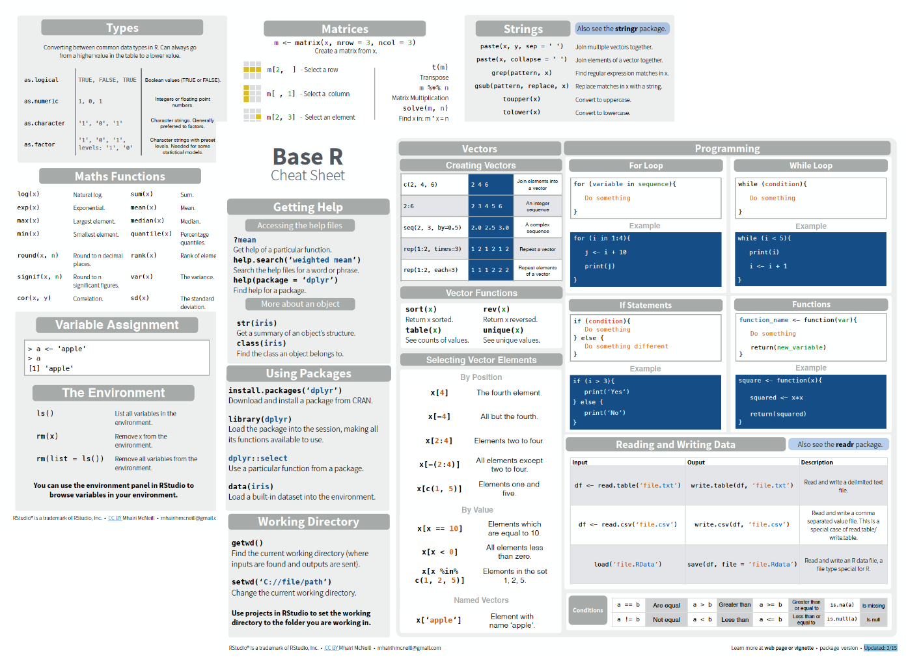

```{r setup, include = FALSE}
library(learnr)
library(rmdformats)
library(tidyverse)
library(skimr)
library(knitr)
library(shiny)
library(gradethis)
knitr::opts_chunk$set(error = TRUE,
                      upload.fun = imgur_upload, 
                      fig.path = "www/",
                      collapse = TRUE,
                      exercise.cap = "Base R",
                      warning = FALSE, 
                      message = FALSE, 
                      dpi = 320,
                      tibble.max_extra_cols = 6, 
                      tibble.width = 60)
options(scipen = 999999999)
gradethis_setup(exercise.reveal_solution = TRUE)
```

## Intro

The exercises below cover the excellent base R cheat sheet by [Mhairi McNeill](http://mhairihmcneill.com/blog/2016/06/05/base-r-cheatsheet.html). 

```{r base-r.png, echo=FALSE, out.height='100%', out.width='100%'}

```

They also include the new pipe operator (`|>`), and extend some sections with more examples. 

This tutorial is intended for anyone new to R, or a `tidyverse` user who is curious how to perform a certain operation/task is base R. 

### Disclaimer 

While this tutorial covers base R, it's assuming you're using R with RStudio.

## Getting Help


### Accessing the help files

### More about an object

## Using Packages

## Working Directory

## Vectors

### Creating Vectors

### Vector Functions

### Selecting Vector Elements

### Conditions

## Programming

### For Loop

### If Statements

### While Loop

### Functions

## Reading and Writing Data

## Types

## Maths Functions

## Variable Assignment

## The Environment

## Matrices

## Lists

## Data Frames

## Strings

## Factors

## Dates

## Statistics

## Distributions

## Plotting
