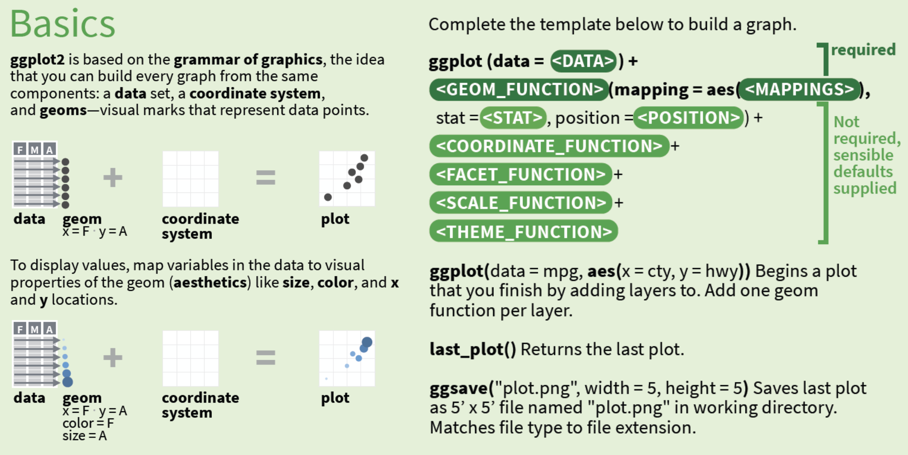
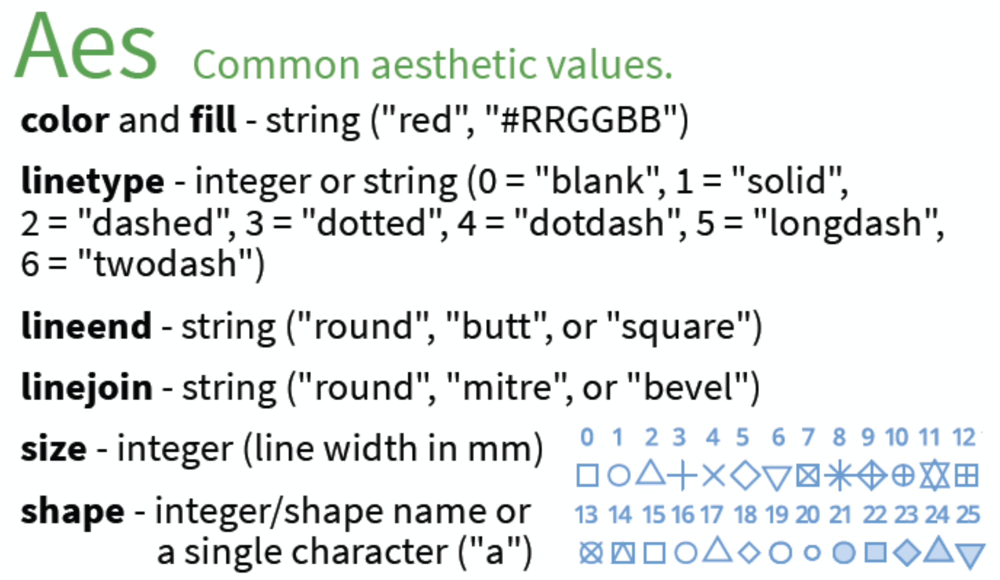
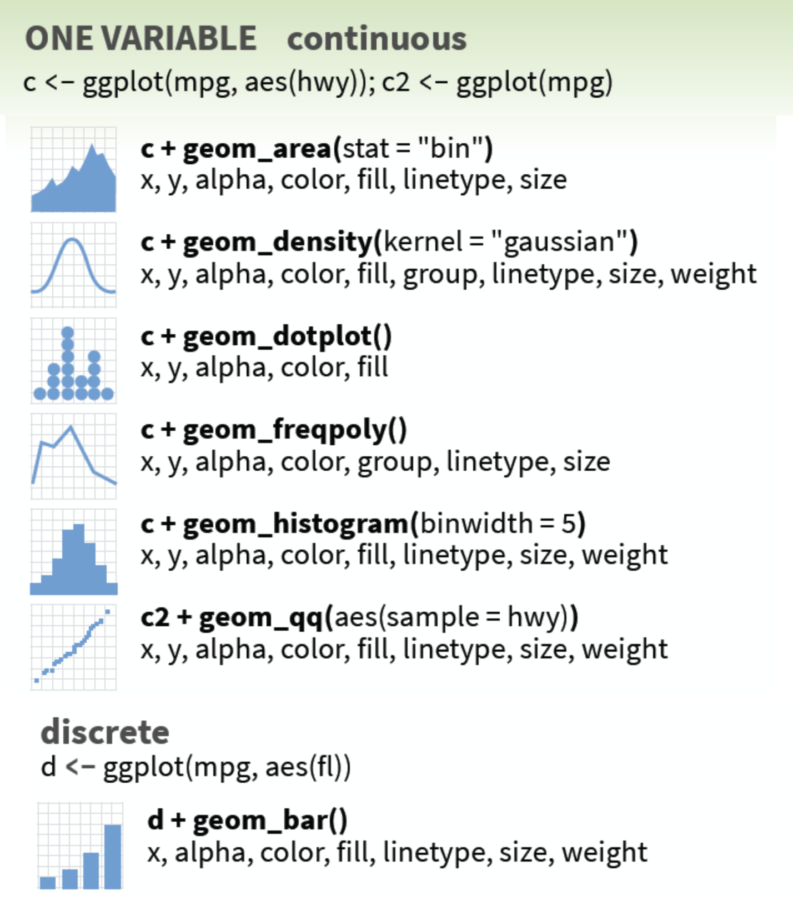

```{r setup, include = FALSE}
library(learnr)
library(tidyverse)
library(skimr)
library(knitr)
library(vroom)
library(patchwork)
library(gradethis)
knitr::opts_chunk$set(error = TRUE,
                      upload.fun = imgur_upload, 
                      fig.path = "www/",
                      exercise.cap = "introduction to ggplot2",
                      warning = FALSE, 
                      message = FALSE, 
                      fig.retina = 2,
                      out.width = "80%",
                      dev = "ragg_png",
                      dpi = 96,
                      fig.align = 'center',
                      tibble.max_extra_cols = 6, 
                      tibble.width = 60)
options(scipen = 999999999)
gradethis_setup(exercise.reveal_solution = TRUE)
```

## Overview 

```{r ggp2-part-01.png, echo=FALSE, out.height='85%', out.width='85%', fig.align='center'}

```

These exercises will cover part 1 of page 1 in the `ggplot2` cheatsheet. Download the cheatsheet [here](https://www.rstudio.com/resources/cheatsheets/). 

## `ggplot2` basics 

This section covers the first portion of the cheatsheet. 

```{r ggp2-basics-png, echo=FALSE, out.height='85%', out.width='85%', fig.align='center'}

```

- **data** = a rectangular data object (`data.frame` or `tibble`)   
- **geoms** = 'geometric elements' (*what you actually see in the plot*)   
- **coordinate systems** = how the data are mapped to the underlying graphical plane (the default is an `x`/`y`, or Cartesian coordinate system)  
- **plot** =  plot object  

When we pass a plot object to the `class()` function, we see the following: 

```r
class(plot)
[1] "gg"     "ggplot"
```

###

### `ggplot2` templates

The cheatsheet provides a template for creating plots with `ggplot2`. 

```{r ggplot2-template-01, echo=FALSE, out.height='70%', out.width='70%'}
knitr::include_graphics("www/ggplot2-template-01.png")
```

These required functions and arguments are described below:

- Graphs are initialized with a dataset and the `ggplot()` function 

  + **`ggplot(<DATA>)`**
  
- Visual elements `geoms` are used to represent the data values  

  + **`<GEOM_FUNCTION>()`**

- Variables are mapped as aesthetics to locations (`x`, `y`) and visual properties (`color`, `fill`, etc.)   

  + **`mapping = aes(<MAPPINGS>)`**
  
###

It's important to note that the template above provides the minimum functions required to create a plot with `ggplot2`, but these functions can be provided in multiple arrangements. 

For example, we could map the variables *inside* the initial `ggplot()` function (which sets these aesthetics *globally*, meaning they will be inherited by any subsequent `geom` layers).

```{r ggplot2-template-02, echo=FALSE, out.height='70%', out.width='70%'}

```

If you're using pipes (`%>%`), we could begin with the **`<DATA>`**, pipe this to the `ggplot()` function, then add the **`<GEOM_FUNCTION>()`** and aesthetic **`<MAPPINGS>`**. 

```{r ggplot2-template-03, echo=FALSE, out.height='70%', out.width='70%'}

```

***Be careful! A common mistake is forgetting that we combine `ggplot2` functions using `+` (and not `%>%`)***

## Aesthetics 

Below are the *Common aesthetic values* from the cheatsheet:

```{r ggp2-aes, echo=FALSE, out.height='60%', out.width='60%', fig.align='center'}

```

###

Below is a table of the values with a little more information on each one. 

```{r includeMarkdown-ae-md, echo=FALSE}
shiny::includeMarkdown(path = "assets/aes.md")
```


## Graphical Primitives 

```{r ggp2-graphical-primitives, echo=FALSE, out.height='50%', out.width='50%', fig.align='center'}
knitr::include_graphics("www/ggp2-graphical-primitives.png")
```

These graph examples use the `economics` and `seals` datasets from the `ggplot2` package. 

###

We've loaded `economics` and `seals` in the code blocks below for you to review. 

```{r prepare-economics-review, include=FALSE}
economics <- ggplot2::economics
```

```{r economics-review, exercise=TRUE, exercise.setup = "prepare-economics-review", exercise.lines = 3}
# click 'Run Code' to view the economics data
economics
```

```{r prepare-seals-review, include=FALSE}
seals <- ggplot2::seals
```

```{r seals-review, exercise=TRUE, exercise.setup = "prepare-seals-review", exercise.lines = 3}
# click 'Run Code' to view the seals data
seals
```

### Graph `a` 

We're going to create graph `a` so you can see what the underlying code looks like with plot. It's a common practice to build plot's iteratively with `ggplot2`, assigning each layer to it's own object (like `a` and `b`), but for learning purposes, it's better to see the full code for each step. 

###

1. Replace `<DATA>` with `economics`   
2. Replace `<MAPPINGS>` and map `date` to the `x` axis and `unemploy` to the `y`. 

```{r graph_a, exercise=TRUE, exercise.lines = 3}
ggplot(data = <DATA>, # provide data
  mapping = aes(<MAPPINGS>)) # map aesthetics 
```

```{r graph_a-solution, echo=FALSE}
ggplot(data = economics, # data
  mapping = aes(x = date, y = unemploy))
```

```{r graph_a-check}
gradethis::grade_this_code()
```


### geom_blank()

The `geom_blank()` function literally [*draws nothing*](https://ggplot2.tidyverse.org/reference/geom_blank.html), but it can be helpful if we want to manually set the ranges of `x` and `y` (instead of relying on the original values). 

###

For example, we might want the `x` and `y` axis in our plot to extend beyond the available values in the `date` and `unemploy` variables. We could store the upper and lower limits to `date` and `unemploy` in `data_ranges`

```{r prepare-data_ranges, echo=FALSE}
data_ranges <- data.frame(
  
  x = c(min(economics$date) - 1095, max(economics$date) + 1095),
  # add/subtract 20% from unemploy
  y = c(min(economics$unemploy) * .80, max(economics$unemploy) * 1.20))
```

View `data_ranges` in the code block below:

```{r print-data_ranges, exercise=TRUE, exercise.setup = "prepare-data_ranges", exercise.lines = 3}
data_ranges
```

###

When we build our plot, we can use the values in `data_ranges` to adjust the `x` and `y` axes. We'll use an additional `geom_point()` (a scatter plot) layer to view the values with our adjusted `x` and `y` coordinates. 


###

In the code block below, 

1. Add a  `geom_blank()` (after `geom_point()`)  
2. Place the `data_ranges` in the `data` argument 

```{r prepare-geom_blank_1, echo=FALSE}
data_ranges <- data.frame(
  # add/subtract three years to either side of date
  x = c(min(economics$date) - 1095, max(economics$date) + 1095),
  # add/subtract 20% from unemploy
  y = c(min(economics$unemploy) * .80, max(economics$unemploy) * 1.20))
```

```{r geom_blank_1, exercise=TRUE, exercise.setup = "prepare-geom_blank_1", exercise.lines = 5}
ggplot(data = economics,
  mapping = aes(x = date, y = unemploy)) +
  geom_point() +
    ____(data = ____, aes(x = x, y = y))
```

```{r geom_blank_1-solution, echo=FALSE}
ggplot(data = economics,
  mapping = aes(x = date, y = unemploy)) +
  geom_point() +
    geom_blank(data = data_ranges, aes(x = x, y = y))
```

```{r geom_blank_1-check}
gradethis::grade_this_code()
```

###

Create an unadjusted version of the same plot. 

In the code block below,

1. Map `date` to the `x` axis  
2. Map `unemploy` to the `y` axis  
3. Add a `geom_point()` layer  

```{r unadj_geom_blank, exercise=TRUE, exercise.lines = 4, eval=TRUE}
ggplot(data = economics,
  # map date and unemploy
  mapping = aes(x = ____, y = ____)) +
  # add the geom_point()
```

```{r unadj_geom_blank-solution, echo=FALSE}
ggplot(data = economics,
  mapping = aes(x = date, y = unemploy)) +
  geom_point()
```

```{r unadj_geom_blank-check, echo=FALSE}
gradethis::grade_this_code()
```

###

Run the code block below to compare the `geom_blank()` plots. 

```{r prepare-show_geom_blanks, echo=FALSE}
  show_geom_blanks <- function() {

    data_ranges <- data.frame(
      # add/subtract three years to either side of date
      x = c(min(economics$date) - 1095, max(economics$date) + 1095),
      # add/subtract 20% from unemploy
      y = c(min(economics$unemploy) * .80, max(economics$unemploy) * 1.20))

    # plot with x/y using data values
    gg_a <- ggplot(data = economics,
      mapping = aes(x = date, y = unemploy)) +
      geom_point() +
      labs(title = "orginal data", subtitle = " ") +
      theme(
        plot.title = element_text(size = 8, face = "bold"),
        plot.subtitle = element_text(size = 7, face = "italic"),
        plot.title.position = "panel"
      )
    # plot with x/y using data_ranges
    gg_blnk <- ggplot(data = economics,
      mapping = aes(x = date, y = unemploy)) +
      geom_point() +
      geom_blank(data = data_ranges, aes(x = x, y = y)) +
      labs(title = "geom_blank(data = data_ranges, aes(x = x, y = y))",
        subtitle = "data_ranges <- data.frame(x = c('1964-07-01', '2018-03-31'),
                          y = c(2148, 18422.4))") +
      theme(
        plot.title = element_text(size = 8, face = "bold"),
        plot.subtitle = element_text(size = 7, face = "italic"),
        plot.title.position = "panel"
      )
  gg_a / gg_blnk
 }
```

```{r show_geom_blanks, exercise=TRUE, exercise.setup="prepare-show_geom_blanks", exercise.lines=3}
show_geom_blanks()
```

### expand_limits()

`expand_limits()` is similar to `geom_blank()`, but it [requires](https://ggplot2.tidyverse.org/reference/expand_limits.html) "*named list of aesthetics specifying the value (or values) that should be included in each scale.*"

In this case, we'll add the values directly to the `x` and `y` axes (`x_limits` and `y_limits`) in `expand_limits`.

Once again we'll use a `geom_point()` layer to view confirm the range of values.

```{r echo=TRUE}
x_limits <- c(min(economics$date) - 1095, 
              max(economics$date) + 1095)
y_limits <- c(max(economics$unemploy) * .80, 
              max(economics$unemploy) * 1.20)
```

```{r prepare-expand_limits, echo=TRUE}
x_limits <- c(min(economics$date) - 1095, max(economics$date) + 1095)
y_limits <- c(max(economics$unemploy) * .80, max(economics$unemploy) * 1.20)
```

We've included `x_limits` and `y_limits` in the code block below. 

###

In the  `expand_limits()` layer  

1. Add `x_limits` to the `x`  
2. Add `y_limits` to the `y`  

```{r expand_limits, exercise=TRUE, exercise.setup = "prepare-expand_limits", exercise.lines = 8}
ggplot(data = economics, 
  mapping = aes(x = date, y = unemploy)) + 
  geom_point() +
    expand_limits(
      # add limits
      x = ____,  
      y = ____)
```

```{r expand_limits-solution, echo=FALSE}
ggplot(data = economics, 
  mapping = aes(x = date, y = unemploy)) + 
  geom_point() +
    expand_limits(
      # add limits
      x = x_limits,  
      y = y_limits)
```

```{r expand_limits-check, echo=FALSE}
gradethis::grade_this_code()
```

###

Compare the graph you've created above to the unadjusted scatter plot of `date` vs `unemply` below:

1. Map `date` to `x`  
2. Map `unemploy` to the `y`  
3. Add a `geom_point()` layer  

```{r unadj_expand_limits, exercise=TRUE, exercise.lines = 5, eval=TRUE}
ggplot(data = economics,
  # map date and unemploy
  mapping = aes(x = ____, y = ____)) +
  # add the geom_point()
```

```{r unadj_expand_limits-solution, echo=FALSE}
ggplot(data = economics,
  mapping = aes(x = date, y = unemploy)) +
  geom_point()
```

```{r unadj_expand_limits-check, echo=FALSE}
gradethis::grade_this_code()
```

###

Run the code block below to compare the `expand_limits()` plots. 
 
```{r prepare-show_expand_limits, echo=FALSE}
show_expand_limits <- function() {

    data_ranges <- data.frame(
      # add/subtract three years to either side of date
      x = c(min(economics$date) - 1095, max(economics$date) + 1095),
      # add/subtract 20% from unemploy
      y = c(min(economics$unemploy) * .80, max(economics$unemploy) * 1.20))
    
  x_limits <- c(min(economics$date) - 1095, max(economics$date) + 1095)
  y_limits <- c(max(economics$unemploy) * .80, max(economics$unemploy) * 1.20)

 gg_a <- ggplot(data = economics,
   mapping = aes(x = date, y = unemploy)) +
   geom_point() +
   labs(title = "orginal data", subtitle = " ") +
   theme(
     plot.title = element_text(size = 8, face = "bold"),
     plot.subtitle = element_text(size = 7, face = "italic"),
     plot.title.position = "panel"
   )
 gg_exp_lmt <- ggplot(data = economics,
   mapping = aes(x = date, y = unemploy)) +
   geom_point() +
   expand_limits(# add limits
     x = x_limits,
     y = y_limits) +
   labs(title = "expand_limits(x = c('1964-07-01', '2018-03-31'),
                            y = c(12281.6, 18422.4)",
     subtitle = " ") +
   theme(
     plot.title = element_text(size = 8, face = "bold"),
     plot.subtitle = element_text(size = 7, face = "italic"),
     plot.title.position = "panel"
   )
    # plot with x/y using data_ranges
 gg_blnk <- ggplot(data = economics,
   mapping = aes(x = date, y = unemploy)) +
   geom_point() +
   geom_blank(data = data_ranges, aes(x = x, y = y)) +
   labs(title = "geom_blank(data = data_ranges, aes(x = x, y = y))",
     subtitle = "data_ranges <- data.frame(x = c('1964-07-01', '2018-03-31'),
                          y = c(2148, 18422.4))") +
   theme(
     plot.title = element_text(size = 8, face = "bold"),
     plot.subtitle = element_text(size = 7, face = "italic"),
     plot.title.position = "panel"
   )

gg_a / gg_exp_lmt / gg_blnk

}
```

```{r show_expand_limits, exercise=TRUE, exercise.lines=3, exercise.setup="prepare-show_expand_limits"}
show_expand_limits()
```

### geom_path() 

The `geom_path()` draws lines to connect values. The arguments in this functions control the shape, size, and appearance of the connections. 

We've created a subset of the `economics` data (`small_econ`) so we can 'zoom in' on a smaller portion of the data. 

###

In the first plot, set 

1. `lineend` to `"butt"`   
2. `linejoin` to `"bevel"`   
3. `linemitre` to `1`   

```{r prepare-geom_path_1, echo=FALSE}
small_econ <- filter(economics,
  date <= "2014-08-01" & date >= "2014-03-01")
```

```{r geom_path_1, exercise=TRUE, exercise.lines = 8, exercise.setup = "prepare-geom_path_1"}
ggplot(data = small_econ,
  mapping = aes(x = date, y = unemploy)) +
  geom_path(
    size = 3, # larger line == easier to see
    lineend = ____,
    linejoin = ____,
    linemitre = ____)
```

```{r geom_path_1-solution, echo=FALSE}
ggplot(data = small_econ,
  mapping = aes(x = date, y = unemploy)) +
  geom_path(size = 3,
    lineend = "butt",
    linejoin = "bevel",
    linemitre = 1)
```

```{r geom_path_1-check, echo=FALSE}
gradethis::grade_this_code()
```

###

```{r prepare-geom_path_2, echo=FALSE}
small_econ <- filter(economics,
  date <= "2014-08-01" & date >= "2014-03-01")
```

In this second plot, set 

1. `lineend` to `"round"`    
2. `linejoin` to `"mitre"`   
3. keep `linemitre` at `1`  

```{r geom_path_2, exercise=TRUE, exercise.lines = 8, exercise.setup = "prepare-geom_path_2"}
ggplot(data = small_econ,
  mapping = aes(x = date, y = unemploy)) +
  geom_path(
    size = 3, # larger line == easier to see
    lineend = ____,
    linejoin = ____,
    linemitre = ____)
```

```{r geom_path_2-solution, echo=FALSE}
ggplot(data = small_econ,
  mapping = aes(x = date, y = unemploy)) +
  geom_path(size = 3,
    lineend = "round",
    linejoin = "mitre",
    linemitre = 10)
```

```{r geom_path_2-check, echo=FALSE}
gradethis::grade_this_code()
```

###

Run the code block below to compare the `geom_path()` plots. 

```{r prepare-show_geom_path, echo=FALSE}
show_geom_path <- function() {

  small_econ <- filter(economics,
    date <= "2014-08-01" & date >= "2014-03-01")

  gg_pth_butt_bevel <- ggplot(data = small_econ,
    mapping = aes(x = date, y = unemploy)) +
    geom_path(
      size = 3,
      lineend = "butt",
      linejoin = "bevel",
      linemitre = 1
    ) +
    labs(title = "geom_path(size = 3, lineend = 'butt', linejoin = 'bevel', linemitre = 1)",
      subtitle = " ") +
    theme(
      plot.title = element_text(size = 8, face = "bold"),
      plot.subtitle = element_text(size = 7, face = "italic"),
      plot.title.position = "panel"
    )
  gg_pth_round_mitre <- ggplot(data = small_econ,
    mapping = aes(x = date, y = unemploy)) +
    geom_path(
      size = 3,
      lineend = "round",
      linejoin = "mitre",
      linemitre = 1
    ) +
    labs(title = "geom_path(size = 3, lineend = 'round', linejoin = 'mitre', linemitre = 1)",
      subtitle = " ") +
    theme(
      plot.title = element_text(size = 8, face = "bold"),
      plot.subtitle = element_text(size = 7, face = "italic"),
      plot.title.position = "panel"
    )

  gg_pth_butt_bevel + gg_pth_round_mitre + patchwork::plot_layout(ncol = 1)

}
```

```{r show_geom_path, exercise=TRUE, exercise.setup="prepare-show_geom_path", exercise.lines=3}
show_geom_path()
```

### geom_polygon()

`geom_polygon()` is similar to the `geom_path()`, "*except that the start and end points are connected and the inside is colored by fill.*"

In this case, we're going to compare the `geom_polygon()` to the `geom_path()` (using the full `economics` dataset). 

###

To create the `geom_polygon()` graph, set 

1. the opacity aesthetic of the filled polygon with `alpha = 50`       
2. remove the legend with `show.legend = FALSE` (*outside* the aesthetic mapping function)    

```{r geom_polygon_1, exercise=TRUE, exercise.lines = 4}
ggplot(data = economics, 
  mapping = aes(x = date, y = unemploy)) + 
    geom_polygon(mapping = aes(____ = ____), show.legend = ____)
```

```{r geom_polygon_1-solution, echo=FALSE}
ggplot(data = economics, 
  mapping = aes(x = date, y = unemploy)) + 
    geom_polygon(mapping = aes(alpha = 50), show.legend = FALSE)
```

```{r geom_polygon_1-check, echo=FALSE}
gradethis::grade_this_code()
```

###

For comparison, create a `geom_path()` plot below, 

1. set `lineend` to `"butt"`  
2. `linejoin` to `"bevel"`, and   
3. `linemitre` to `1`   

```{r geom_polygon_2, exercise=TRUE, exercise.lines = 4}
ggplot(data = economics,
  mapping = aes(x = date, y = unemploy)) +
  geom_path(____ = ____, ____ = ____, ____ = ____)
```

```{r geom_polygon_2-solution, echo=FALSE}
ggplot(data = economics,
  mapping = aes(x = date, y = unemploy)) +
  geom_path(lineend = "butt", linejoin = "bevel", linemitre = 1)
```

```{r geom_polygon_2-check, echo=FALSE}
gradethis::grade_this_code()
```

### Combine geom layers

We read above the `geom_path()` is similar to `geom_polygon()`, but sometimes it's easier to *see* how two geoms are similar by combining them on the same graph. That's the beauty of `ggplot2`'s syntax--we can easily add layers to existing graphs using the same coordinate systems and variables. 

###

Use the code chunk below to combine `geom_path()` and `geom_polygon()` (with the values listed above).

```{r geom_polygon_3, exercise=TRUE, exercise.lines = 5}
ggplot(data = economics,
  mapping = aes(x = date, y = unemploy)) +
  geom_path(____ = ____, ____ = ____, ____ = ____) + 
  geom_polygon(mapping = aes(____ = ____), show.legend = ____)
```

```{r geom_polygon_3-solution, echo=FALSE}
ggplot(data = economics,
  mapping = aes(x = date, y = unemploy)) +
  geom_path(lineend = "butt", linejoin = "bevel", linemitre = 1) + 
  geom_polygon(mapping = aes(alpha = 50), show.legend = FALSE)
```

```{r geom_polygon_3-check, echo=FALSE}
gradethis::grade_this_code()
```

###

Run the code block below to compare the `geom_path()` plots. 

```{r prepare-show_geom_poly, echo=FALSE}
show_geom_poly <- function() {
  
  gg_poly1 <- ggplot(data = economics,
    mapping = aes(x = date, y = unemploy)) +
    geom_polygon(mapping = aes(alpha = 10), show.legend = FALSE) +
    labs(title = "geom_polygon(mapping = aes(alpha = 10), show.legend = FALSE)",
      subtile = " ") +
    theme(
      plot.title = element_text(size = 7, face = "bold"),
      plot.subtitle = element_text(size = 6, face = "italic"),
      plot.title.position = "panel")

  gg_poly2 <- ggplot(data = economics,
    mapping = aes(x = date, y = unemploy)) +
    geom_polygon(mapping = aes(alpha = 10), show.legend = FALSE) +
    geom_path(lineend = "butt",
      linejoin = "bevel",
      linemitre = 1) +
    labs(title = "geom_polygon(mapping = aes(alpha = 10), show.legend = FALSE)",
      subtitle = "geom_path(lineend = 'butt', linejoin = 'bevel', linemitre = 1)") +
    theme(
      plot.title = element_text(size = 7, face = "bold"),
      plot.subtitle = element_text(size = 6, face = "italic"),
      plot.title.position = "panel")

  gg_poly1 / gg_poly2
  
}
```

```{r show_geom_poly, exercise=TRUE, exercise.setup="prepare-show_geom_poly", exercise.lines=3}
show_geom_poly()
```

### geom_ribbon() 

`geom_ribbon()` gives us control over the 'thickness' of the line by adjusting the range of `y` values. 

###

In the code block below,

1. Map the `ymin` to `unemploy - 900`  
2. Map the `ymax` to `unemploy + 900`  

```{r geom_ribbon_1, exercise=TRUE, exercise.lines = 4}
ggplot(data = economics,
  mapping = aes(x = date, y = unemploy)) +
    geom_ribbon(aes(ymin = unemploy ____, ymax = unemploy ____))
```

```{r geom_ribbon_1-solution, echo=FALSE}
ggplot(data = economics,
  mapping = aes(x = date, y = unemploy)) +
  geom_ribbon(aes(ymin = unemploy - 900, ymax = unemploy + 900))
```

```{r geom_ribbon_1-check, echo=FALSE}
gradethis::grade_this_code()
```

###

If we'd like to create a ribbon that represents a statistical value (like the [standard deviation](https://en.wikipedia.org/wiki/Standard_deviation)), we can calculate this and provide it as a value to `ymin` and `ymax`. 

###

In the code block below,

1. Assign the value of `sd(economics$unemploy)` to `unemp_sd`, 
2. Add a `geom_path()` layer to the plot after the `geom_ribbon()`, and 
3. Set the `color` aesthetic in the `geom_path()` to `"red"`  

```{r  geom_ribbon_2, exercise=TRUE, exercise.lines = 8}
____ <- sd(economics$unemploy)
ggplot(data = economics,
  mapping = aes(x = date, y = unemploy)) +
    geom_ribbon(aes(ymin = unemploy - unemp_sd, ymax = unemploy + unemp_sd,
      alpha = 50), show.legend = FALSE) +
    ____(____ = ____)
```

```{r geom_ribbon_2-solution, echo=FALSE}
unemp_sd <- sd(economics$unemploy)
ggplot(data = economics,
  mapping = aes(x = date, y = unemploy)) +
    geom_ribbon(aes(ymin = unemploy - unemp_sd, ymax = unemploy + unemp_sd,
      alpha = 50), show.legend = FALSE) +
    geom_path(color = "red")
```

```{r geom_ribbon_2-check, echo=FALSE}
gradethis::grade_this_code()
```

###

```{r prepare-show_geom_ribbon, echo=FALSE}
show_geom_ribbon <- function() {
  # get sd
unemp_sd <- sd(economics$unemploy)
# plot 1
gg_rib1 <- ggplot(data = economics,
  mapping = aes(x = date, y = unemploy)) +
  geom_ribbon(aes(ymin = unemploy - 900, ymax = unemploy + 900)) +
  labs(title = "geom_ribbon(aes(ymin = unemploy - 900, ymax = unemploy + 900))") +
  theme(
    plot.title = element_text(size = 7, face = "bold"),
    plot.subtitle = element_text(size = 6, face = "italic"),
    plot.title.position = "panel")
# plot 2
gg_rib2 <- ggplot(data = economics,
  mapping = aes(x = date, y = unemploy)) +
  geom_ribbon(aes(
    ymin = unemploy - unemp_sd,
    ymax = unemploy + unemp_sd,
    alpha = 50),
    show.legend = FALSE) +
  geom_path(color = "red") +
  labs(title = "unemp_sd <- sd(economics$unemploy)\n geom_ribbon(aes(ymin = unemploy - unemp_sd, ymax = unemploy + unemp_sd)) +",
    subtitle = "  geom_path(color = 'red'')") +
  theme(
    plot.title = element_text(size = 7, face = "bold"),
    plot.subtitle = element_text(size = 7, face = "bold"),
    plot.title.position = "panel",
    plot.caption = element_text(size = 6))

  gg_rib1 / gg_rib2

}
```

```{r show_geom_ribbon, exercise=TRUE, exercise.setup="prepare-show_geom_ribbon", exercise.lines=3}
show_geom_ribbon()
```

### Graph `b`

We're going to create graph `b` from the cheatsheet below:

###

1. replace `<DATA>` with the `seals` data   
2. map `long` to the `x` axis, and `lat` to the `y` axis  

```{r graph_b, exercise=TRUE, exercise.lines = 3}
ggplot(data = <DATA>,
  mapping = aes(<MAPPINGS>))
```

```{r graph_b-solution, echo=FALSE}
ggplot(data = seals,
  mapping = aes(x = long, y = lat))
```

```{r graph_b-check, echo=FALSE}
gradethis::grade_this_code()
```

### geom_curve()

`geom_curve()` uses `yend` and `xend` to draw curved lines. The `curvature` value determines how the line should curve (negative values = left-hand curves, positive values = right-hand curves, zero = straight line). 

###

In the code block below: 

1. set `yend` to `lat + 1` 
2. set `xend` to `long + 1`  
3. set the curvature to `2`  

```{r geom_curve_1, exercise=TRUE, exercise.lines = 4}
ggplot(data = seals,
  mapping = aes(x = long, y = lat)) +
  geom_curve(aes(yend = ____, xend = ____), curvature = ____)
```

```{r geom_curve_1-solution, echo=FALSE}
ggplot(data = seals,
  mapping = aes(x = long, y = lat)) +
  geom_curve(aes(yend = lat + 1, xend = long + 1), curvature = 2)
```

```{r geom_curve_1-check, echo=FALSE}
gradethis::grade_this_code()
```

###

We can see this geom creates a series of circles around each point. We can see where each curve begins (in reference to each value) by taking a smaller sample of `seals` and coloring the points (`"red"`).

###


1. Add a `geom_point()` to the `geom_curve()`   
2. Color the points `"red"`   

```{r geom_curve_2, exercise=TRUE, exercise.lines = 5}
ggplot(data = dplyr::slice_sample(seals, n = 10),
  mapping = aes(x = long, y = lat)) +
  geom_curve(aes(yend = lat + 1, xend = long + 1), curvature = 2) +
  _____(color = ____)
```

```{r geom_curve_2-solution, echo=FALSE}
ggplot(data = dplyr::slice_sample(seals, n = 10),
  mapping = aes(x = long, y = lat)) +
    geom_curve(aes(yend = lat + 1, xend = long + 1), curvature = 2) +
    geom_point(color = "red")
```

```{r geom_curve_2-check, echo=FALSE}
gradethis::grade_this_code()
```

###

Run `show_geom_curve()` below to view all the `geom_curve()` graphs. 

```{r prepare-show_geom_curve, echo=FALSE}
gg_point <- ggplot(data = seals,
  mapping = aes(x = long, y = lat)) +
  geom_point(size = 0.7) +
  labs(title = "Reference: geom_point()") +
  theme(
    plot.title = element_text(size = 8, face = "bold"),
    plot.subtitle = element_text(size = 7, face = "italic"),
    plot.title.position = "panel")

gg_curve <- ggplot(data = seals,
  mapping = aes(x = long, y = lat)) +
    geom_curve(aes(yend = lat + 1, xend = long + 1), 
      curvature = 2, size = 0.2) +
  labs(
    title = "geom_curve(aes(yend = lat + 1, xend = long + 1),
                    curvature = 2)") +
  theme(
    plot.title = element_text(size = 8, face = "bold"),
    plot.subtitle = element_text(size = 7, face = "italic"),
    plot.title.position = "panel")

show_geom_curve <- function() {
  gg_point + gg_curve 
}
```

```{r show_geom_curve, exercise=TRUE, exercise.setup="prepare-show_geom_curve", exercise.lines=3}
show_geom_curve()
```

### geom_rect()

`geom_react()` uses 'the four corners' of the Cartesian coordinate system (`xmin`, `xmax`, `ymin`, and `ymax`) to draw a rectangle. 

We're going to use the `seals` data from graph `b` to demonstrate the `geom_react()`, but first we'll use `geom_point()` to get a picture of how these two variables are related to each other:

###

Add a `geom_point()` to the plot below:

```{r geom_rect_1, exercise=TRUE, exercise.lines = 4}
ggplot(data = seals, 
  mapping = aes(x = long, y = lat)) + 
  ____()
```

```{r geom_rect_1-solution, echo=FALSE}
ggplot(data = seals, 
  mapping = aes(x = long, y = lat)) + 
  geom_point()
```

```{r geom_rect_1-check, echo=FALSE}
gradethis::grade_this_code()
```

###

These points are arranged along a grid because they truly represent a ["*vector field of seal movements*"](https://ggplot2.tidyverse.org/reference/seals.html) (not necessarily the relationship between two measurements, such as height and weight).

###

We'll replace the `geom_point()` with `geom_rect()` and include the following values in the code block below: 

1. `xmin` = `long`  
2. `ymin` = `lat`  
3. `xmax` = `long + 1`  
4. `ymax` = `lat + 1`  

```{r geom_rect_2, exercise=TRUE, exercise.lines = 5}
ggplot(data = seals,
  mapping = aes(x = long, y = lat)) +
  geom_rect(aes(xmin = ____, ymin = ____,
                xmax = ____ + 1, ymax = ____ + 1))
```

```{r geom_rect_2-solution, echo=FALSE}
ggplot(data = seals,
  mapping = aes(x = long, y = lat)) +
  geom_rect(aes(xmin = long, ymin = lat,
                xmax = long + 1, ymax = lat + 1))
```

```{r geom_rect_2-check, echo=FALSE}
gradethis::grade_this_code()
```

We can see this drew a rectangle around the points in the previous plot.

###

Let's add the `geom_point()` back to the plot and color the points `"white"` to verify they are still there. 

1. Add a `geom_point()` (after the `geom_rect()`)  
2. color the points `"white"`  

```{r geom_rect_3, exercise=TRUE, exercise.lines = 7}
ggplot(data = seals,
  mapping = aes(x = long, y = lat)) +
  geom_rect(aes(xmin = long, ymin = lat,
                xmax = long + 1, ymax = lat + 1)) +
  # add the geom_point() and set the color to "white"
  ____(color = ____)
```

```{r geom_rect_3-solution, echo=FALSE}
ggplot(data = seals,
  mapping = aes(x = long, y = lat)) +
  geom_rect(aes(xmin = long, ymin = lat,
                xmax = long + 1, ymax = lat + 1)) +
  geom_point(color = "white")
```

```{r geom_rect_3-check, echo=FALSE}
gradethis::grade_this_code()
```

###

We've loaded all three plots in the code block below. Click *Run Code* to run `show_geom_rect()` them side by side and compare. 

```{r prepare-show_geom_rect, echo=FALSE}
show_geom_rect <- function() {
  
gg_rect <- ggplot(data = seals,
  mapping = aes(x = long, y = lat)) +
  geom_rect(aes(xmin = long, ymin = lat,
                xmax = long + 1, ymax = lat + 1)) +
  labs(title = "geom_rect(aes(
    xmin = long, xmax = long + 1,
    ymin = lat, ymax = lat + 1)") +
  theme(
    plot.title = element_text(size = 8, face = "bold"),
    plot.subtitle = element_text(size = 7, face = "italic"),
    plot.title.position = "panel")

gg_point_rect <- ggplot(data = seals,
  mapping = aes(x = long, y = lat)) +
  geom_rect(aes(xmin = long, ymin = lat,
                xmax = long + 1, ymax = lat + 1)) +
  geom_point(size = 0.2, color = "white") +
  labs(title = "Reference: geom_point() + geom_rect()",
    subtitle = "") +
  theme(
    plot.title = element_text(size = 8, face = "bold"),
    plot.subtitle = element_text(size = 7, face = "bold.italic"),
    plot.title.position = "panel")

  gg_rect + gg_point_rect
  
}
```

```{r show_geom_rect, exercise=TRUE, exercise.lines = 2, exercise.setup = "prepare-show_geom_rect"}
show_geom_rect()
```


## Line Segments 

In this section we're going to use graph `b` to demonstrate five geoms that create line segments:

```{r ggp2-line-segments, echo=FALSE, out.height='50%', out.width='50%', fig.align='center'}
knitr::include_graphics("www/ggp2-line-segments.png")
```

###

These geoms behave slightly different than other geoms because they can take values directly (and won't inherit values from previous layers). 

### geom_abline() 

`geom_abline()` draws a line using parameters from a [linear regression equation](http://www.stat.yale.edu/Courses/1997-98/101/linreg.htm), 

###### "*A linear regression line has an equation of the form `Y = a + bX`, where `X` is the explanatory variable and `Y` is the dependent variable. The slope of the line is `b`, and `a` is the intercept (the value of `y` when `x` = 0)*"

Thus `geom_abline()` is a `geom_a`(*intercept*)`b`(*slope*)`line()`. The `intercept` is where the line will cross the `y` axis (this can extend beyond the visible range of observable `y` values), and the `slope`--the 'rise-over-run'--determines the angle of the line.

###

The `geom_abline()` example in the cheatsheet uses the `seals` data, which we've loaded in the code block below for you to explore. 

Create a scatter-plot below using graph `b` 

1. Add a `geom_abline()`  
2. Map `intercept` to `0`   
3. Map `slope` to `1`  

```{r geom_abline, exercise=TRUE, exercise.lines = 4}
ggplot(data = seals,
  mapping = aes(x = long, y = lat)) + 
  ____(aes(____ = ____, ____ = ____))
```

```{r geom_abline-solution, echo=FALSE}
ggplot(data = seals,
  mapping = aes(x = long, y = lat)) + 
  geom_abline(aes(intercept = 0, slope = 1))
```

```{r geom_abline-check, echo=FALSE}
gradethis::grade_this_code()
```

###

This example doesn't quite give us a full picture of how `geom_abline()` works, so we'll use the examples from the [documentation](https://ggplot2.tidyverse.org/reference/geom_abline.html) and the [Palmer penguins data.](https://allisonhorst.github.io/palmerpenguins/)

###

Consider the `geom_point()` plot below of `flipper_length_mm` (flipper length (millimeters)) vs. `bill_length_mm` (bill length (millimeters)).

```{r load-palmerpenguins, echo=FALSE}
library(palmerpenguins)
penguins <- palmerpenguins::penguins
```

```{r penguins-scatter, eval=TRUE}
ggplot(data = penguins,
  mapping = aes(x = flipper_length_mm, y = bill_length_mm)) +
    geom_point()
```

###

We can see from the data points in the graph above that the relationship between `flipper_length_mm` and `bill_length_mm` is positive (as flipper lengths gets higher, the values of bill lengths gets higher), which tells us the `slope` is positive.


###

In the code block below: 

1. Add an `geom_abline()` layer after the `geom_point()`  
2. Set the `intercept` to `2`  
3. Set the `slope` to `0.2`

```{r geom_abline_1, exercise=TRUE, exercise.lines = 5}
ggplot(data = penguins,
  mapping = aes(x = flipper_length_mm, y = bill_length_mm)) +
    geom_point() +
    ____(aes(____ = ____, ____ = ____))
```

```{r geom_abline_1-solution, echo=FALSE}
ggplot(data = penguins,
  mapping = aes(x = flipper_length_mm, y = bill_length_mm)) +
    geom_point() +
    geom_abline(aes(intercept = 2, slope = 0.2))
```

```{r geom_abline_1-check, echo=FALSE}
gradethis::grade_this_code()
```

###

This line passes through *some* of the data points, but if we're trying to find the 'best fit' line (i.e., the line that passes through the most values for `x` and `y`), we should use a model to predict these values.

###

We can do this using [linear model](https://stat.ethz.ch/R-manual/R-devel/library/stats/html/lm.html) (`lm()`) function (for fitting **l**inear **m**odels) and `coef()` (to extract model **coef**ficients). We store the coefficients in `mod_coeffs`.

```{r coef}
# store model results
mod <- lm(bill_length_mm ~ flipper_length_mm, 
                  data = penguins)
# get model coefficients 
mod_coeffs <- coef(mod)
mod_coeffs
```

###

In the code block below: 

1. Add a `geom_abline()` layer after the `geom_point()`  
2. Set the `intercept` to the `(Intercept)` value using `mod_coeffs["(Intercept)"]` 
3. Set `slope` to `flipper_length_mm` value using `mod_coeffs["flipper_length_mm"]` 

```{r prepare-geom_abline_2, echo=FALSE}
# store model results
mod <- lm(bill_length_mm ~ flipper_length_mm,
                  data = penguins)
# get model coefficients
mod_coeffs <- coef(mod)
```


```{r geom_abline_2, exercise=TRUE, exercise.setup="prepare-geom_abline_2", exercise.lines = 6}
ggplot(data = penguins,
  mapping = aes(x = flipper_length_mm, y = bill_length_mm)) +
  geom_point() +
  ____(aes(intercept = mod_coeffs["(____)"],
           slope = mod_coeffs["____"]))
```

```{r geom_abline_2-solution, echo=FALSE}
ggplot(data = penguins,
  mapping = aes(x = flipper_length_mm, y = bill_length_mm)) +
  geom_point() +
  geom_abline(aes(intercept = mod_coeffs["(Intercept)"], 
                  slope = mod_coeffs["flipper_length_mm"]))
```

```{r geom_abline_2-check, echo=FALSE}
gradethis::grade_this_code()
```

###

Plotting the best fit 'linear' line through data points is much easier with [`geom_smooth()`](https://ggplot2.tidyverse.org/reference/geom_smooth.html) (but we'll cover that in a future section).

###

Click *Run Code* below to compare the `geom_abline()` with `geom_smooth()`

```{r prepare-show_ablines, echo=FALSE}
show_ablines <- function() {
  require(palmerpenguins)
  penguins <- palmerpenguins::penguins

  # store model results
  mod <- lm(bill_length_mm ~ flipper_length_mm,
            data = penguins)
  # get model coefficients
  mod_coeffs <- coef(mod)

gg_penguins_abline <- ggplot(data = penguins,
  mapping = aes(x = flipper_length_mm, y = bill_length_mm)) +
  geom_point(size = 0.4) +
  geom_abline(aes(intercept = mod_coeffs["(Intercept)"],
    slope = mod_coeffs["flipper_length_mm"])) +
  labs(title = "geom_abline(
                  aes(intercept = -7.2648678, slope = 0.2547682))") +
  theme(
    plot.title = element_text(size = 9, face = "bold"),
    plot.subtitle = element_text(size = 7, face = "bold.italic"),
    plot.title.position = "panel"
  )

gg_penguins_smooth <- ggplot(data = penguins,
  mapping = aes(x = flipper_length_mm, y = bill_length_mm)) +
  geom_point(size = 0.4) +
  geom_smooth(method = "lm") +
  labs(title = "geom_smooth(method = 'lm')") +
  theme(
    plot.title = element_text(size = 9, face = "bold"),
    plot.subtitle = element_text(size = 7, face = "bold.italic"),
    plot.title.position = "panel"
  )

  gg_penguins_abline / gg_penguins_smooth
  
}
```

```{r show_ablines, exercise=TRUE, exercise.setup = "prepare-show_ablines", exercise.lines = 2}
show_ablines()
```

### geom_hline() 

The `geom_hline()` stands for 'horizontal line' and takes a `yintercept` (y-intercept) argument. The `yintercept` can be a constant *or* a calculated value.

###

In the code block below, 

1. Add a `geom_hline()`  
2. Map `lat` to the `yintercept`  

```{r geom_hline_1,  exercise=TRUE, exercise.lines = 4}
ggplot(data = seals,
  mapping = aes(x = long, y = lat)) +
    _____(aes(____ = ____))
```

```{r geom_hline_1-solution, echo=FALSE}
ggplot(data = seals,
  mapping = aes(x = long, y = lat)) +
    geom_hline(aes(yintercept = lat))
```

```{r geom_hline_1-check, echo=FALSE}
gradethis::grade_this_code()
```

### geom_vline() 

`geom_vline()` works similar to `geom_hline()`, except it takes a `xintercept` argument. 

###

In the code block below, 

1. Add a `geom_vline()`  
2. Map `long` to the `xintercept`  

```{r geom_vline_1, exercise=TRUE, exercise.lines = 4}
ggplot(data = seals,
  mapping = aes(x = long, y = lat)) +
    ____(aes(____ = ____))
```

```{r geom_vline_1-solution, echo=FALSE}
ggplot(data = seals,
  mapping = aes(x = long, y = lat)) +
    geom_vline(aes(xintercept = long))
```

```{r geom_vline_1-check, echo=FALSE}
gradethis::grade_this_code()
```

### geom_segment() 

`geom_segment()` draws a line 'segment.' We already specified where the line should start (the `x` and `y` aesthetic), now all we need to specify is where we want the line to end (with `xend` and `yend`)

###

In the code block below, 

1. Add a `geom_segment()`   
2. Map `long + 1` to `xend`   
3. Map `lat + 1` to `yend`  

```{r geom_segment_1, exercise=TRUE, exercise.lines = 4}
ggplot(data = seals,
  mapping = aes(x = long, y = lat)) +
  _______(aes(____ = ____ + 1, ____ = ____ + 1))
```

```{r geom_segment_1-solution, echo=FALSE}
ggplot(data = seals,
  mapping = aes(x = long, y = lat)) +
  geom_segment(aes(xend = long + 1, yend = lat + 1))
```

```{r geom_segment_1-check, echo=FALSE}
gradethis::grade_this_code()
```

### Reference lines 

`geom_hline()` and `geom_vline()` are helpful if you want to add reference lines to your plot. We'll use graph `a` below to demonstrate:

###

1. Add a `geom_hline()` to the graph, setting the `yintercept` to the average `unemploy`   
2. Set the `linetype` to `"dashed"`, the `size` to `1`, and `color` to `"red"`   
3. Add a `geom_point()` layer, and set the `alpha` to `3/5`  

```{r reference_lines_1, exercise=TRUE, exercise.lines = 9}
ggplot(data = economics,
  mapping = aes(x = date, y = unemploy)) +
  ____(
    aes(____ = mean(____, na.rm = TRUE)),
    linetype = "____",
    size = ____,
    color = "____") +
  ____(alpha = ____ / ____)
```

```{r reference_lines_1-solution, echo=FALSE}
ggplot(data = economics,
  mapping = aes(x = date, y = unemploy)) +
  geom_hline(
    aes(yintercept = mean(unemploy, na.rm = TRUE)),
    linetype = "dashed",
    size = 1,
    color = "red") +
  geom_point(alpha = 3 / 5)
```

```{r reference_lines_1-check, echo=FALSE}
gradethis::grade_this_code()
```

###

Adjusting the alpha on the points helps with the over-plotting (we can see where the points group on top of each other), and the now we can see the average value for `unemploy` across the entire range of `date`s. 

But we don't have to stop here...we can add another geom we've previously covered. We'll include a colored band around our data points that tell us the standard deviation (a measure of dispersion) for this variable. 

###

In the code block below, 

1. Add a `geom_ribbon()` below the `geom_hline()`, but above the `geom_point()`  
2. Inside the `geom_ribbon()`  
  + Set the `ymin` to `unemploy` *minus* the standard deviation of `unemploy`    
  + Set the `ymax` to `unemploy` *plus* the standard deviation of `unemploy`  
3. Outside the `aes()` function, set the `alpha` to `1/5`  

```{r reference_lines_2, exercise=TRUE, exercise.lines = 10}
ggplot(data = economics,
  mapping = aes(x = date, y = unemploy)) + 
  geom_hline(aes(yintercept = mean(unemploy, na.rm = TRUE)),
    linetype = "dashed", size = 1, color = "red") + 
  # add geom_ribbon() layer here!
  ____(aes(ymin = ____ - sd(____, na.rm = TRUE), 
                  ymax = ____ + sd(____, na.rm = TRUE),
      ), ____ = ____) + 
    geom_point(alpha = 3/5)
```

```{r reference_lines_2-solution, echo=TRUE}
ggplot(data = economics,
  mapping = aes(x = date, y = unemploy)) + 
  geom_hline(aes(yintercept = mean(unemploy, na.rm = TRUE)),
    linetype = "dashed", size = 1, color = "red") + 
  geom_ribbon(aes(ymin = unemploy - sd(unemploy, na.rm = TRUE), 
                  ymax = unemploy + sd(unemploy, na.rm = TRUE)
      ), alpha = 1/5) + 
    geom_point(alpha = 3/5)
```

```{r reference_lines_2-check, echo=FALSE}
gradethis::grade_this_code()
```

###

Click *Run Code* below to compare `geom_abline()`, `geom_hline()`, `geom_vline()` and `geom_segment()`. 

```{r prepare-show_lines, echo=FALSE}
show_lines <- function() {

gg_abline <- ggplot(data = seals,
  mapping = aes(x = long, y = lat)) +
  geom_abline(aes(intercept = 0, slope = 1), size = 0.2) +
  labs(title = "geom_abline()") +
  theme(
    plot.title = element_text(size = 8, face = "bold"),
    plot.subtitle = element_text(size = 7, face = "italic"),
    plot.title.position = "panel")

gg_hline <- ggplot(data = seals,
  mapping = aes(x = long, y = lat)) +
  geom_hline(aes(yintercept = lat), size = 0.2) +
  labs(title = "geom_hline()") +
  theme(
    plot.title = element_text(size = 8, face = "bold"),
    plot.subtitle = element_text(size = 7, face = "italic"),
    plot.title.position = "panel")

gg_vline <- ggplot(data = seals,
  mapping = aes(x = long, y = lat)) +
  geom_vline(aes(xintercept = long), size = 0.2) +
  labs(title = "geom_vline()") +
  theme(
    plot.title = element_text(size = 8, face = "bold"),
    plot.subtitle = element_text(size = 7, face = "italic"),
    plot.title.position = "panel")

gg_segment <- ggplot(data = seals,
  mapping = aes(x = long, y = lat)) +
  geom_segment(aes(yend = lat + 1, xend = long + 1), size = 0.2) +
  labs(title = "geom_segment()") +
  theme(
    plot.title = element_text(size = 8, face = "bold"),
    plot.subtitle = element_text(size = 7, face = "italic"),
    plot.title.position = "panel")

  gg_abline + gg_hline +
    gg_vline + gg_segment +
    patchwork::plot_layout(ncol = 2)
}
```

```{r show_lines, exercise=TRUE, exercise.setup = "prepare-show_lines", exercise.lines = 2}
show_lines()
```

### geom_spoke() 

`geom_spoke()` can draw more complicated lines. Additional arguments include the  `angle` and `radius`. The `angle` needs to have a value for every observation in the dataset, and the `radius` determines the length of the line 

###

In the code block below, 

1. Add a `geom_spoke()`   
2. Map `1:1155` to `angle`   
3. Map `1` to `radius`  

```{r geom_spoke_1, exercise=TRUE, exercise.lines = 4}
ggplot(data = seals,
  mapping = aes(x = long, y = lat)) +
  ____(aes(____ = ____:____, ____ = ____))
```

```{r geom_spoke_1-solution, echo=FALSE}
ggplot(data = seals,
  mapping = aes(x = long, y = lat)) +
  geom_spoke(aes(angle = 1:1155, radius = 1))
```

```{r geom_spoke_1-check, echo=FALSE}
gradethis::grade_this_code()
```

As we can see, this creates a series of small lines that at every data point on the graph. We're going to compare making changes to the `angle` and `radius` values to see how the change the angle and length of the lines. 

###

We'll start by changing the angle to a number randomly generated from the [`rnorm()` function](https://stat.ethz.ch/R-manual/R-devel/library/stats/html/Normal.html). Use the code block below to see how this function works.

`n` is the number of values to generate, `mean` is what the average number should be, `sd` is the variation/dispersion of the variable:

```{r rnorm, exercise=TRUE, exercise.lines=3}
# test some different values in nrorm() below
rnorm(n = , mean = , sd = )
```

In the `geom_spoke()` plot below, we're going to create a series of `1155` random numbers using `rnorm()` and assign them to `angle` (and leave `radius` at `1`)

###

In the code block below,

1. Map the values of `angle` to `rnorm()`   
2. Inside `rnorm()`  
  + set `n` to `1155`  
  + `mean` to `1`   
  + `sd` to `0.1`    
3. Leave `radius` at `1`  

```{r geom_spoke_2, exercise=TRUE, exercise.lines = 4}
ggplot(data = seals,
  mapping = aes(x = long, y = lat)) +
  geom_spoke(aes(angle = ____(n = ____, mean = ____, sd = ____), radius = ____))
```

```{r geom_spoke_2-solution, echo=FALSE}
ggplot(data = seals,
  mapping = aes(x = long, y = lat)) +
  geom_spoke(aes(angle = rnorm(n = 1155, mean = 1, sd = 0.1), radius = 1))
```

```{r geom_spoke_2-check, echo=FALSE}
gradethis::grade_this_code()
```

Notice this changes *most* of the lines to in the plot to have a uniform angle. That's because there was very little variation in the `angle` value we provided. 

###

Click *Run Code* on the code block below to see four examples of `geom_spoke()` with different values of `rnorm()` in the `angle` argument.

```{r prepare-show_rnorm_spokes, echo=FALSE}
show_rnorm_spokes <- function() {

gg_spoke_a <- ggplot(data = seals,
  mapping = aes(x = long, y = lat)) +
  geom_spoke(aes(angle = rnorm(
    n = 1155, mean = 1, sd = 0
  ), radius = 1),
    size = 0.3) +
  labs(title = "angle = rnorm(n = 1155, mean = 1, sd = 0)",
    subtitle = "radius = 1") +
  theme(
    plot.title = element_text(size = 8, face = "bold"),
    plot.subtitle = element_text(size = 7, face = "italic"),
    plot.title.position = "panel")

gg_spoke_b <- ggplot(data = seals,
  mapping = aes(x = long, y = lat)) +
  geom_spoke(aes(angle = rnorm(
    n = 1155, mean = 1, sd = 0.1
  ), radius = 1),
    size = 0.3) +
  labs(title = "angle = rnorm(n = 1155, mean = 1, sd = 0.01)",
    subtitle = "radius = 1") +
  theme(
    plot.title = element_text(size = 8, face = "bold"),
    plot.subtitle = element_text(size = 7, face = "italic"),
    plot.title.position = "panel")

gg_spoke_c <- ggplot(data = seals,
  mapping = aes(x = long, y = lat)) +
  geom_spoke(aes(angle = rnorm(
    n = 1155, mean = 1, sd = 1
  ), radius = 1),
    size = 0.3) +
  labs(title = "angle = rnorm(n = 1155, mean = 1, sd = 1)",
    subtitle = "radius = 1") +
  theme(
    plot.title = element_text(size = 8, face = "bold"),
    plot.subtitle = element_text(size = 7, face = "italic"),
    plot.title.position = "panel")

gg_spoke_d <- ggplot(data = seals,
  mapping = aes(x = long, y = lat)) +
  geom_spoke(aes(angle = rnorm(
    n = 1155, mean = 1, sd = 10
  ), radius = 1),
    size = 0.3) +
  labs(title = "angle = rnorm(n = 1155, mean = 1, sd = 10)",
    subtitle = "radius = 1") +
  theme(
    plot.title = element_text(size = 8, face = "bold"),
    plot.subtitle = element_text(size = 7, face = "italic"),
    plot.title.position = "panel"
  )

  gg_spoke_a / gg_spoke_b / gg_spoke_c / gg_spoke_d + patchwork::plot_layout(ncol = 2)

}
```

```{r show_rnorm_spokes, exercise=TRUE, exercise.setup="prepare-show_rnorm_spokes"}
show_rnorm_spokes()
```

The `angle` of the lines in each plot gets more and more random, which is what we expect by changing the values in `rnorm()`, and holding `radius` constant. 

###

Now we're going to make some *uniform* changes `angle` using the [`rep()` function.](https://stat.ethz.ch/R-manual/R-devel/library/base/html/rep.html) `rep()` will replicate (or repeat) a value for however many `times` we specify. Try it out in the code block below:


```{r rep, exercise=TRUE, exercise.lines=3}
# test some different values in rep() below
rep(x = , times = )
```

###

In the code block below: 

1. Change the `angle` to `rep()` and set:
  + `x` to `1`   
  + `times` to `1155`   
2. Increase the `radius` to `10` so the line changes are more pronounced  

```{r geom_spoke_3, exercise=TRUE, exercise.lines = 4}
ggplot(data = seals,
  mapping = aes(x = long, y = lat)) +
  geom_spoke(aes(angle = ____(x = ____, times = ____), radius = ____))
```

```{r geom_spoke_3-solution, echo=FALSE}
ggplot(data = seals,
  mapping = aes(x = long, y = lat)) +
  geom_spoke(aes(angle = rep(x = 1, times = 1155), radius = 10))
```

```{r geom_spoke_3-check, echo=FALSE}
gradethis::grade_this_code()
```

###

We've created four `geom_spoke()` plots using different values for `rep()` in the code block below. Click *Run Code* to view them and compare:

```{r prepare-show_rep_spokes, echo=FALSE}
show_rep_spokes <- function() {

gg_spoke_1 <- ggplot(data = seals,
  mapping = aes(x = long, y = lat)) +
  geom_spoke(aes(angle = rep(1, times = 1155), radius = 10), size = 0.15) +
  labs(title = "angle = rep(1, times = 1155)", subtitle = "radius = 10") +
  theme(
    plot.title = element_text(size = 8, face = "bold"),
    plot.subtitle = element_text(size = 7, face = "italic"),
    plot.title.position = "panel"
  )

gg_spoke_2 <- ggplot(data = seals,
  mapping = aes(x = long, y = lat)) +
  geom_spoke(aes(angle = rep(2, times = 1155), radius = 10), size = 0.15) +
  labs(title = "angle = rep(2, times = 1155)", subtitle = "radius = 10") +
  theme(
    plot.title = element_text(size = 8, face = "bold"),
    plot.subtitle = element_text(size = 7, face = "italic"),
    plot.title.position = "panel"
  )

gg_spoke_3 <- ggplot(data = seals,
  mapping = aes(x = long, y = lat)) +
  geom_spoke(aes(angle = rep(3, times = 1155), radius = 10), size = 0.15) +
  labs(title = "angle = rep(3, times = 1155)", subtitle = "radius = 10") +
  theme(
    plot.title = element_text(size = 8, face = "bold"),
    plot.subtitle = element_text(size = 7, face = "italic"),
    plot.title.position = "panel"
  )

gg_spoke_4 <- ggplot(data = seals,
  mapping = aes(x = long, y = lat)) +
  geom_spoke(aes(angle = rep(4, times = 1155), radius = 10), size = 0.15) +
  labs(title = "angle = rep(4, times = 1155)", subtitle = "radius = 10") +
  theme(
    plot.title = element_text(size = 8, face = "bold"),
    plot.subtitle = element_text(size = 7, face = "italic"),
    plot.title.position = "panel"
  )

  gg_spoke_1 / gg_spoke_2 / gg_spoke_3 / gg_spoke_4 +
    patchwork::plot_layout(ncol = 2)

}
```

```{r show_rep_spokes, exercise=TRUE, exercise.setup="prepare-show_rep_spokes"}
show_rep_spokes()
```

## One Variable (continuous)

```{r ggp2-1var-cont, echo=FALSE, out.height='50%', out.width='50%', fig.align='center'}

```

###


One variable plots show us a columns distribution. These are incredibly helpful in exploratory data analysis and checking model assumptions. 

### Graph `c` 

Use the code block below to explore the `mpg` dataset 

```{r prepare-mpg, echo=FALSE}
mpg <- ggplot2::mpg
```

```{r explore-mpg, exercise=TRUE, exercise.setup="prepare-mpg"}
mpg
```

###

Create graph `c` in the code block below: 

1. Replace `<DATA>` with `mpg`   
2. Replace `<MAPPINGS>` and map `hwy` to the `x` axis 

```{r graph_c, exercise=TRUE, exercise.lines = 3}
ggplot(data = <DATA>, # provide data
  mapping = aes(<MAPPINGS>)) # map aesthetics 
```

```{r graph_c-solution, echo=FALSE}
ggplot(data = mpg, 
  mapping = aes(x = hwy)) 
```

```{r graph_c-check, echo=FALSE}
gradethis::grade_this_code()
```


### geom_area()

`geom_area()` is similar the `geom_ribbon()` we learned above, except, "*`ymin` is fixed to `0` and `y` is used instead of `ymax`*"

###

In the code block below, 

1. Add a `geom_area()` layer  
2. Instead of mapping a variable, set `stat` to `"bin"` inside the `geom_area()`  

```{r geom_area_1, exercise=TRUE, exercise.lines = 3}
ggplot(data = mpg, mapping = aes(x = hwy)) + 
  ____(____ = ____)
```

```{r geom_area_1-solution, echo=FALSE}
ggplot(data = mpg, mapping = aes(x = hwy)) + 
  geom_area(stat = "bin")
```

```{r geom_area_1-check, echo=FALSE}
gradethis::grade_this_code()
```

Hey--what does this mean? 

###


```
`stat_bin()` using `bins = 30`. Pick better value with `binwidth`
```

`bins` and `binwidth` control the shape of the geom when we're visualizing distributions. 

###

We'll cover them more in the next geoms, but for now click on *Run Code* to compare changes in `bins` to `binwidth` for `geom_area()`

```{r prepare-show_area_bins, echo=FALSE}
show_area_bins <- function() {

gg_area_b15 <- ggplot(data = mpg, mapping = aes(x = hwy)) +
  geom_area(stat = "bin", bins = 15) +
  labs(title = "bins = 15") +
  theme(
    plot.title = element_text(size = 8, face = "bold"),
    plot.subtitle = element_text(size = 7, face = "italic"),
    plot.title.position = "panel"
  )
gg_area_b30 <- ggplot(data = mpg, mapping = aes(x = hwy)) +
  geom_area(stat = "bin", bins = 30) +
  labs(title = "bins = 30") +
  theme(
    plot.title = element_text(size = 8, face = "bold"),
    plot.subtitle = element_text(size = 7, face = "italic"),
    plot.title.position = "panel"
  )
gg_area_b45 <- ggplot(data = mpg, mapping = aes(x = hwy)) +
  geom_area(stat = "bin", bins = 45) +
  labs(title = "bins = 45") +
  theme(
    plot.title = element_text(size = 8, face = "bold"),
    plot.subtitle = element_text(size = 7, face = "italic"),
    plot.title.position = "panel"
  )
gg_area_bw1 <- ggplot(data = mpg, mapping = aes(x = hwy)) +
  geom_area(stat = "bin", binwidth = 1) +
  labs(title = "binwidth = 1") +
  theme(
    plot.title = element_text(size = 8, face = "bold"),
    plot.subtitle = element_text(size = 7, face = "italic"),
    plot.title.position = "panel"
  )
gg_area_bw2 <- ggplot(data = mpg, mapping = aes(x = hwy)) +
  geom_area(stat = "bin", binwidth = 2) +
  labs(title = "binwidth = 2") +
  theme(
    plot.title = element_text(size = 8, face = "bold"),
    plot.subtitle = element_text(size = 7, face = "italic"),
    plot.title.position = "panel"
  )
gg_area_bw3 <- ggplot(data = mpg, mapping = aes(x = hwy)) +
  geom_area(stat = "bin", binwidth = 3) +
  labs(title = "binwidth = 3") +
  theme(
    plot.title = element_text(size = 8, face = "bold"),
    plot.subtitle = element_text(size = 7, face = "italic"),
    plot.title.position = "panel"
  )

  gg_area_b15 + gg_area_b30 + gg_area_b45 +
    gg_area_bw1 + gg_area_bw2 + gg_area_bw3 +
    patchwork::plot_layout(ncol = 3)

}
```

```{r show_area_bins, exercise=TRUE, exercise.setup="prepare-show_area_bins", exercise.lines=3}
show_area_bins()
```

### geom_density()

The `geom_density()` draws a curved line of a variables distribution. Or, more specifically, ["*computes and draws kernel density estimate*."](https://ggplot2.tidyverse.org/reference/geom_density). 

###

In the code block below, 

1. Add a `geom_density()` layer  
2. Set the `kernel` estimation to `"gaussian"`  

```{r geom_density_1, exercise=TRUE, exercise.lines = 3}
ggplot(data = mpg, mapping = aes(x = hwy)) + 
  ____(____ = ____)
```

```{r geom_density_1-solution, echo=FALSE}
ggplot(data = mpg, mapping = aes(x = hwy)) + 
  geom_density(kernel = "gaussian")
```

```{r geom_density_1-check, echo=FALSE}
gradethis::grade_this_code()
```

###

`"gaussian"` is actually the default `kernel` estimate in `geom_density()`, but if we wanted to compare this `kernel` estimate to the others available, we can take advantage of `ggplot2`'s grammar and add more `geom_density()` layers with some different aesthetics. 

###

In the code block below: 

1. In the first `geom_density()` layer,  
  + set the `linetype` to `"solid"`  
  + set the `color` to `#444444`  
2. In the second `geom_density()` layer,  
  + set the `kernel` to `"rectangular"`  
  + set the `linetype` to `"twodash"`  
  + set the `color` to `#2bd1fc`  

```{r geom_density_2, exercise=TRUE, exercise.lines = 5}
ggplot(data = mpg, mapping = aes(x = hwy)) +
  geom_density(linetype = ____, ____ = ____) +
  geom_density(kernel = ____, ____ = ____, ____ = ____)
```

```{r geom_density_2-solution, echo=FALSE}
ggplot(data = mpg, mapping = aes(x = hwy)) +
  geom_density(linetype = "solid", color = "#444444") +
  geom_density(kernel = "rectangular",
    linetype = "twodash", color = "#2bd1fc")
```

```{r geom_density_2-check, echo=FALSE}
gradethis::grade_this_code()
```

As we can see, the `"rectangular"` kernel draws a much different smoothed line. Lets compare another by adding another `geom_density()` layer: 


###

1. In the third `geom_density()` layer,  
  + set the `kernel` to `"epanechnikov"`  
  + set the `linetype` to `"longdash"`  
  + set the `color` to `#ff3f3f` 
  
```{r geom_density_3, exercise=TRUE, exercise.lines = 5}
ggplot(data = mpg, mapping = aes(x = hwy)) +
  geom_density(linetype = "solid", color = "#444444") +
  geom_density(kernel = "rectangular", linetype = "twodash", color = "#2bd1fc") +
  geom_density(kernel = ____, ____ = ____, ____ = ____)
```

```{r geom_density_3-solution, echo=FALSE}
ggplot(data = mpg, mapping = aes(x = hwy)) +
  geom_density(linetype = "solid", color = "#444444") +
  geom_density(kernel = "rectangular", linetype = "twodash", color = "#2bd1fc") +
  geom_density(kernel = "epanechnikov", linetype = "longdash", color = "#ff3f3f")
```

```{r geom_density_3-check, echo=FALSE}
gradethis::grade_this_code()
```

###

In the plots above we used hex-codes (or [hexadecimal color codes](https://en.wikipedia.org/wiki/Web_colors)) to color the lines. `ggplot2` can use multiple color formats, as described in [this section of the `ggplot2` book](https://ggplot2-book.org/scale-colour.html).  

###

Click *Run Code* below to see the other `kernel` smoothing estimates available in `geom_density()`

```{r prepare-show_densities, echo=FALSE}
show_densities <- function() {

gaussian <- ggplot(data = mpg, mapping = aes(x = hwy)) +
  geom_density(kernel = "gaussian") +
  labs(title = "kernel = 'gaussian'") +
  theme(
    plot.title = element_text(size = 8, face = "bold"),
    plot.subtitle = element_text(size = 7, face = "italic"),
    plot.title.position = "panel"
  )

biweight <- ggplot(data = mpg, mapping = aes(x = hwy)) +
  geom_density(kernel = "biweight") +
  labs(title = "kernel = 'biweight'") +
  theme(
    plot.title = element_text(size = 8, face = "bold"),
    plot.subtitle = element_text(size = 7, face = "italic"),
    plot.title.position = "panel"
  )

cosine <- ggplot(data = mpg, mapping = aes(x = hwy)) +
  geom_density(kernel = "cosine")  +
  labs(title = "kernel = 'cosine'") +
  theme(
    plot.title = element_text(size = 8, face = "bold"),
    plot.subtitle = element_text(size = 7, face = "italic"),
    plot.title.position = "panel"
  )

optcosine <- ggplot(data = mpg, mapping = aes(x = hwy)) +
  geom_density(kernel = "optcosine") +
  labs(title = "kernel = 'optcosine'") +
  theme(
    plot.title = element_text(size = 8, face = "bold"),
    plot.subtitle = element_text(size = 7, face = "italic"),
    plot.title.position = "panel"
  )

  gaussian + biweight + cosine + optcosine + patchwork::plot_layout(ncol = 2)

}
```

```{r show_densities, exercise=TRUE, exercise.setup="prepare-show_densities", exercise.lines=3}
show_densities()
```


### geom_dotplot()

`geom_dotplot()` creates a series of 'dots' for the variable values, but with lots of options. We'll start by creating the example in the cheatsheet.

###

1. Add a `geom_dotplot()` layer to the initialized plot  

```{r geom_dotplot_1, exercise=TRUE, exercise.lines = 3}
ggplot(data = mpg, mapping = aes(x = hwy)) + 
  ____()
```

```{r geom_dotplot_1-solution, echo=FALSE}
ggplot(data = mpg, mapping = aes(x = hwy)) + 
  geom_dotplot()
```

```{r geom_dotplot_1-check, echo=FALSE}
gradethis::grade_this_code()
```

As we can see, this dot-plot stacks dots along the values of the `x` axis, and the number of dots in each stack represent an observation. 

###

However, the stack of dots is extending off the `y` axis. We can change the size of the dots with `dotsize`.

In the code block below:

1. Add a `geom_dotplot()` to the initialized plot  
2. Set the `dotsize` value to `0.4`

```{r geom_dotplot_2, exercise=TRUE, exercise.lines = 3}
ggplot(data = mpg, mapping = aes(x = hwy)) +
  ____(____ = ____)
```

```{r geom_dotplot_2-solution, echo=FALSE}
ggplot(data = mpg, mapping = aes(x = hwy)) +
  geom_dotplot(dotsize = 0.4)
```

```{r geom_dotplot_2-check, echo=FALSE}
gradethis::grade_this_code()
```

Now all the dots are visible, but the `y` axis only ranges from `0` to `1.00`? This is normal, and is the result of how `ggplot2` is determining the number/size of the dots:  

##### *[When binning along the x axis and stacking along the y axis, the numbers on y axis are not meaningful, due to technical limitations of ggplot2](https://ggplot2.tidyverse.org/reference/geom_dotplot.html#details)*

###

`geom_dotplot()`s can be built using one of two methods--`"dotdensity"` (the default) or `"histodot"`. These methods control how the data are 'binned' into dots. 

If we're using `"dotdensity"`, the `binwidth` is the "**max** width of each bin", and if we're using `"histodot"`, "**width** of each bin."

###

Click *Run Code* below to compare two dot-plots. The first is using `method = "dotdensity"` with a `binwidth` of `0.6`. The second is using `method = "histodot"` with the same `binwidth`. 


```{r prepare-show_compare_dots, echo=FALSE}
show_compare_dots <- function() {

dotdensity <- ggplot(data = mpg, mapping = aes(x = hwy)) +
  geom_dotplot(method = "dotdensity",
    binwidth = 0.6,
    dotsize = 0.35) +
  scale_y_continuous(NULL, breaks = NULL) +
  labs(title = "method = 'dotdensity', binwidth = 0.6") +
  theme(
    plot.title = element_text(size = 8, face = "bold"),
    plot.subtitle = element_text(size = 7, face = "italic"),
    plot.title.position = "panel"
  )

histodot <- ggplot(data = mpg, mapping = aes(x = hwy)) +
  geom_dotplot(method = "histodot",
    binwidth = 0.6,
    dotsize = 0.35) +
  scale_y_continuous(NULL, breaks = NULL) +
  labs(title = "method = 'histodot', binwidth = 0.6") +
  theme(
    plot.title = element_text(size = 8, face = "bold"),
    plot.subtitle = element_text(size = 7, face = "italic"),
    plot.title.position = "panel"
  )

  dotdensity + histodot + patchwork::plot_layout(ncol = 1)

}
```

```{r show_compare_dots, exercise=TRUE, exercise.setup="prepare-show_compare_dots", exercise.lines = 3}
show_compare_dots()
```

Can you spot the difference? It's subtle, and probably easier to see if we keep them on the same plot (and combine as layers).

###

In the code block below: 

1. In the first `geom_dotplot()` 
  + set the `method` to `"histodot"` 
  + set the `binwidth` to `0.6`  
  + set the `fill` to `"#00ffff"`  
  + set the `alpha` to `1/2`
2. Add a second `geom_dotplot()` layer and 
  + set the `method` to `"dotdensity"`   
  + set the `binwidth` to `0.6`  
  + set the `fill` to `"#ffd319"`  
  + set the `alpha` to `1/2`

```{r geom_dotplot_3, exercise=TRUE, exercise.lines = 5}
ggplot(data = mpg, mapping = aes(x = hwy)) +
  ____(method = "histodot", ____ = ____, ____ = ____, ____ = ____) +
  ____(method = "dotdensity", ____ = ____, ____ = ____, ____ = ____)
```

```{r geom_dotplot_3-solution, echo=FALSE}
ggplot(data = mpg, mapping = aes(x = hwy)) +
  geom_dotplot(method = "histodot", binwidth = 0.6, fill = "#00ffff", alpha = 1/2) +
  geom_dotplot(method = "dotdensity", binwidth = 0.6, fill = "#ffd319", alpha = 1/2) 
```

```{r geom_dotplot_3-check, echo=FALSE}
gradethis::grade_this_code()
```

Now we can see the differences! You might be asking yourself where the green dots came from, but it's actually the overlapping dots (the colors and alpha levels we chose give them this appearance when the dots totally overlap).

###

In the first layer (using `method = "histodot"` and colored in cyan), the `0.6` value is specifying the "**width** of each bin." In the second layer, using `method = "dotdensity"` and colored in yellow), the 0.6 value is specifying the "**max** width of each bin". 

```{r prepare-show_dotplot_bin_methods, echo=FALSE}
show_dotplot_bin_methods <- function() {

cyan <- ggplot(data = mpg, mapping = aes(x = hwy)) +
  geom_dotplot(
    method = "histodot",
    binwidth = 0.6,
    fill = "#00ffff",
    alpha = 1 / 2,
    dotsize = 0.8
  ) +
  scale_y_continuous(NULL, breaks = NULL) +
  labs(title = "method = 'histodot', binwidth = 0.6") +
  theme(
    plot.title = element_text(size = 8, face = "bold"),
    plot.subtitle = element_text(size = 7, face = "italic"),
    plot.title.position = "panel"
  )

yellow <- ggplot(data = mpg, mapping = aes(x = hwy)) +
  geom_dotplot(
    method = "dotdensity",
    binwidth = 0.6,
    fill = "#ffd319",
    alpha = 1 / 2,
    dotsize = 0.8
  ) +
  scale_y_continuous(NULL, breaks = NULL) +
  labs(title = "method = 'dotdensity', binwidth = 0.6") +
  theme(
    plot.title = element_text(size = 8, face = "bold"),
    plot.subtitle = element_text(size = 7, face = "italic"),
    plot.title.position = "panel"
  )

both_dotplots <- ggplot(data = mpg, mapping = aes(x = hwy)) +
  geom_dotplot(
    method = "histodot",
    binwidth = 0.6,
    fill = "#00ffff",
    alpha = 1 / 2,
    dotsize = 1.3
  ) +
  geom_dotplot(
    method = "dotdensity",
    binwidth = 0.6,
    fill = "#ffd319",
    alpha = 1 / 2,
    dotsize = 1.3
  ) +
  scale_y_continuous(NULL, breaks = NULL) +
  labs(title = "method = 'histodot' + method = 'dotdensity' (binwidth = 0.6)") +
  theme(
    plot.title = element_text(size = 8, face = "bold"),
    plot.subtitle = element_text(size = 7, face = "italic"),
    plot.title.position = "panel"
  )

  cyan / yellow  | both_dotplots
}
```

###


Click on the **Run Code** button to view the `geom_dotplot()`` graphs.

```{r show_dotplot_bin_methods, exercise=TRUE, exercise.setup="prepare-show_dotplot_bin_methods", exercise.lines=3}
show_dotplot_bin_methods()
```


### geom_freqpoly()

`geom_freqpoly()` plots a 'frequency polygon' that traces the distribution of the `x` variable. These are similar to the line plots above, and accept the same [aesthetics.](https://ggplot2.tidyverse.org/articles/ggplot2-specs.html?q=colour#lines)

###

In the code block below, 

1. Add the `geom_freqpoly()` to the initiated plot 

```{r geom_freqpoly_1, exercise=TRUE, exercise.lines = 3}
ggplot(data = mpg, mapping = aes(x = hwy)) + 
  ____()
```

```{r geom_freqpoly_1-solution, echo=FALSE}
ggplot(data = mpg, mapping = aes(x = hwy)) + 
  geom_freqpoly()
```

```{r geom_freqpoly_1-check, echo=FALSE}
gradethis::grade_this_code()
```

[Frequency polygons are preferred when we want to compare the distribution across the levels of a categorical variable.](https://ggplot2.tidyverse.org/reference/geom_histogram.html)

###

In the code block below, 

1. Add the `geom_freqpoly()` to the initiated plot 
2. In the `aes()` function, map the `class` variable to `color`  

```{r geom_freqpoly_2, exercise=TRUE, exercise.lines = 3}
ggplot(data = mpg, mapping = aes(x = hwy)) + 
  ____(aes(____ = ____))
```

```{r geom_freqpoly_2-solution, echo=FALSE}
ggplot(data = mpg, mapping = aes(x = hwy)) + 
  geom_freqpoly(aes(color = class))
```

```{r geom_freqpoly_2-check, echo=FALSE}
gradethis::grade_this_code()
```

### geom_histogram()

`geom_histogram()` is similar to `geom_freqpoly()`, but it uses bars instead of lines to show the distribution of the `x` variable. 

###

In the code block below, 

1. Add the `geom_histogram()` to the initiated plot 

```{r geom_histogram_1, exercise=TRUE, exercise.lines = 3}
ggplot(data = mpg, mapping = aes(x = hwy)) + 
  ____()
```

```{r geom_histogram_1-solution, echo=FALSE}
ggplot(data = mpg, mapping = aes(x = hwy)) + 
  geom_histogram()
```

```{r geom_histogram_1-check, echo=FALSE}
gradethis::grade_this_code()
```

If you add a `geom_histogram()` layer, you might see the following message: 

```
#> `stat_bin()` using `bins = 30`. Pick better value with `binwidth`.
```

###


We encountered this with `geom_area()` previously. It's telling us the `bins` have a default setting or 30. This means the `hwy` observations have been divided (i.e., 'binned') and the number of the each observation have been counted in each bin. This number is the height of the bar. 


It's recommended to experiment with multiple `binwidth` arguments to *[find the best to illustrate the stories in your data.](https://ggplot2.tidyverse.org/reference/geom_histogram.html#arguments)*.

###

In the code block below, 

1. Add the `geom_histogram()` to the initiated plot 
2. Set the `binwidth` to `5` 

```{r geom_histogram_2, exercise=TRUE, exercise.lines = 3}
ggplot(data = mpg, mapping = aes(x = hwy)) + 
  ____()
```

```{r geom_histogram_2-solution, echo=FALSE}
ggplot(data = mpg, mapping = aes(x = hwy)) + 
  geom_histogram(binwidth = 5)
```

```{r geom_histogram_2-check, echo=FALSE}
gradethis::grade_this_code()
```

We also have the option to manually set the `bins` argument. Below we'll build a graph with two `geom_histogram()` layers to illustrate the relationship between `bins` and `binwidth`. 

###

In the code block below, 

1. Add the `geom_histogram()` to the initiated plot 
2. Set the `binwidth` to `4`   
3. Set the `color` to `"#b967ff"`   
4. Set the `size` to `0.8`   
5. Set the `alpha` to `0.0`  

```{r geom_histogram_3, exercise=TRUE, exercise.lines = 4}
ggplot(data = mpg, mapping = aes(x = hwy)) +
  ____(binwidth = ____, color = "____", 
    size = ____, alpha = ____)
```

```{r geom_histogram_3-solution, echo=FALSE}
ggplot(data = mpg, mapping = aes(x = hwy)) +
  geom_histogram(binwidth = 4, color = "#b967ff", 
    size = 0.8, alpha = 0.0)
```

```{r geom_histogram_3-check, echo=FALSE}
gradethis::grade_this_code()
```


###

If we count the number of bins (or bars), we can see there are nine. We'll use this value to add another `geom_histogram()` layer.  

In the code block below, 

1. Add the `geom_histogram()` to the initiated plot   
2. Set the `bins` to `9`    
3. Set the `fill` to `"#05ffa1"`   
4. Set the `alpha` to `0.5`  

```{r geom_histogram_4, exercise=TRUE, exercise.lines = 4}
ggplot(data = mpg, mapping = aes(x = hwy)) +
  geom_histogram(binwidth = 4, color = "#b967ff", size = 0.8, alpha = 0.0) +
  ____(bins = ____, fill = "#____", alpha = ____) 
```

```{r geom_histogram_4-solution, echo=FALSE}
ggplot(data = mpg, mapping = aes(x = hwy)) +
  geom_histogram(binwidth = 4, color = "#b967ff", size = 0.8, alpha = 0.0) +
  geom_histogram(bins = 9, fill = "#05ffa1", alpha = 0.3) 
```

```{r geom_histogram_4-check, echo=FALSE}
gradethis::grade_this_code()
```

The two histogram layers perfectly overlap, telling us that by setting `binwidth` to `4`, we've binned the data into 9 `bins`. 

###

Click *Run Code* below to see the three single variable distribution geoms (all set the same `binwidth`). 

```{r prepare-show_compare_binwidth, echo=FALSE}
show_compare_binwidth <- function() {
  gg_dotplot <- ggplot(data = mpg, mapping = aes(x = hwy)) +
    geom_dotplot(
      binwidth = 3,
      dotsize = 0.22,
      stackratio = 0.99,
      alpha = 0.8
    ) +
    labs(title = "geom_dotplot(binwidth = 4)") +
    theme(plot.title = element_text(size = 8, face = "bold"),
      plot.title.position = "panel")

  gg_freqpoly <- ggplot(data = mpg, mapping = aes(x = hwy)) +
    geom_freqpoly(binwidth = 3,
      size = 1.5,
      alpha = 0.8) +
    labs(title = "gg_freqpoly(binwidth = 3)") +
    theme(plot.title = element_text(size = 8, face = "bold"),
      plot.title.position = "panel")

  gg_histogram <- ggplot(data = mpg, mapping = aes(x = hwy)) +
    geom_histogram(binwidth = 3, alpha = 0.8) +
    labs(title = "geom_histogram(binwidth = 3)") +
    theme(plot.title = element_text(size = 8, face = "bold"),
      plot.title.position = "panel")

  gg_dotplot | gg_freqpoly / gg_histogram

}
```

```{r show_compare_binwidth, exercise=TRUE, exercise.setup="prepare-show_compare_binwidth", exercise.lines=3}
show_compare_binwidth()
```

### Graph `c2` 

The next geom uses a sample of the `hwy` variable, which is applied in the `aes()` function, so the `c2` base-plot consists of only the initiated graph object with the `mpg` dataset. 

###

Create graph `c2` in the code block below: 

1. Replace `<DATA>` with `mpg`   

```{r graph_c2, exercise=TRUE, exercise.lines = 3}
ggplot(data = <DATA>) # provide data
```

```{r graph_c2-solution, echo=FALSE}
ggplot(data = mpg) 
```

```{r graph_c2-check, echo=FALSE}
gradethis::grade_this_code()
```

We can see by initializing a data object with `ggplot()` gives us a 'blank canvas' (or coordinate system).

### geom_qq()

The `qq` in `geom_qq()` stands for 'quantile-quantile plot'. These plots are used to check the normality of a variables distribution. If a variable's distribution is approximately normal, the points on the quantile-quantile plot will lie close to a straight line (drawn with `geom_qq_line()`). 

###

In the code block below, 

1. Add a `geom_qq()` layer  
2. Map `hwy` to `sample`   
 
```{r geom_qq_1, exercise=TRUE, exercise.lines = 3}
ggplot(data = mpg) + 
  ____(aes(sample = ____))
```

```{r geom_qq_1-solution, echo=FALSE}
ggplot(data = mpg) + 
  geom_qq(aes(sample = hwy))
```

```{r geom_qq_1-check, echo=FALSE}
gradethis::grade_this_code()
```

The `x` values are calculated ('theoretical quantiles') and are plotted against the `y` ('sample quantiles'). To check if `hwy` is normally distributed, we add the straight line with `geom_qq_line()` and inspect the resulting plot. 

###

In the code block below, 

1. Add a `geom_qq_line()` layer (beneath the `geom_qq()` layer)  
2. Inside `aes()`, map `hwy` to `sample`   

```{r geom_qq_2, exercise=TRUE, exercise.lines = 4}
ggplot(data = mpg) + 
  geom_qq(aes(sample = hwy)) + 
  ____(aes(sample = ____)) 
```

```{r geom_qq_2-solution, echo=FALSE}
ggplot(data = mpg) + 
  geom_qq(aes(sample = hwy)) + 
  geom_qq_line(aes(sample = hwy)) 
```

```{r geom_qq_2-check, echo=FALSE}
gradethis::grade_this_code()
```

The straight line passes through *most* of the data points. When using qq-plots, we do a visual inspection to see if the straight line created by `geom_qq_line()` passes through the majority of the points. 

###

Click *Run Code* below to view how the `geom_qq()` and `geom_qq_line()` geoms work on the [Normal](https://stat.ethz.ch/R-manual/R-devel/library/stats/html/Normal.html), [Poisson](https://stat.ethz.ch/R-manual/R-devel/library/stats/html/Poisson.html), [Weibull](https://stat.ethz.ch/R-manual/R-devel/library/stats/html/Weibull.html), and [Cauchy](https://stat.ethz.ch/R-manual/R-devel/library/stats/html/Cauchy.html) distributions. 

```{r prepare-show_compare_qq, echo=FALSE}
show_compare_qq <- function() {

qqplots_data <- tibble::tibble(norm = rnorm(n = 100, mean = 0, sd = 1),
                       pois = rpois(n = 100, lambda = 4),
                       weibull = rweibull(n = 100, shape = 1 , scale = 10),
                       cauchy = rcauchy(n = 100, location = 0, scale = 1))
qq_rnorm <- ggplot(data = qqplots_data) +
  geom_qq(aes(sample = norm), size = 0.75, alpha = 0.7) +
  geom_qq_line(aes(sample = norm)) +
  labs(title = "Random normal distribution with mean and sd",
    subtitle = "mean = 0, sd = 1") +
  theme(
    plot.title = element_text(size = 8, face = "bold"),
    plot.subtitle = element_text(size = 8, face = "bold.italic"),
    plot.title.position = "panel")
qq_rpois <- ggplot(data = qqplots_data) +
  geom_qq(aes(sample = pois), size = 0.75, alpha = 0.7) +
  geom_qq_line(aes(sample = pois)) +
  labs(title = "Poisson distribution with parameter lambda",
    subtitle = "lambda = 4") +
  theme(
    plot.title = element_text(size = 8, face = "bold"),
    plot.subtitle = element_text(size = 8, face = "bold.italic"),
    plot.title.position = "panel")

qq_weibull <- ggplot(data = qqplots_data) +
  geom_qq(aes(sample = weibull), size = 0.75, alpha = 0.7) +
  geom_qq_line(aes(sample = weibull)) +
  labs(title = "Weibull distribution with parameters shape and scale",
    subtitle = "shape = 1 , scale = 10") +
  theme(
    plot.title = element_text(size = 8, face = "bold"),
    plot.subtitle = element_text(size = 8, face = "bold.italic"),
    plot.title.position = "panel")

qq_cauchy <- ggplot(data = qqplots_data) +
  geom_qq(aes(sample = cauchy), size = 0.75, alpha = 0.7) +
  geom_qq_line(aes(sample = cauchy)) +
  labs(title = "Cauchy distribution with location parameters location and scale",
    subtitle = "location = 0, scale = 1") +
  theme(
    plot.title = element_text(size = 8, face = "bold"),
    plot.subtitle = element_text(size = 8, face = "bold.italic"),
    plot.title.position = "panel")

    qq_rnorm + qq_rpois + qq_weibull + qq_cauchy + patchwork::plot_layout(ncol = 2)
}
```

```{r show_compare_qq, exercise=TRUE, exercise.setup="prepare-show_compare_qq", exercise.lines=3}
show_compare_qq()
```

## Discrete

### geom_bar()

`geom_bar()` is similar to the `geom_histogram()`, but it's used when we want the distribution of a categorical (i.e. discrete) variable. 

###

In the code block below, 

1. Add the `geom_bar()` to the initialized plot  
 
```{r geom_bar_1, exercise=TRUE, exercise.lines = 3}
ggplot(data = mpg, mapping = aes(fl)) + 
  _____()
```

```{r geom_bar_1-solution, echo=FALSE}
ggplot(data = mpg, mapping = aes(fl)) + 
  geom_bar()
```

```{r geom_bar_1-check, echo=FALSE}
gradethis::grade_this_code()
```

The default behavior of `geom_bar()` is to display counts of each unique level or category of `x`, but we can override this with the stat argument if the data have already been summarized. 

###

Below we summarized the the `max()` values of `hwy` (highway miles per gallon) by `fl` (fuel type) in `max_hwy_x_fl`. Use the code block to explore these data:

```{r prepare-max_hwy_x_fl, echo=FALSE}
max_hwy_x_fl <- group_by(.data = mpg, fl) %>%
  summarise(max_hwy = max(hwy, na.rm = TRUE)) %>%
  ungroup()
```

```{r max_hwy_x_fl, exercise=TRUE, exercise.setup="prepare-max_hwy_x_fl", exercise.lines=3}
max_hwy_x_fl
```

###

In the code block below, 

1. Replace the `mpg` data with `max_hwy_x_fl` 
2. Set the `fl` variable to `x`  
3. Set the `max_hwy` variable to `y`  
4. Add a `geom_bar()` to the initialized plot    
  + Inside the `geom_bar()`, set the `stat` value to `"identity"`   

```{r geom_bar_2, exercise=TRUE, exercise.lines = 4, exercise.setup="prepare-max_hwy_x_fl"}
ggplot(data = ____, 
  mapping = aes(x = ____, y = ____)) + 
  _____(stat = "____")
```

```{r geom_bar_2-solution, echo=FALSE}
ggplot(data = max_hwy_x_fl,
  mapping = aes(x = fl, y = max_hwy)) +
  geom_bar(stat = "identity")
```

```{r geom_bar_2-check, echo=FALSE}
gradethis::grade_this_code()
```

## Recap 

We've covered the first section of the `ggplot2` cheatsheet. Read more about the `ggplot2` grammar and functions in the [ggplot2 book](https://ggplot2-book.org/index.html) or on the [package website.](https://ggplot2.tidyverse.org/index.html)

### Explore functions

All of the `show_*` functions are built with the phenomenal [patchwork package.](https://patchwork.data-imaginist.com/) 

Use the code block below to explore the `show_` functions: 

 + `show_ablines()`

 + `show_area_bins()`

 + `show_compare_binwidth()`

 + `show_compare_dots()`

 + `show_compare_qq()`

 + `show_densities()`

 + `show_dotplot_bin_methods()`

 + `show_expand_limits()`

 + `show_geom_blanks()`

 + `show_geom_curve()`

 + `show_geom_path()`

 + `show_geom_poly()`

 + `show_geom_rect()`

 + `show_geom_ribbon()`

 + `show_lines()`

 + `show_rep_spokes()`

 + `show_rnorm_spokes()`


```{r prepare-recap, echo=FALSE, message=FALSE, warning=FALSE, results='hide'}
source("https://raw.githubusercontent.com/mjfrigaard/sheetcheatR/gh-pages/R/ggp2_p1.R")
```

```{r recap, exercise=TRUE, exercise.lines=3, exercise.setup="prepare-recap"}
# type show_ to view all the show functions in the exercises above
```

You can also check the  [slides](https://mjfrigaard.github.io/FA22-JOUR301/slides/ggp2-part-01.html#1) and [exercises](https://mjfrigaard.github.io/FA22-JOUR301/exercises/intro-to-ggplot2.html) on the my JOUR 301 website. 


