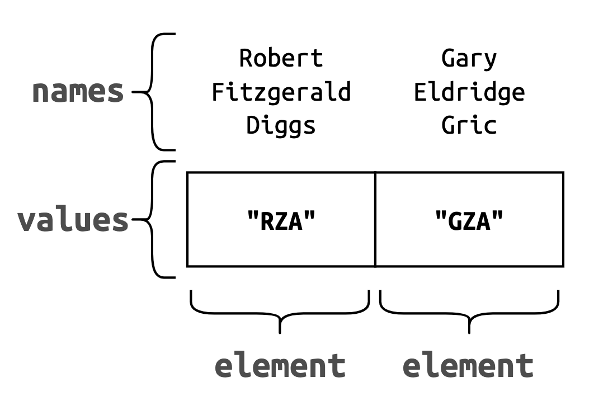
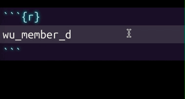

```{r setup, include = FALSE}
library(learnr)
library(rmdformats)
library(tidyr)
library(janitor)
library(stringr)
library(forcats)
library(skimr)
library(knitr)
library(gradethis)
library(data.table)
library(sheetcheatR)
library(reactable)
library(dplyr)
library(listviewer)
knitr::opts_chunk$set(
  error = TRUE,
  upload.fun = imgur_upload,
  fig.path = "www/",
  collapse = TRUE,
  exercise.cap = "subsetting",
  warning = FALSE,
  message = FALSE,
  dpi = 96,
  tibble.max_extra_cols = 6,
  tibble.width = 65
)
options(scipen = 999999999, width = 60)
strOptions(
  strict.width = "yes",
  digits.d = 1,
  vec.len = 2,
  list.len = 65,
  deparse.lines = NULL
)
gradethis_setup(exercise.reveal_solution = TRUE)
```

## Overview

There isn't a cheatsheet on subsetting, but there probably should be :)

When we want to extract an element from an object, the term for this action is [subsetting.](https://adv-r.hadley.nz/subsetting.html) Subsetting is used when we want a reduced portion (i.e. *subset*) of an object, or if we want to convert an object into a less complex structure (i.e. from a `data.frame` or `list` to a `vector`).

We're going to cover following topics:

1.  The index brackets: `[`  
2.  double brackets: `[[`  
3.  dollar sign: `$`


### 

### What are subsetting operators?

When composing human-readable text, these symbols are either used for 1) denoting units for currency (`$`), or 2) distinguishing a group of text from it's surroundings (`[]`).

These operators can be used to extract or replace values in R's data objects. They're often referred to as operators, but these are *actually* functions. See below:

```{r what-are-subsetting-operators, eval=TRUE}
class(`[`)
class(`[[`)
class(`$`)
```

## The Index Brackets

The index brackets come in two flavors: single brackets `object[x]` or double brackets `object[[x]]`. How the brackets work depend on 1) their placement with respect the assignment operator (`<-`), 2) the object they're being used with (vectors, matrices, data.frames, lists, etc.), and 3) the value provided (`x`).

When subsetting, we're typically looking to do one of two things:

1.  *Extract* a subset of elements from a data object  
2.  *Replace* a subset of elements in a data object

When the brackets are placed on the right-hand-side of an assignment operator (`<-`), the elements are extracted. If the brackets are placed on left-hand-side of the assignment operator (`<-`), the elements are replaced.

### Enter the Wu

```{r prepare_wu_members, echo=FALSE}
# Clifford Smith, Jr. = method man's real name
# Inspectah Deck != Inspector deck
wu_members <- c(`Robert Fitzgerald Diggs` = "RZA",
                `Gary Eldridge Gric` = "GZA",
                `Russell Tyrone Jones` = "ODB",
                `Andre Romelle Young` = "Method Man",
                `Corey Woods` = "Raekwon",
                `Dennis Coles` = "Ghostface Killah",
                `Jason Richard Hunter` = "Inspector deck",
                `Lamont Jody Hawkins` = "U-God",
                `Jamel Irief` = "Masta Killa",
                `Darryl Hill` = "Cappadonna")
# # check
# identical(
#   x = names(x = wu_members)[4] <- "Clifford Smith, Jr.", 
#   y = names(x = wu_members)[[4]] <- "Clifford Smith, Jr.")
# identical(
#   x = wu_members[7] <- "Inspectah Deck", 
#   y = wu_members[[7]] <- "Inspectah Deck")
```

```{r prepare_wu_small, echo=FALSE}
wu_small <- data.frame(
            member = c("RZA","GZA","ODB",
                       "Method Man","Raekwon","Ghostface Killah", 
                       "Inspectah Deck", "U-God","Masta Killa", 
                        "Cappadonna"),
              born = c(1969L,1966L,1968L,1971L,
                       1970L,1970L,1970L,1970L,1969L,1968L),
             alive = c(TRUE,TRUE,FALSE,TRUE,TRUE,
                       TRUE,TRUE,TRUE,TRUE,TRUE)
)
```

We're going to use a vector of [Wu-Tang Clan](https://en.wikipedia.org/wiki/Wu-Tang_Clan) members (an American hip hop group):

<br><br>

```{r Wu_Tang_Clan_on_Stage, echo=FALSE, fig.cap="source: https://en.wikipedia.org/wiki/Wu-Tang_Clan", out.height='90%', out.width='90%', fig.align='center'}
knitr::include_graphics(path = "https://upload.wikimedia.org/wikipedia/commons/8/80/Wu_Tang_Clan_on_Stage.jpg")
```

`wu_members` is a named vector with 10 values. View it's contents below:

```{r prepare_preview_wu_members, echo=FALSE, eval=TRUE}
# Clifford Smith, Jr. = method man's real name
# Inspectah Deck != Inspector deck
wu_members <- c(`Robert Fitzgerald Diggs` = "RZA",
                `Gary Eldridge Gric` = "GZA",
                `Russell Tyrone Jones` = "ODB",
                `Andre Romelle Young` = "Method Man",
                `Corey Woods` = "Raekwon",
                `Dennis Coles` = "Ghostface Killah",
                `Jason Richard Hunter` = "Inspector deck",
                `Lamont Jody Hawkins` = "U-God",
                `Jamel Irief` = "Masta Killa",
                `Darryl Hill` = "Cappadonna")
```

```{r preview_wu_members, echo=TRUE}
wu_members
```

### Elements, names, and values

We're going to clear up some jargon before we move ahead. The `wu_members` vector has ten **elements**, and each element has **value** and **name** attribute. For example, if check the attributes of the first and second elements from `wu_members`, we see the following:

```{r attributes, eval=FALSE}
# check attributes
attributes(wu_members[1:2])
## $names
## [1] "Robert Fitzgerald Diggs" "Gary Eldridge Gric"
```

We can see the `$names` attribute is a set of character values (one for each value in `wu_members`). If we deconstruct the first two elements with `dput()`, we can see these are created in `` `name` = "value" `` pairs.

```{r deconstruct, eval=FALSE}
# deconstruct 
dput(wu_members[1:2])
## c(`Robert Fitzgerald Diggs` = "RZA", 
##   `Gary Eldridge Gric` = "GZA")
```

The figure below displays how to think about elements, names, and values.

```{r element-name-value, echo=FALSE, fig.align='center', out.width='80%', out.height='80%'}

```

### 

Die-hard fans will notice two errors in `wu_members`:

1.  `Andre Romelle Young` isn't `"Method Man"`'s real name--it's [**`Clifford Smith, Jr.`**](https://en.wikipedia.org/wiki/Method_Man)

<!-- { width=40% height=40%} -->

```{r method_man-jpg, fig.cap="https://en.wikipedia.org/wiki/Method_Man", fig.align='right', echo=FALSE, out.height='35%', out.width='35%'}
knitr::include_graphics(path = "www/method_man.jpg")
```

2.  `Jason Richard Hunter`'s stage name is spelled incorrectly: it's currently spelled, `"Inspector deck"`, but it should be, [**`"Inspectah Deck"`**.](https://en.wikipedia.org/wiki/Inspectah_Deck)

<!-- { width=50% height=50%} -->

```{r inspectah_deck-jpg, fig.cap="https://en.wikipedia.org/wiki/Inspectah_Deck", fig.align='right', echo=FALSE, out.height='50%', out.width='50%'}
knitr::include_graphics(path = "www/inspectah_deck.jpg")
```

## Extraction

As we stated above, extraction with brackets requires placing the object we're subsetting *from* on the right-hand side of the assignment operator (and the extracted element on the left-hand side).

```{r single-vs-double-extract, eval=FALSE}
element <- object[x] # extract multiple elements x
element <- object[[x]] # extract single element x
```

### Extraction (`[x]`)

If we want to extract an element from a vector with single brackets, we can use numerical indexes or names (in quotes).

In the code block below,

1.  Extract the 4th and 7th elements in `wu_members` by placing single index brackets on the right-side of the assignment operator\
2.  Assign the extracted elements to `method_man_1b` and `inspectah_deck_1b`\
3.  Print `method_man_1b` and `inspectah_deck_1b` to the screen on the following lines.

```{r extract_single_bracket, exercise=TRUE,  exercise.lines=4, exercise.setup="prepare_wu_members"}
____ <- wu_members[____] # extract method_man_1b
____ <- wu_members[____] # extract inspectah_deck_1b
____
____
```

```{r extract_single_bracket-solution}
method_man_1b <- wu_members[4] # extract method_man_1b
inspectah_deck_1b <- wu_members[7] # extract inspectah_deck_1b
method_man_1b
inspectah_deck_1b
```

```{r extract_single_bracket-check}
gradethis::grade_code()
```

### 

We can see the previous output extracted 1) the values in quotes (`"Method Man"` and `"Inspector deck"`), and 2) the names without quotes (`Andre Romelle Young` and `Jason Richard Hunter`).

```{r names-values, echo=FALSE, out.height='100%', out.width='100%', fig.align='center'}
knitr::include_graphics(path = "www/names-values.png")
```

As it turns out, the `names` attribute can also be used to subset the values `wu_members` (just like their numerical positions).

In the code block below,

1.  Extract the elements with the `"Andre Romelle Young"` and `"Jason Richard Hunter"` names in `wu_members`, using single index brackets on the right-side of the assignment operator\
2.  Assign the extracted elements to `method_man_1bn` (for '1 bracket, name') and `inspectah_deck_1bn`\
3.  Compare `method_man_1b` to `method_man_1bn` and `inspectah_deck_1bn` to `inspectah_deck_1bn` with the two `identical()` functions on the following lines

```{r prepare_extract_single_bracket_name, echo=FALSE}
wu_members <- c(`Robert Fitzgerald Diggs` = "RZA",
                `Gary Eldridge Gric` = "GZA",
                `Russell Tyrone Jones` = "ODB",
                `Andre Romelle Young` = "Method Man",
                `Corey Woods` = "Raekwon",
                `Dennis Coles` = "Ghostface Killah",
                `Jason Richard Hunter` = "Inspector deck",
                `Lamont Jody Hawkins` = "U-God",
                `Jamel Irief` = "Masta Killa",
                `Darryl Hill` = "Cappadonna")
method_man_1b <- wu_members[4] # extract method_man_1b
inspectah_deck_1b <- wu_members[7] # extract inspectah_deck_1b
```

```{r extract_single_bracket_name, exercise=TRUE,  exercise.lines=6, exercise.setup="prepare_extract_single_bracket_name"}
____ <- wu_members[____] # extract method_man_1bn
____ <- wu_members[____] # extract inspectah_deck_1bn
# compare method man using identical 
identical(x = ____, y = ____)
# compare Inspectah Deck using identical
identical(x = ____, y = ____)
```

```{r extract_single_bracket_name-solution}
method_man_1bn <- wu_members["Andre Romelle Young"] 
inspectah_deck_1bn <- wu_members["Jason Richard Hunter"] 
# compare method man using identical 
identical(x = method_man_1b, y = method_man_1bn)
# compare Inspectah Deck using identical
identical(x = inspectah_deck_1b, y = inspectah_deck_1bn)
```

```{r extract_single_bracket_name-check}
gradethis::grade_code()
```

### 

Correcting the elements in `wu_members` presents a bit of a pickle--we need to replace the ***name*** of element `4` (`Andre Romelle Young` needs to be **`Clifford Smith, Jr.`**) and the ***value*** of element `7` (`"Inspector deck"` needs to be **`"Inspectah Deck"`**).

<br>

```{r wu_members-png, out.height='100%', out.width='100%', echo=FALSE}
knitr::include_graphics(path = "www/wu_members.png")
```

<br>

We're going to explore extraction and replacement with the double brackets to see if it can help us get `wu_members` sorted out.

### Extraction (`[[x]]`)

In the code block below,

1.  Extract the 4th and 7th elements in `wu_members` by placing *double* index brackets on the right-side of the assignment operator (`<-`)\
2.  Assign the extracted elements to `method_man_2b` and `inspectah_deck_2b`\
3.  Print `method_man_2b` and `inspectah_deck_2b` to the screen on the following lines

```{r extract_double_bracket, exercise=TRUE,  exercise.lines=4, exercise.setup="prepare_wu_members"}
____ <- wu_members[[____]] # extract method_man
____ <- wu_members[[____]] # extract inspectah_deck
____
____
```

```{r extract_double_bracket-solution}
method_man_2b <- wu_members[[4]] # extract method_man
inspectah_deck_2b <- wu_members[[7]] # extract inspectah_deck
method_man_2b
inspectah_deck_2b
```

```{r extract_double_bracket-check}
gradethis::grade_code()
```

### 

As we can see from the two exercises above, using a single bracket extracts multiple elements (i.e. the stage name **value** and the given **name** of the Wu-Tang Clan member), while using double brackets extracts only a single element (i.e., stage name **value**).

We'll use these rules to replace the incorrect values in `wu_members`.

## Replacement

We've just covered extraction using single and double brackets. In these next exercises, we're going to use brackets to replace values in `wu_members`.

Recall that replacement requires the brackets to be placed on the left-hand side of the assignment operator (and replacement value).

```{r single-vs-double-replace, eval=FALSE}
object[x] <- element # replace multiple elements x
object[[x]] <- element # replace single element x
```

### Replacment (`[x]`)

We're going to replace the `"Inspector deck"` value with `"Inspectah Deck"` using this elements `name` attribute (`Jason Richard Hunter`) instead of it's position (a name is more precise than a number--sometimes values get sorted or rearranged--and we want to be as explicit as we can for the element we want to replace).

1.  Place `wu_members` on the *left-hand* side of the assignment operator (`<-`)\
2.  Place the correct spelling of Jason Richard Hunter's stage name in quotes on the *right-hand* side of the assignment operator\
3.  Print `wu_members` to the screen

```{r single_bracket_replacement, exercise=TRUE, exercise.lines=2,  exercise.setup="prepare_wu_members"}
____["Jason Richard Hunter"] <- "____"
____
```

```{r single_bracket_replacement-solution}
wu_members["Jason Richard Hunter"] <- "Inspectah Deck"
wu_members
```

```{r single_bracket_replacement-check}
gradethis::grade_code()
```

### 

***What happened?***

```{r wu_members_replacement_single_bracket, eval=TRUE, echo=FALSE}
# Clifford Smith, Jr. = method man's real name
# Inspectah Deck != Inspector deck
wu_members <- c(`Robert Fitzgerald Diggs` = "RZA",
                `Gary Eldridge Gric` = "GZA",
                `Russell Tyrone Jones` = "ODB",
                `Andre Romelle Young` = "Method Man",
                `Corey Woods` = "Raekwon",
                `Dennis Coles` = "Ghostface Killah",
                `Jason Richard Hunter` = "Inspector deck",
                `Lamont Jody Hawkins` = "U-God",
                `Jamel Irief` = "Masta Killa",
                `Darryl Hill` = "Cappadonna")
```

When we placed the `name` for the element in single brackets, it extracted *both* the name *and* the value.

```{r check-Jason-Richard-Hunter}
wu_members["Jason Richard Hunter"]
```

```{r sb-extract, echo=FALSE, out.width='100%', out.height='100%'}
knitr::include_graphics(path = "www/sb-extract.png")
```

Then we added an assignment operator and corrected stage name, which assigned the new value to to the vector.

```{r check-Inspectah-Deck}
wu_members["Jason Richard Hunter"] <- "Inspectah Deck"
wu_members[7]
```

```{r sb-replace, echo=FALSE, out.width='100%', out.height='100%'}
knitr::include_graphics(path = "www/sb-replace.png")
```

### Replacement (`[[x]]`)

To replace the Method Man's given name, we need to access the `$names` (and only the `$names`) in the `wu_members` vector. We can do this with the `names()` function. Try it out on `wu_members` in the code block below:

```{r prepare_wu_members_2, echo=FALSE, eval=TRUE}
# the Inspectah Deck has been fixed, but not Andre Romelle Young!
wu_members <- c(`Robert Fitzgerald Diggs` = "RZA",
                `Gary Eldridge Gric` = "GZA",
                `Russell Tyrone Jones` = "ODB",
                `Andre Romelle Young` = "Method Man",
                `Corey Woods` = "Raekwon",
                `Dennis Coles` = "Ghostface Killah",
                `Jason Richard Hunter` = "Inspectah Deck",
                `Lamont Jody Hawkins` = "U-God",
                `Jamel Irief` = "Masta Killa",
                `Darryl Hill` = "Cappadonna")
```

```{r try-names-wu_members, exercise=TRUE, exercise.setup="prepare_wu_members_2", exercise.lines=3}
names(x = ____)
```

```{r try-names-wu_members-solution}
names(x = wu_members)
```

```{r try-names-wu_members-check}
gradethis::grade_code()
```

In the code block below, we're going to replace the `name` of a single element (i.e., the `name` of element `4`) in `wu_members` by placing the index brackets on the *left-hand* side of the assignment operator, and the replacement value on the *right-hand* side.

1.  Enter the `wu_members` vector in the `x` argument for `names()`\
2.  Place the correct given name of Method Man (`"Clifford Smith, Jr."`) in the quotes\
3.  Print `wu_members` to the screen

```{r change_wu_members, exercise=TRUE, exercise.lines=2, exercise.setup="prepare_wu_members_2"}
names(x = ____)[[4]] <- "____"
____
```

```{r change_wu_members-solution}
names(x = wu_members)[[4]] <- "Clifford Smith, Jr."
wu_members
```

```{r change_wu_members-check}
gradethis::grade_code()
```

### 

***What happened?***

When we used `names()` on `wu_members`, it returned a character vector with *only* the given names.

```{r prepare_wu_members_3, echo=FALSE, eval=TRUE}
# the Inspectah Deck has been fixed, but not Andre Romelle Young!
wu_members <- c(`Robert Fitzgerald Diggs` = "RZA",
                `Gary Eldridge Gric` = "GZA",
                `Russell Tyrone Jones` = "ODB",
                `Andre Romelle Young` = "Method Man",
                `Corey Woods` = "Raekwon",
                `Dennis Coles` = "Ghostface Killah",
                `Jason Richard Hunter` = "Inspectah Deck",
                `Lamont Jody Hawkins` = "U-God",
                `Jamel Irief` = "Masta Killa",
                `Darryl Hill` = "Cappadonna")
```

```{r print-wu_names, echo=TRUE}
names(wu_members)
```

Then, by placing the double brackets directly on the *right-hand* side of the `names()` function, we've extracted *only* the 4th value in the output character vector:

```{r print-4th-wu-name, echo=TRUE}
names(wu_members)[[4]]
```

```{r db-extract, echo=FALSE, out.width='100%', out.height='100%'}
knitr::include_graphics(path = "www/db-extract.png")
```

Finally, when we added the assignment operator and replacement value, the *name* for the value at position `4` is changed (but not the underlying value).

```{r print-fixed-4th-wu-name, echo=TRUE}
names(x = wu_members)[[4]] <- "Clifford Smith, Jr."
names(wu_members)[[4]]
```

```{r db-replace, echo=FALSE, out.width='100%', out.height='100%'}
knitr::include_graphics(path = "www/db-replace.png")
```

### Recap

Using a single index bracket (`[]`) extracts/replaces multiple elements, and two index brackets (`[[]]`) extracts/replaces a single element. If we're working with vectors, two brackets will extract or replace the same element as using a single bracket.

For example, in the exercise above we used `names(x = wu_members)[[4]]`, which returns only the *name* for the value at position `4`.

Based on what we've learned, decide whether `x` and `y` arguments in the `identical()` function below will be `TRUE` or `FALSE`

```{r prepare_wu_members_fixed, echo=FALSE, eval=TRUE}
wu_members <- c(`Robert Fitzgerald Diggs` = "RZA",
                `Gary Eldridge Gric` = "GZA",
                `Russell Tyrone Jones` = "ODB",
                `Clifford Smith, Jr.` = "Method Man",
                `Corey Woods` = "Raekwon",
                `Dennis Coles` = "Ghostface Killah",
                `Jason Richard Hunter` = "Inspectah Deck",
                `Lamont Jody Hawkins` = "U-God",
                `Jamel Irief` = "Masta Killa",
                `Darryl Hill` = "Cappadonna")
```

```{r identical-double-brackets, eval=FALSE}
identical(
  x = names(x = wu_members)[[4]], 
  y = names(x = wu_members)[4])
```

```{r identical-double-brackets-tf, exercise=TRUE, exercise.lines=2}
# enter TRUE or FALSE
```

```{r identical-double-brackets-tf-solution}
TRUE
```

```{r identical-double-brackets-tf-check}
gradethis::grade_code()
```

## The `$` operator

Hidden away in the help documentation (<code>?\`[[\`</code>) is a very important point about the three subsetting operators:

> *The most important distinction between `[`, `[[` and `$` is that the `[` can select more than one element whereas the other two select a single element.*

As stated above, `$` and `[[` are similar. However, `$` only works on recursive objects, like `lists` and `data.frame`s.

Let's convert the previous `wu_members` vector into a `data.frame`, with two columns: `name` and `member`.

```{r prepare_wu_member_df, echo=TRUE, eval=TRUE}
wu_members <- c(`Robert Fitzgerald Diggs` = "RZA",
                `Gary Eldridge Gric` = "GZA",
                `Russell Tyrone Jones` = "ODB",
                `Clifford Smith, Jr.` = "Method Man",
                `Corey Woods` = "Raekwon",
                `Dennis Coles` = "Ghostface Killah",
                `Jason Richard Hunter` = "Inspectah Deck",
                `Lamont Jody Hawkins` = "U-God",
                `Jamel Irief` = "Masta Killa",
                `Darryl Hill` = "Cappadonna")
```

In the code block below:

1.  Create `member_names` from the `names()` of `wu_members`\
2.  In `data.frame()`, create two columns:\

-   `member`: the original `wu_members` vector\
-   `name`: the new `member_names` vector

```{r wu_member_df, exercise=TRUE, exercise.lines=6, exercise.setup="prepare_wu_member_df"}
# create member_names
member_names <- names(____)
# create df
wu_member_df <- data.frame(
                  member = ____, 
                  name = ____) 
```

```{r wu_member_df-solution}
# create member_names
member_names <- names(wu_members)
# create df
wu_member_df <- data.frame(
                  member = wu_members, 
                  name = member_names) 
```

```{r wu_member_df-check}
gradethis::grade_code()
```

### 

### Tab completion with `$`

One of the handy aspects of the `$` operator is it gives us access to the named elements in a recursive object. For example, if we're trying to access the first element in `wu_member_df`, we could use the `$` operator to see which names pop-up in RStudio:

```{r dollar-sign-completion, echo=FALSE, fig.cap="Pretty neat, huh?", fig.align='center'}

```

### Partial matching

One thing to pay attention to when using the `$` operator is partial matching. By default, `$` will match any element that matches the characters following it.

For example,

In the code block below,

1.  Extract the `name` column below `wu_members_df` using only `$na`:

```{r prepare_partial_match, eval=TRUE, echo=FALSE}
wu_members <- c(`Robert Fitzgerald Diggs` = "RZA",
                `Gary Eldridge Gric` = "GZA",
                `Russell Tyrone Jones` = "ODB",
                `Clifford Smith, Jr.` = "Method Man",
                `Corey Woods` = "Raekwon",
                `Dennis Coles` = "Ghostface Killah",
                `Jason Richard Hunter` = "Inspectah Deck",
                `Lamont Jody Hawkins` = "U-God",
                `Jamel Irief` = "Masta Killa",
                `Darryl Hill` = "Cappadonna")
# create member_names
member_names <- names(wu_members)
# create df
wu_member_df <- data.frame(
                  member = wu_members, 
                  name = member_names) 
```

```{r partial_match, exercise=TRUE, exercise.setup="prepare_partial_match"}
# match names with 'na'
wu_member_df$__
```

```{r partial_match-solution}
wu_member_df$na
```

```{r partial_match-check}
gradethis::grade_code()
```

This behavior is similar to the `exact` argument in the double brackets (`[[ , exact = ]]`. By default, exact is set to `TRUE`, but if we change it to `FALSE`, the double brackets will have the same behavior as above.

In the code block below:

1.  Use double brackets to extract the `name` column from `wu_member_df` with only the first two letters (i.e., `"na"`)
2.  Set the `exact` argument to `FALSE`

```{r partial_match_db, exercise=TRUE, exercise.setup="prepare_partial_match"}
wu_member_df[[____, exact = ____]]
```

```{r partial_match_db-solution}
wu_member_df[["na", exact = FALSE]]
```

```{r partial_match_db-check}
gradethis::grade_code()
```

### Recap

While it's handy to use `$` if you're quickly exploring a column in a `data.frame` or `list`, it's usually better to stick with brackets because they give you more precision and control over what you're extracting/replacing (as you'll see in the exercises below).

## Vector Subsetting

```{r prepare-wu_members, include=FALSE}
wu_tbl <- sheetcheatR::wu_tbl
wu_members <- wu_tbl[['member']]
```

We've created a new version of `wu_members` *without* the members given names (view it in the code chunk by clicking on the **Run Code** button):

```{r wu_members, exercise=TRUE}
wu_members <- c("RZA", "GZA", "ODB", "Method Man", "Raekwon", 
                "Ghostface Killah", "Inspectah Deck", "U-God", 
                "Masta Killa", "Cappadonna")
wu_members
```

The exercises below will give you some practice subsetting with vectors.

###

### Vector indexing (with `[`)

In the code block below:

1.  Subset `wu_members` using brackets and the element at position `5`\
2.  Subset `wu_members` using brackets and the element at position `2`

```{r int_vec_index, exercise=TRUE, exercise.setup = "prepare-wu_members"}
# subset the number at position 5

# subset the number at position 2

```

```{r int_vec_index-solution}
# subset the number at position 5
wu_members[5]
# subset the number at position 2
wu_members[2]
```

```{r int_vec_index-check}
gradethis::grade_this_code()
```

### Vector indexing (`[` and `:`)

We can use the `:` to create a range of integers (see below):

```{r integer-range, eval=TRUE, echo=TRUE}
1:5
```

We can also use `:` to subset a range of indexes. For example, if we wanted to index elements at positions 1 through 3, we could use `1:3`.

In the code block below:

Subset the numbers from position 2-4 using `2:4`:

```{r int_vec_index_range, exercise=TRUE, exercise.setup = "prepare-wu_members"}
# subset numbers 2-4 

```

```{r int_vec_index_range-solution}
wu_members[2:4]
```

```{r int_vec_index_range-check}
gradethis::grade_this_code()
```

Note that the output from `wu_members[2:4]` is another character vector (of the elements we've subsetted).

In the code block below:

1.  Store the output from `wu_members[2:4]` as `subset_wu_mem`\
2.  Check the structure with `str()`

```{r int_vec_index_range_str, exercise=TRUE, exercise.setup = "prepare-wu_members"}
subset_wu_mem <- wu_members[____:____]
str(____)
```

```{r int_vec_index_range_str-solution}
subset_wu_mem <- wu_members[2:4]
str(subset_wu_mem)
```

```{r int_vec_index_range_str-check}
gradethis::grade_this_code()
```

We can see this is a character vector with three members.

### Negative vector indexing (with `-`)

We can also ***omit*** elements (as opposed to extracting) using indexing by placing a negative (`-`) sign in front of the index.

In the code block below:

1.  Omit the number at position `2` from `wu_members` using brackets

```{r neg-int_vec_index, exercise=TRUE, exercise.setup = "prepare-wu_members"}
# remove the number at position 2

```

```{r neg-int_vec_index-solution}
wu_members[-2]

```

```{r neg-int_vec_index-check}
gradethis::grade_this_code()
```

We can also use negative indexing to remove a range of values from a vector.

In the code block below:

1.  Remove the numbers from position `0` to `3` from `wu_members` using `-` and brackets

```{r neg-int_vec_index_range, exercise=TRUE, exercise.setup = "prepare-wu_members"}
# remove the numbers from positions 0 through 3
wu_members[-___:____]
```

```{r neg-int_vec_index_range-solution}
wu_members[-0:3]
```

```{r neg-int_vec_index_range-check}
gradethis::grade_this_code()
```

**Note:** if you're using a negative index it should start at `0`, otherwise you'll get an error (`only 0's may be mixed with negative subscripts`).

### Vector indexing (with `c()`)

We can also use vectors to subset `wu_members`. The simplest example of this involves creating a logical vector with `TRUE` values placed in the location of the elements we'd like to return, and `FALSE` elements for those we'd like to omit.

```{r log-indexing, echo=TRUE, eval=TRUE}
wu_members <- c(2L, 9L, 4L, 3L, 7L)
# logical vector for indexing (TRUE values are returned)
log_index <- c(TRUE, FALSE, FALSE, TRUE, FALSE)
wu_members[log_index]
```

###

If we subset using a numeric vector, the values will be interpreted as the *positions* (or indexes) for the values we'd like to return.

In the code block below:

1.  Create `vec_index`, which contains an index for three positions in `wu_members`  
2.  Subset `wu_members` with `vec_index`

```{r int_vec_vec_index, exercise=TRUE, exercise.setup = "prepare-wu_members"}
# create vec_index
____ <- c(2, 3, 4)
# subset wu_members with vec_index
____[vec_index]
```

```{r int_vec_vec_index-solution}
vec_index <- c(2, 3, 4)
wu_members[vec_index]
```

```{r int_vec_vec_index-check}
gradethis::grade_this_code()
```

###

We can see the `wu_members[vec_index]` returns the same result as `wu_members[2:4]`.

```{r identical-wu_members, echo=FALSE, eval=TRUE}
wu_members <- c(2L, 9L, 4L, 3L, 7L)
vec_index <- c(2, 3, 4)
```

```{r identical-wu_members-indexing}
identical(
  x = wu_members[vec_index], 
  y = wu_members[2:4])
```

### Negative vector indexing (with `c()` or another vector)

We can use vectors and `c()` for negative indexing the same way we used them to subset above. To omit the values using a vector (or a list of values created with `c()`), place a negative sign (`-`) in front of the vector.

In the code block below:

1.  Create `neg_vec_index` for values at positions `1` and `5`\
2.  Use this to subset the `wu_members` vector (with negative indexing)

```{r int_vec_neg_vec_index, exercise=TRUE, exercise.setup = "prepare-wu_members"}
neg_vec_index <- c(1, 5)
wu_members[-____]
```

```{r int_vec_neg_vec_index-solution}
neg_vec_index <- c(1, 5)
wu_members[-neg_vec_index]
```

```{r int_vec_neg_vec_index-check}
gradethis::grade_this_code()
```

This will return everything *but* the elements in these positions.

### Vector indexing (with `[[]]`)

We can also use double-brackets to subset a **single** position from a vectors.

In the code block below:

1.  Store the output from indexing the element at position `4` from `wu_members` with a single bracket in `wu_sgl_brkt` (*wu single bracket*)

2.  Store the output from indexing the element at position `4` from `wu_members` with double-brackets in `wu_dbl_brkt` (*wu double bracket*)

3.  Compare `wu_sgl_brkt` to `wu_dbl_brkt` using the `identical(x = , y = )` function.

```{r indentical-single-double-bracket, exercise=TRUE, exercise.setup = "prepare-wu_members"}
wu_sgl_brkt <- wu_members
wu_dbl_brkt <- wu_members
identical(x = ____, y = ____)
```

```{r indentical-single-double-bracket-solution}
wu_sgl_brkt <- wu_members[4]
wu_dbl_brkt <- wu_members[[4]]
identical(x = wu_sgl_brkt, y = wu_dbl_brkt)
```

```{r indentical-single-double-bracket-check}
gradethis::grade_this_code()
```

###

***What happened?***

**How can the extracted values from single brackets be identical to the extracted output from double brackets?** 

Let's take a step back and look at the `wu_members` vector using `unclass()`. 

```{r no-names-wu-members, eval=TRUE, echo=TRUE}
wu_members <- c("RZA", "GZA", "ODB", "Method Man", "Raekwon",
                "Ghostface Killah", "Inspectah Deck",
                "U-God", "Masta Killa", "Cappadonna")
unclass(wu_members)
```

We can see the `wu_members` elements only consist of 10 character values. If we check for attributes, we see there aren't any: 

```{r}
attributes(wu_members)
```

###

The reason the value returned from the element at position `[4]` is identical to the element at position `[[4]]` is because they're are no additional attributes (or 'layers') to this element (or the `wu_members` vector). 

```{r}
identical(
  x = wu_members[4], 
  y = wu_members[[4]])
```

###

However, we previously dealt with a named version of `wu_members`. We've loaded that vector below as `wu_members_nmd`:

```{r assign-wu-names, eval=TRUE, echo=FALSE}
wu_nms <- c(
    "Robert Fitzgerald Diggs",
    "Gary Eldridge Gric",
    "Russell Tyrone Jones",
    "Clifford Smith, Jr.",
    "Corey Woods",
    "Dennis Coles",
    "Jason Richard Hunter",
    "Lamont Jody Hawkins",
    "Jamel Irief",
    "Darryl Hill")
names(wu_members) <- wu_nms
wu_members_nmd <- wu_members
rm(wu_members)
```

```{r wu_members_nmd, eval=TRUE}
wu_members_nmd
```

###

As we can see, `wu_members_nmd` has a `name` attribute:

```{r}
attributes(wu_members_nmd)
```

Which is why the elements extracted with a single and double brackets aren't identical: 

```{r}
wu_members_nmd[4]
wu_members_nmd[[4]]
identical(
  x = wu_members_nmd[4], 
  y = wu_members_nmd[[4]])
```

###

This subtle difference isn't as apparent with simple vectors, but it becomes more important as we move onto more complex objects. 

###

Double brackets really come in handy when we're subsetting more complex objects (like `data.frame`s or `list`s), but it's important to remember that `[[` will *only* return a single value from a vector, so the previous methods for extracting multiple values with `[` won't work. 

See below:

```{r double_bracket_indexing_error_01, eval=FALSE}
wu_members[[2:4]]
# Error in wu_members[[2:4]] : 
#  attempt to select more than one element in vectorIndex
wu_members[[c(2, 3, 4)]]
# Error in wu_members[[c(2, 3, 4)]] : 
#  attempt to select more than one element in vectorIndex
```

### Recap 

We've learned the following about vector subsetting: 

1. We can index vectors with numbers (`vector[1]`), integer ranges (`vector[1:3]`), other vectors (`vector[vector]`).

2. Omitting or removing elements follow the same rules, but require a negative sign (`vector[-[1]]`, `vector[-1:3]`).

3. If the elements have the name attribute, the name can be used like an index for extraction or replacement (`vector["name"]`). 

4. Double-brackets *won't* work with a numerical range or vector index that returns multiple values.

## List Subsetting 

Lists are special objects in R because they're heterogeneous, which means they can hold elements of any type (not just vectors). These elements can also be of different length. 

```{r prepare_wu_studio_albums, echo=FALSE, eval=TRUE}
album <- c("Enter the Wu-Tang (36 Chambers)",
            "Wu-Tang Forever", "The W",
            "Iron Flag", "8 Diagrams",
            "A Better Tomorrow",
            "Once Upon a Time in Shaolin")
year <- c(1993L, 1997L, 2000L, 2001L, 2007L, 2014L, 2015L)
wu_studio_albums <- matrix(
  data = c(album, year),
  ncol = 2,
  dimnames = list(c(1:7), c("album", "year"))
)
```

For example, below we have a matrix of [Wu-Tang Clan](https://en.wikipedia.org/wiki/Wu-Tang_Clan#Studio_albums) studio albums (view it in the code chunk by clicking on the **Run Code** button):

```{r wu_studio_albums, exercise=TRUE, exercise.setup="prepare_wu_studio_albums"}
wu_studio_albums
```

###

### Creating lists 

One of the great things about lists is their versatility. For example, `wu_studio_albums` can be combined with additional vectors containing information on Wu-Tang Clan group members to form `wu_list`: 

```{r wu_list, eval=TRUE, echo=TRUE}
wu_list <- list(
  member = c(
    "RZA", "GZA", "ODB", "Method Man",
    "Raekwon", "Ghostface Killah", "Inspectah Deck",
    "U-God", "Masta Killa", "Cappadonna"
  ),
  name = c(
    "Robert Fitzgerald Diggs", "Gary Eldridge Gric",
    "Russell Tyrone Jones", "Clifford Smith, Jr.",
    "Corey Woods", "Dennis Coles",
    "Jason Richard Hunter", "Lamont Jody Hawkins",
    "Jamel Irief", "Darryl Hill"
  ),
  born = c(1969L, 1966L, 1968L, 1971L, 1970L, 1970L,
    1970L, 1970L, 1969L, 1968L
  ),
  alive = c(
    TRUE, TRUE, FALSE, TRUE, TRUE,
    TRUE, TRUE, TRUE, TRUE, TRUE
  ), 
  albums = wu_studio_albums
)
```

###


As we can see, `wu_list` contains four vectors (`member`, `name`, `born`, and `alive`) *and* the matrix of `albums`. 

```{r print-wu_list, echo=TRUE}
wu_list
```


### Viewing lists 

```{r prepare_wu_list, echo=FALSE, eval=TRUE}
album <- c("Enter the Wu-Tang (36 Chambers)",
            "Wu-Tang Forever", "The W",
            "Iron Flag", "8 Diagrams",
            "A Better Tomorrow",
            "Once Upon a Time in Shaolin")
album_year <- c(1993L, 1997L, 2000L, 2001L, 2007L, 2014L, 2015L)
wu_studio_albums <- matrix(
  data = c(album, album_year),
  ncol = 2,
  dimnames = list(c(1:7), c("album", "year"))
)
wu_list <- list(
  member = c(
    "RZA", "GZA", "ODB", "Method Man",
    "Raekwon", "Ghostface Killah", "Inspectah Deck",
    "U-God", "Masta Killa", "Cappadonna"
  ),
  name = c(
    "Robert Fitzgerald Diggs", "Gary Eldridge Gric",
    "Russell Tyrone Jones", "Clifford Smith, Jr.",
    "Corey Woods", "Dennis Coles",
    "Jason Richard Hunter", "Lamont Jody Hawkins",
    "Jamel Irief", "Darryl Hill"
  ),
  born = c(1969L, 1966L, 1968L, 1971L, 1970L, 1970L,
    1970L, 1970L, 1969L, 1968L
  ),
  alive = c(
    TRUE, TRUE, FALSE, TRUE, TRUE,
    TRUE, TRUE, TRUE, TRUE, TRUE
  ), 
  albums = wu_studio_albums
)
```


Helpful functions for viewing lists include `str()` and `dplyr`s `glimpse()`. Try them in the code chunk below: 

```{r view_wu_list, exercise=TRUE, exercise.setup="prepare_wu_list"}
str(____)
dplyr::glimpse(____)
```

```{r view_wu_list-solution}
str(wu_list)
dplyr::glimpse(wu_list)
```

```{r view_wu_list-check}
gradethis::grade_this_code()
```

###

I also like using the `jsonedit()` function from the `listviewer` package to view lists.  

```{r listviewer-jsonedit, message=FALSE, warning=FALSE}
library(listviewer)
listviewer::jsonedit(listdata = wu_list)
```

As you can see, if gives a nice display of the hierarchy of the items.

### List Subsetting (with `[`)

Subsetting lists with a single bracket works much like subsetting a vector. We can extract a single element using numerical indexing: 

```{r single-bracket-list-number, eval=TRUE}
wu_list[1]
```

Or we can use a name

```{r single-bracket-list-name, eval=TRUE}
wu_list["member"]
```

If we'd like to extract multiple elements, we can use a range

```{r single-bracket-list-range, eval=TRUE}
wu_list[1:2]
```

Or multiple names 

```{r single-bracket-list-names, eval=TRUE}
wu_list[c("member", "name")]
```

The important thing to pay attention to is what type of element is returned. 

In the code block below, 

1. Extract the `member` and `albums` elements from `wu_list` using single brackets  
2. Store these in `wu_m` and `wu_a`. 
3. Check their structure with `class()` 

```{r sbl_01, exercise=TRUE, exercise.setup="prepare_wu_list"}
wu_m <- wu_list["____"]
wu_a <- wu_list["____"]
class(____)
class(____)
```

```{r sbl_01-solution}
wu_m <- wu_list["member"]
wu_a <- wu_list["albums"]
class(wu_m)
class(wu_a)
```

```{r sbl_01-check}
gradethis::grade_this_code()
```

### 

**What happened?**

**When we extract items from a list using a single bracket, the result will always be a list**. This is why the vector of `members` and the matrix of studio `albums` were returned as a lists. It's not that these items have been converted to a list--they're just still in their original 'packaging'. 

To get to the individual values in a list element, we need to use double brackets. 

### List Subsetting (with `[[`)

As noted above, using a single bracket to extract elements from a list will always return a list. If we want to return the element values (and type) we use the double brackets (`[[`). 

In the code block below: 

1. Extract the `member` and `albums` elements from `wu_list` again, but this time using double brackets  
2. Store these in `wu_m` and `wu_a`  
3. Check their structure with `str()` 

```{r dbl_01, exercise=TRUE, exercise.setup="prepare_wu_list"}
wu_m <- wu_list[["____"]]
wu_a <- wu_list[["____"]]
class(____)
class(____)
```

```{r dbl_01-solution}
wu_m <- wu_list[["member"]]
wu_a <- wu_list[["albums"]]
class(wu_m)
class(wu_a)
```

```{r dbl_01-check}
gradethis::grade_this_code()
```

###

***What happened?***

Recall that we used double brackets to subset our named `wu_member` vector, it omitted the name and returned only the value: 

```{r prep_recall_wu_members_extraction, echo=FALSE, eval=TRUE}
# fixed! 
wu_members <- c(`Robert Fitzgerald Diggs` = "RZA",
                `Gary Eldridge Gric` = "GZA",
                `Russell Tyrone Jones` = "ODB",
                `Clifford Smith, Jr.` = "Method Man",
                `Corey Woods` = "Raekwon",
                `Dennis Coles` = "Ghostface Killah",
                `Jason Richard Hunter` = "Inspectah Deck",
                `Lamont Jody Hawkins` = "U-God",
                `Jamel Irief` = "Masta Killa",
                `Darryl Hill` = "Cappadonna")
```

```{r recall_wu_members_extraction}
wu_members["Clifford Smith, Jr."]
wu_members[["Clifford Smith, Jr."]]
```

The same principle applies to lists: one bracket returns multiple elements, two brackets returns a single element.  

###

The Advanced R's text has a [great metaphor for subsetting lists](https://adv-r.hadley.nz/subsetting.html#subset-single), which we'll demonstrate below: 

> "*If list `x` is a train carrying objects, then `x[[5]]` is the object in car `5`; `x[4:6]` is a train of cars `4`-`6`.*"

```{r advr-demo, eval=TRUE, echo=TRUE}
# build train 
x <- list(1:3, "a", 4:6)
x
```

```{r train-png, echo=FALSE, fig.align='center', fig.cap="source = https://adv-r.hadley.nz/subsetting.html#subset-single", out.height='70%', out.width='70%'}
knitr::include_graphics(path = "www/train.png")
```

###


> "*When extracting a single element, you have two options: you can create a smaller train, i.e., fewer carriages, or you can extract the contents of a particular carriage. This is the difference between `[` and `[[`:*"

```{r train-single-code-01, eval=TRUE, echo=TRUE}
x[1]
```

```{r train-single-01, echo=FALSE, fig.align='center', fig.cap="source = https://adv-r.hadley.nz/subsetting.html#subset-single", out.height='100%', out.width='100%'}
knitr::include_graphics(path = "www/train-single-01.png")
```

```{r train-single-code-02, eval=TRUE, echo=TRUE}
x[[1]]
```

```{r train-single-02, echo=FALSE, fig.align='center', fig.cap="source = https://adv-r.hadley.nz/subsetting.html#subset-single", out.height='100%', out.width='100%'}
knitr::include_graphics(path = "www/train-single-02.png")
```

###

> "*When extracting multiple (or even zero!) elements, you have to make a smaller train:*"

```{r train-multiple-code-01, eval=TRUE, echo=TRUE}
# "cars 1 & 2" 
x[1:2]
```

```{r train-multiple-01, echo=FALSE, fig.align='center', fig.cap="source = https://adv-r.hadley.nz/subsetting.html#subset-single", out.height='100%', out.width='100%'}
knitr::include_graphics(path = 
"www/train-multiple-01.png")
```

###

```{r train-multiple-code-02, eval=TRUE, echo=TRUE}
# "not car 2"
x[-2]
```

```{r train-multiple-02, echo=FALSE, fig.align='center', fig.cap="source = https://adv-r.hadley.nz/subsetting.html#subset-single", out.height='100%', out.width='100%'}
knitr::include_graphics(path = 
"www/train-multiple-02.png")
```

###

```{r train-multiple-code-03, eval=TRUE, echo=TRUE}
# "car 1, twice"
x[c(1,1)]
```

```{r train-multiple-03, echo=FALSE, fig.align='center', fig.cap="source = https://adv-r.hadley.nz/subsetting.html#subset-single", out.height='100%', out.width='100%'}
knitr::include_graphics(path = 
"www/train-multiple-03.png")
```

###

```{r train-multiple-code-04, eval=TRUE, echo=TRUE}
# "just the train, no cars"
x[0]
```

```{r train-multiple-04, echo=FALSE, fig.align='center', fig.cap="source = https://adv-r.hadley.nz/subsetting.html#subset-single", out.height='70%', out.width='70%'}
knitr::include_graphics(path = 
"www/train-multiple-04.png")
```

### List Subsetting (with `$`)

The `$` shorthand operator can be used to subset lists (just like the `data.frame` example above). RStudio also makes it easy to use `$` to subset the items in a list (see below):

```{r subset-wu-list, echo=FALSE, fig.align='center', fig.cap="In RStudio IDE", out.height='70%', out.width='70%'}
knitr::include_graphics(path = "www/subset-wu-list.gif")
```

###

The `$` is also handy for extracting recursive (or nested) objects. For example, the code below can be used to extract the first three studio albums names and release dates from `wu_studio_albums`. 

```{r prep-wu_studio_albums-example, eval=TRUE, echo=FALSE}
wu_studio_albums <- matrix(data =
    c(c("Enter the Wu-Tang (36 Chambers)",
        "Wu-Tang Forever",
        "The W",
        "Iron Flag",
        "8 Diagrams",
        "A Better Tomorrow",
        "Once Upon a Time in Shaolin"),
      c(1993L, 1997L, 2000L, 2001L, 2007L, 2014L, 2015L)),
  nrow = 7,
  ncol = 2 ,
  dimnames = list(c(1:7),
    c("album", "year")))
```

```{r exrtact-matrix-example, eval=TRUE, echo=TRUE}
wu_studio_albums[1:3, c("album", "year")]
```

What if we wanted to extract this from `wu_list`? 

In the code block below: 

1. Extract the first three `album`(s) and their release `year` from `wu_list` and store them in `wu_early_work`  
2. Check the class() of `wu_early_work` 
3. Print `wu_early_work` to the screen 

```{r dbl_02, exercise=TRUE, exercise.setup="prepare_wu_list"}
# extract the album and year from album 
wu_early_work <- wu_list$____[1:3, c("____", "____")]
# check class 
class(____)
# print 
____
```

```{r dbl_02-solution}
# extract the album and year from album 
wu_early_work <- wu_list$albums[1:3, c("album", "year")]
# check class 
class(wu_early_work)
# print 
wu_early_work
```

```{r dbl_02-check}
gradethis::grade_this_code()
```

###

In the previous example we used `wu_list$albums` to access the data in the albums matrix. However, we can also do this with double brackets (as `wu_list[["albums"]]`). See below 

```{r dollar-vs-double, eval=TRUE, echo=TRUE}
identical(
  # with dollar sign
  x = wu_list$albums[1:3, c("album", "year")], 
  # double brackets
  y = wu_list[["albums"]][1:3, c("album", "year")])
```

It's still a good idea to use the double brackets because of the partial matching issue mentioned above. Below is a real example of this issue using the `alive` vector and `albums` matrix in `wu_list`. 

```{r list-partial-matching, eval=TRUE, echo=TRUE}
# returns NULL
wu_list$al
# partial match
wu_list$ali
# partial match
wu_list$alb
```

### Recap 

Subsetting lists is a lot like subsetting vectors, 

1. Return multiple elements from a list using `[` and position (`list[1]`), name (`list["name"]`), a range (`list[1:5]`), or a vector of names (`list[c("member", "name")]`).  
2. Using `[` with a list always returns a list.  
3. Return a single value from a list using `[[` or `$` and it's position or name.  
4. Extract nested elements using `[[` or `$` and additional subsetting methods (i.e. `list[["name"]][1:3]` or `list[["name"]][c(1, 2, 3)]`).

## `data.frame` Subsetting

Many of the methods we've covered for subsetting lists also apply to subsetting a `data.frame`. After all, `data.frame`s inherit their class from lists, so it they behave in similar ways. We're going to use `wu_df`, a `data.frame` with five columns of information [Wu-Tang Clan members](https://en.wikipedia.org/wiki/Wu-Tang_Clan). The code used to create `wu_df` is in the code block below (view `wu_df` in the code chunk by clicking on the **Run Code** button):

```{r prepare_wu_df, exercise=TRUE, eval=TRUE}
wu_df <- data.frame(
  member = c("RZA", "GZA", "ODB", 
    "Method Man", "Raekwon", "Ghostface Killah", 
    "Inspectah Deck", "U-God", "Masta Killa", 
    "Cappadonna"), 
  name = c("Robert Fitzgerald Diggs", 
    "Gary Eldridge Gric", "Russell Tyrone Jones", 
    "Clifford Smith, Jr.", "Corey Woods", 
    "Dennis Coles", "Jason Richard Hunter", 
    "Lamont Jody Hawkins", 
    "Jamel Irief", "Darryl Hill"), 
  born = c(1969L, 1966L, 1968L, 1971L, 
    1970L, 1970L, 1970L, 1970L, 1969L, 1968L), 
  from = c("(Brownsville) Brooklyn", 
    "Brooklyn", "(Fort Greene) Brooklyn", 
    "Hempstead", "(Brownsville) Brooklyn", 
    "(Stapleton Houses) Staten Island", 
    "Park Hill Projects, Clifton (Staten Island)", 
    "(Brownsville) Brooklyn", 
    "Brooklyn", "Staten Island"), 
  alive = c(TRUE, TRUE, FALSE, TRUE, TRUE, 
    TRUE, TRUE, TRUE, TRUE, TRUE)
)
wu_df
```

### data.frame Subetting with (`[`)


### data.frame Subetting with (`[[`)

### data.frame Subetting with (`$`)

However, if we're using `data.frame`s (like `wu_df`), a single row index returns a `data.frame` (with all seven columns), but a single column index returns a vector (of all rows):

```{r prepare-wu_df, include=FALSE}
wu_df <- sheetcheatR::wu_df
```

In the code block below,

1.  Provide a single row index to the 6th row in the `data.frame`\
2.  Provide a single columns index to the 5th column in the `data.frame`

```{r wu_df-bracket-single-row-index, exercise=TRUE, exercise.setup = "prepare-wu_df"}
# provide a single row index for 6th row
wu_df[6, ]
# provide a single column index for the 5th column
wu_df[ , 5]
```

This distinction is important because we need to know the structure of each object we're subsetting.

We can use column names to subset, too. We can use `c()` to subset the `"title"` and `"genres"` for `13 Going On 30`.

```{r prepare-wu_tbl-bracket-c-named-cols, include=FALSE}
source("https://bit.ly/3c6DfGe")
wu_tbl <- create_movie_data()
```

```{r wu_tbl-bracket-c-named-cols, exercise=TRUE, exercise.setup = "prepare-wu_tbl-bracket-c-named-cols"}
# enter "title" and "genres" in the c() to subset 
# these columns
wu_tbl[ 5, c("", "")]
```

We can also use this method to subset the `wu_df`:

```{r prepare-wu_df-bracket-c-named-cols, include=FALSE}
source("https://bit.ly/3c6DfGe")
wu_tbl <- create_movie_data()
wu_df <- as.data.frame(wu_tbl)
```

```{r wu_df-bracket-c-named-cols, exercise=TRUE, exercise.setup = "prepare-wu_df-bracket-c-named-cols"}
# enter "title" and "genres" in the c() to subset 
# these columns
wu_df[ 5, c("", "")]
```

Note the difference in the printed output: the `tibble` gives us the dimensions of the output object (`# A tibble: 1 × 2`), and the *number of rows* (`1`), while the `data.frame` prints column names (without the format) the row index (`5`).

Recall that the dollar-sign returns a vector (`wu_tbl$`), which means we can subset this output by combing it with brackets (`[]`)

```{r prepare-wu_tbl-dollar-sign-bracket, include=FALSE}
source("https://bit.ly/3c6DfGe")
wu_tbl <- create_movie_data()
```

```{r wu_tbl-dollar-sign-bracket, exercise=TRUE, exercise.setup = "prepare-wu_tbl-dollar-sign-bracket"}
# subset the movie "13 Going On 30" (in position 5)
wu_tbl$title[ ]
```

We can also combine the dollar sign `$` with `==` to return a logical vector. Use `str()` to view the structure of the two logical conditions below:

```{r prepare-wu_tbl-dollar-sign-equals, include=FALSE}
source("https://bit.ly/3c6DfGe")
wu_tbl <- create_movie_data()
wu_df <- as.data.frame(wu_tbl)
```

```{r wu_tbl-dollar-sign-equals, exercise=TRUE, exercise.setup = "prepare-wu_tbl-dollar-sign-equals"}
# return the structure of movies less than 95 minutes long
str(wu_tbl$length < )
```

```{r prepare-wu_df-dollar-sign-equals, include=FALSE}
source("https://bit.ly/3c6DfGe")
wu_tbl <- create_movie_data()
wu_df <- as.data.frame(wu_tbl)
```

```{r wu_df-dollar-sign-equals, exercise=TRUE, exercise.setup = "prepare-wu_df-dollar-sign-equals"}
# return the structure of movies greater than 90 minutes long
str(wu_df$length > )
```

Logical vectors might not seem very helpful, but they come in handy when we combine them with `[]`.

We can use the logical vectors from `$` and `==` in combination with `[]` to subset `data.frame`s and `tibble`s. Use the code below to subset all movies in `wu_tbl` that are 120 minutes long.

```{r prepare-wu_tbl-dollar-sign-equals-bracket, include=FALSE}
source("https://bit.ly/3c6DfGe")
wu_tbl <- create_movie_data()
```

```{r wu_tbl-dollar-sign-equals-bracket, exercise=TRUE, exercise.setup = "prepare-wu_tbl-dollar-sign-equals-bracket"}
# return movies that are 120 minutes long (recall that 'length' is 
# a column, so the '120' should be in the column position)
wu_tbl[wu_tbl$length == , ]
```

We can also use `c()` with `$`, `==` and `[]` to subset multiple movie lengths from `wu_df`.

```{r prepare-wu_df-dollar-sign-equals-bracket-c, include=FALSE}
source("https://bit.ly/3c6DfGe")
wu_tbl <- create_movie_data()
wu_df <- as.data.frame(wu_tbl)
```

```{r wu_df-dollar-sign-equals-bracket-c, exercise=TRUE, exercise.setup = "prepare-wu_df-dollar-sign-equals-bracket-c"}
# return movie 'title' and 'length' that are 85 and 110 minutes long 
wu_df[wu_df$length == c( , ), c(" ", " ")]
```

We can control the subsetted results for *both* tibbles and data frames using double brackets (`[[]]`). Let's review the behavior of single brackets. If we use a single bracket (without commas) and a numerical index, we get the first column in both `wu_tbl` and `wu_df` as a rectangular object.

```{r prepare-wu_tbl-wu_df-review-bracket, include=FALSE}
source("https://bit.ly/3c6DfGe")
wu_tbl <- create_movie_data()
wu_df <- as.data.frame(wu_tbl)
```

```{r wu_tbl-wu_df-review-bracket, exercise=TRUE, exercise.setup = "prepare-wu_tbl-wu_df-review-bracket"}
# character column from tibble
str(wu_tbl[1])
# character column from data frame 
str(wu_df[1])
```

But if we use double-brackets, we get the same first column, but as a vector.

```{r prepare-wu_tbl-wu_df-double-brackets, include=FALSE}
source("https://bit.ly/3c6DfGe")
wu_tbl <- create_movie_data()
wu_df <- as.data.frame(wu_tbl)
```

```{r wu_tbl-wu_df-double-brackets, exercise=TRUE, exercise.setup = "prepare-wu_tbl-wu_df-double-brackets"}
# character column as vectors
str(wu_tbl[[1]])
str(wu_df[[1]])
```


## `tibble` Subsetting

```{r prepare-wu_tbl, echo=FALSE, eval=TRUE}
wu_tbl <- sheetcheatR::wu_tbl
```

Most of the data we'll encounter in the `tidyverse` will be in `data.frame`s or `tibble`s. We've loaded `wu_tbl`, a `tibble` of [Wu-Tang Clan members](https://en.wikipedia.org/wiki/Wu-Tang_Clan). Below are it's contents in a [formatted table](https://bookdown.org/yihui/rmarkdown-cookbook/kable.html):

<br>

```{r gt-wu_tbl, echo=FALSE}
knitr::kable(wu_tbl)
```

<br>

###

Below are the contents of `wu_tbl` if it's printed in the console:

```{r wu_tbl-console, echo=FALSE, eval=TRUE}
wu_tbl
```

###

`tibbles` are rectangular (like spreadsheets). They have columns and rows (or *dimensions*), and the column are vectors of equal length.

### `tibble` Subsetting (with `$`)

The dollar sign (`$`) can be used to subset the columns (or variables) by their name.

In the code block below:

1.  Use the dollar sign to subset the `member` column from `wu_tbl`

```{r wu_tbl-dollar-sign, exercise=TRUE, exercise.setup = "prepare-wu_tbl"}
# view the member column with $

```

```{r wu_tbl-dollar-sign-solution}
wu_tbl$member
```

```{r wu_tbl-dollar-sign-check}
gradethis::grade_this_code()
```

What class of object did this return?

###

<br><br>

**If we use the dollar sign to subset columns from a `tibble` or `data.frame`, the output is a vector.**

<br>

### `tibble` subsetting (with `[`)

We can also use the row and column position to subset `tibble`s just like vectors. But in order to index using brackets, we need to supply **two positions** (or indexes): One for the row, and another for the column (as `tibble[row, column]`).

In the code block below:

1.  Use a single bracket to print the `member` column (in quotes)

```{r wu_tbl-member, exercise=TRUE, exercise.setup = "prepare-wu_tbl"}
wu_tbl[____]
```

```{r wu_tbl-member-solution}
wu_tbl["member"]
```

```{r wu_tbl-member-check}
gradethis::grade_this_code()
```

**NOTE:** The numbers printed in the output above can be used for indexing in the next exercise

In the code block below:

1.  Use a single bracket to get `Method Man`s `name`:

```{r wu_tbl-bracket, exercise=TRUE, exercise.setup = "prepare-wu_tbl"}
# subset Method Man's name
wu_tbl[____, "name"]
```

```{r wu_tbl-bracket-solution}
wu_tbl[4, "name"]
```

```{r wu_tbl-bracket-check}
gradethis::grade_this_code()
```

**If we provide two indexes (`[ 5, 3]`) to subset `wu_tbl`, the return object is a `tibble`.**

The same is true if we use a single row or column index.

In the code block below:

1.  Subset row at position `5` in `wu_tbl` and store in `wu_row5`\
2.  Subset column at position `3` in `wu_tbl` and store in `wu_col3`\
3.  Check their structure with `str()`

```{r bracket-single-row-col-index, exercise=TRUE, exercise.setup = "prepare-wu_tbl"}
# single row index
wu_row5 <- wu_tbl[ ____, ]
# single column index
wu_col3 <- wu_tbl[ , ____]
str(____)
str(____)
```

```{r bracket-single-row-col-index-solution}
# single row index
wu_row5 <- wu_tbl[5, ]
# single column index
wu_col3 <- wu_tbl[ , 3]
str(wu_row5)
str(wu_col3)
```

```{r bracket-single-row-col-index-check}
gradethis::grade_this_code()
```

### `tibble` Subsetting (with `[[]]`)

We learned above that we can subset a vector

In the code block below:

1.  Subset the `"alive"` column with double-brackets (`[[]]`) and store the output in `alive_dbl`\
2.  Subset the `"alive"` column with a single-bracket (`[]`) and store the output in `alive_sgl`\
3.  Print the output to the screen

```{r tbl-double-brackets, exercise=TRUE, exercise.setup = "prepare-wu_tbl"}
alive_dbl <- wu_tbl____
alive_sgl <- wu_tbl____
# print each output
____
____
```

```{r tbl-double-brackets-solution}
alive_dbl <- wu_tbl[["alive"]]
alive_sgl <- wu_tbl["alive"]
alive_dbl
alive_sgl
```

```{r tbl-double-brackets-check}
gradethis::grade_this_code()
```

**If we subset a `tibble` with double-brackets, the return element is a vector.**

This predictable behavior is one of the great things about using `tibble`s.

