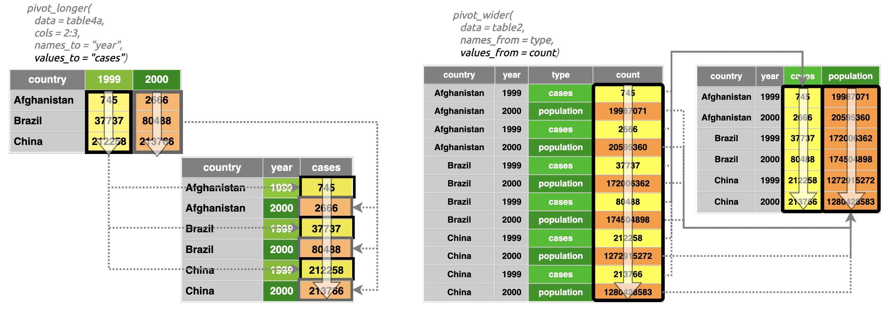
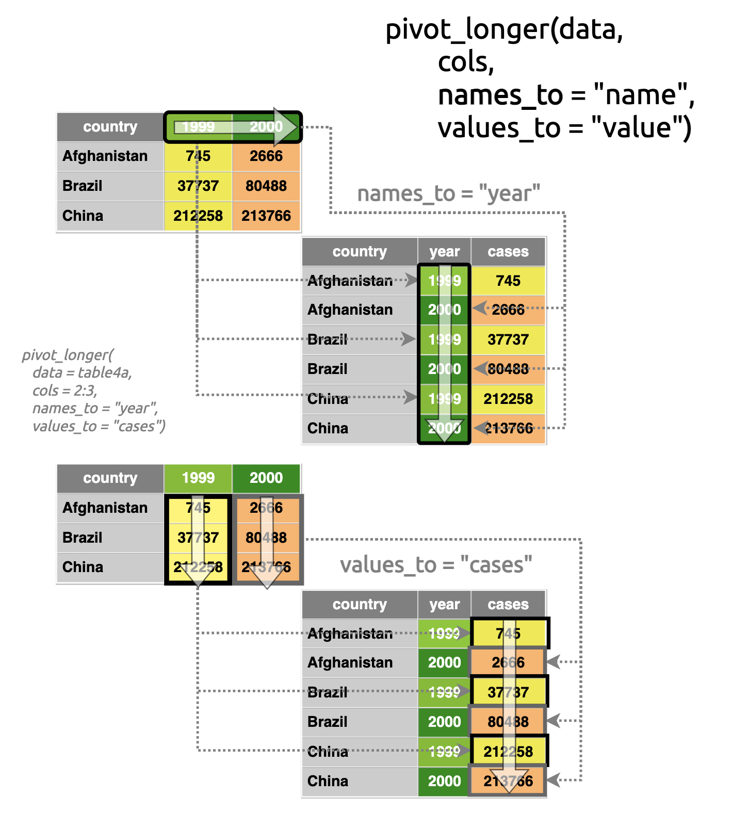
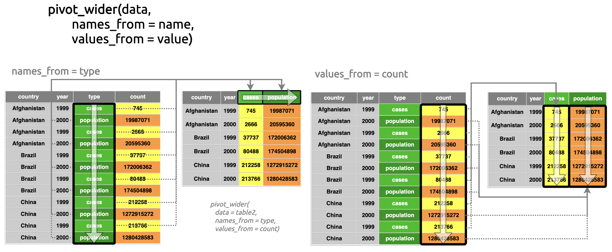
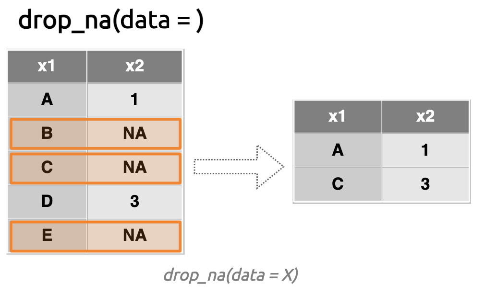
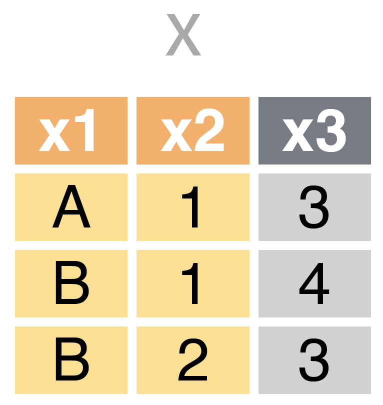
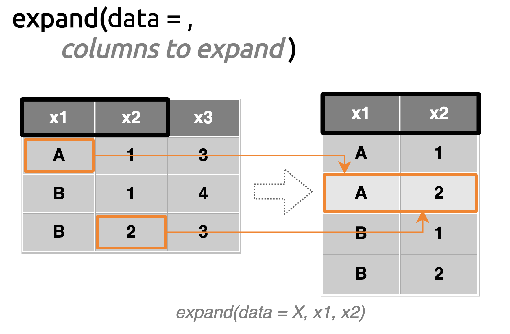

```{r setup, include = FALSE}
library(learnr)
library(tidyverse)
library(skimr)
library(knitr)
library(datapasta)
library(gt)
library(gradethis)
knitr::opts_chunk$set(error = TRUE,
                      upload.fun = imgur_upload, 
                      fig.path = "www/",
                      collapse = TRUE,
                      exercise.cap = "tidyr",
                      warning = FALSE, 
                      message = FALSE, 
                      dpi = 96,
                      tibble.max_extra_cols = 6, 
                      tibble.width = 60)
options(scipen = 999999999)
gradethis::gradethis_setup(exercise.reveal_solution = TRUE)
```

[Link to `tidyr` website](https://tidyr.tidyverse.org/)  
[Link to cheatsheets](https://www.rstudio.com/resources/cheatsheets/) 

## The cheatsheet (part 1)

```{r tidyr-p1.png, echo=FALSE, fig.align='center', out.height='100%', out.width='100%'}
knitr::include_graphics(path = "www/tidyr-p1.png")
```

> "*The `tidyr` package provides a framework for creating and shaping tidy data, the data format that works the most seamlessly with R and the `tidyverse`.*

### Outline

Below is an outline of the topics on the front page of the `tidyr` cheatsheet  (access the full cheatsheet [here](https://raw.githubusercontent.com/rstudio/cheatsheets/main/tidyr.pdf)).

+ A definitions of tidy data   
  - *standardizing the way you store data*   
+ An overview of the `tibble` package  
  - *modern `data.frame`s*    
+ Reshaping data
  - *moving rows -> columns, or columns -> rows*  
+ Splitting cells   
  - *separating the contents of cells*    
+ Expand tables   
  - *filling cells with all possible combinations of values*    
+ Missing values  
  - *what to do when the data aren't there*  

###

This tutorial covers the front page of the `tidyr` cheatsheet, which includes various functions for reshaping ('tidying') data in RStudio. The goal of this tutorial is to show what the contents of the cheatsheet look like in your RStudio console. 

Below we install and load the packages:

```{r packages, eval=FALSE}
install.packages(c("tidyr", "dplyr", "tibble"))
library(tidyr)
library(dplyr)
library(tibble)
```

## Tidy data

Tidy data is a central concept in the `tidyverse`. Most of the packages in the `tidyverse` are built to work with data in a tidy format, so having a firm grasp on this concept will make life easier. There are three main tenets of tidy data:

1. Each column contains a single **variable**  
2. Each row contains a single **observation**  
3. **Values** are at the intersection of variables and observations  

These tenets make data transformation, visualization, modeling easier in R because most of R's functions are *vectorized* (meaning they work on vectors).

###

```{r tidy-data, echo=FALSE, fig.align='center', out.height='45%', out.width='45%'}
knitr::include_graphics(path = "www/tidy-data.png")
```

### Variables, observations, and values  

The third tenet is a logical extension from first two 1 & 2, as noted in this quote from the [author of the tidy data paper](https://doi.org/10.18637/jss.v059.i10) by Hadley Wickham, 

> "*Values are organized in two ways. Every value belongs to a variable and an observation.*" - Hadley Wickham, 2014

###

At bottom, a dataset contains values-it's how we organize the values into  variables and observations that determines if a dataset it tidy. 

### Columns (variables)

Columns contain variables, which are measurements or attributes that can have multiple values (i.e., they 'vary'). These are things like countries, time periods, stock prices, political affiliation, temperatures, etc. 

```{r columns.png, echo=FALSE, out.height='30%', out.width='30%', fig.align='center'}
knitr::include_graphics("www/columns.png")
```


### Rows (observations)

Rows hold observations, which represent a unit of analysis. These are the things, places, people, years, etc., which are measured. 

```{r rows.png, echo=FALSE, out.height='30%', out.width='30%', fig.align='center'}
knitr::include_graphics("www/rows.png")
```

### Values 

The values are the single instance, number, category or classification of a variable and observation. 

```{r values.png, echo=FALSE, out.height='25%', out.width='25%', fig.align='center'}
knitr::include_graphics("www/values.png")
```

## Tibbles

A `tibble` is the `tidyverse` version of a `data.frame`, R's fundamental data structure. 

```{r tibble.png, echo=FALSE, out.height='25%', out.width='25%', fig.align='left'}
knitr::include_graphics("www/tibble.png")
```

`tibble`s are rectangular data objects--similar to spreadsheets--but they have a few distinct characteristics that make them a little different than `data.frame`s. 

### `tibble` functions

We'll cover three functions for creating tibbles:  

1. `tibble::tibble()`  
2. `tibble::tribble()` 
3. `tibble::enframe()`  

We're also going to cover how to convert a `data.frame` to a `tibble` using the `tibble::as_tibble()` function. 

### tibble::tibble()

Use `tibble::tibble()` and `c()` to create the tibble below where column `x` contains a numeric vector with values 1-3, and `y` contains a character vector with the letters `"a"`, `"b"`, `"c"`. 

```{r tibble_ex, exercise=TRUE, exercise.lines=5}
# create tibble below with:
#  x is 1, 2, 3
#  y is "a", "b", "c"
```

```{r tibble_ex-solution}
# create tibble below:
tibble(x = c(1, 2, 3), 
       y = c("a", "b", "c"))
```

```{r tibble_ex-check}
gradethis::grade_code()
```


###

`tibble()` also makes tibbles with existing vectors. Create `nums` and `chars` below, and assign `num` to column `x` and `chars` to column `y`.

```{r tibble_vectors, exercise=TRUE, exercise.lines=5}
nums <- # create nums with values 1, 2, and 3
chars <- # create chars with values "a", "b", and "c"
tibble(x = , 
        y = )
```

```{r tibble_vectors-solution}
nums <- c(1, 2, 3)
chars <- c("a", "b", "c")
tibble(x = nums, 
        y = chars)
```

```{r tibble_vectors-check}
gradethis::grade_code()
```


### tibble::tribble() 

***Creating a tibble (by rows)***

The `tribble()` function allows us to create a tibble 'by rows'. When using `tribble()`, the column names must be preceded by the tilde (`~`) character. 

Create the tibble below with columns `x` and `y`. 

```{r tribble_ex, exercise=TRUE, exercise.lines=5}
# make x numeric and y character 
tribble(,  ,
         1,  "a",
         2,  "b",
         3,  "c")
```

```{r tribble_ex-solution}
# make x numeric and y character 
tribble(~x,   ~y,
         1,  "a",
         2,  "b",
         3,  "c")
```

```{r tribble_ex-check}
gradethis::grade_code()
```


###

If you have white space or special characters in your dataset, you can place the name in [backticks](https://en.wikipedia.org/wiki/Grave_accent#Use_in_programming)  (`` ` ``).

Create the tibble below using the following column names: `Column X` and `Column Y`

```{r tribble_complex_names, exercise=TRUE, exercise.lines=5}
#  make `Column X` numeric and `Column Y` character 
tribble(,    ,
                  1,            "a",
                  2,            "b",
                  3,            "c")
```

```{r tribble_complex_names-solution}
tribble(~`Column X`,    ~`Column Y`,
                  1,            "a",
                  2,            "b",
                  3,            "c")
```

```{r tribble_complex_names-check}
gradethis::grade_code()
```


### tibble::enframe()

If you have a named vector or list, you can convert it to a `data.frame` using `enframe()`, In the code block below is a named vector, `five_babies`, which comes from the [`babynames`](https://github.com/hadley/babynames) package. 

```{r prepare-five_babies, echo=FALSE}
five_babies <- c(Falisha = 14L, Katelinn = 11L, 
                 Tarita = 7L, Duron = 5L, Tanasia = 14L)
```

###

Print `five_babies` and inspect it with `str()` or `dput()`

```{r view-five_babies, exercise=TRUE, exercise.lines=3, exercise.setup="prepare-five_babies"}
# view five_babies
five_babies
```

###

Use the `enframe()` function to convert `five_babies` into a `tibble`. 

```{r enframe_ex, exercise=TRUE, exercise.lines=2, exercise.setup="prepare-five_babies"}
# use enframe() on five_babies

```

```{r enframe_ex-solution}
enframe(five_babies)
```

```{r enframe_ex-check}
gradethis::grade_code()
```


### Converting to tibble

When converting `data.frames` to `tibbles`, use the `tibble::as_tibble()` function. 

In the code block below we've loaded the `smiths` data from the `tidyr` package as `smiths_tbl`. Print the structure (`str()`) of `smiths_tbl` below: 

```{r prepare_smiths, echo=FALSE, eval=TRUE}
library(tidyr)
smiths_tbl <- tibble::tribble(
      ~subject, ~time, ~age, ~weight, ~height,
  "John Smith",     1,   33,      90,    1.87,
  "Mary Smith",     1,   NA,      NA,    1.54
  )
smiths_tbl <- tibble::as_tibble(smiths_tbl)
smiths_df <- data.frame(
  stringsAsFactors = FALSE,
           subject = c("John Smith", "Mary Smith"),
              time = c(1, 1),
               age = c(33, NA),
            weight = c(90, NA),
            height = c(1.87, 1.54)
)
smiths_df <- as.data.frame(smiths_df)
```

```{r smiths_tbl_str, exercise=TRUE, exercise.lines=5, exercise.setup="prepare_smiths"}
# print 'smiths_tbl' to the console
str(____)
```

```{r smiths_tbl_str-solution}
str(smiths_tbl)
```

```{r smiths_tbl_str-check}
gradethis::grade_code()
```


###

We've also loaded these data as a `data.frame` as `smiths_df`. Print the structure (`str()`) of `smiths_df` below:

```{r smiths_df_str_ex, exercise=TRUE, exercise.lines=5, exercise.setup="prepare_smiths"}
# print 'smiths_df' to the console
str(____)
```

```{r smiths_df_str_ex-solution}
str(smiths_df)
```

```{r smiths_df_str_ex-check}
gradethis::grade_code()
```

###

Note the differences in the `tibble` and `data.frame` outputs: 

**`tibble`:**

```{r , eval=FALSE}
# tibble [<rows> × <cols>] (S3: tbl_df/tbl/data.frame)
#  $ <variable>: <class/mode> [<start>:<end>] "value 1" "value 2"
#  $ <variable>: <class/mode> [<start>:<end>] 1 2
```

###

**`data.frame`:**

```{r , eval=FALSE}
# 'data.frame':   <# rows> obs. of <# cols> variables:
#  $ <variable>: <class/mode> "value 1" "value 2"
#  $ <variable>: <class/mode> 1 2
```

###

In the code block below, convert `smiths_df` to a `tibble` using `tibble::as_tibble()`. 

```{r as_tibble_ex, exercise=TRUE, exercise.lines=5, exercise.setup="prepare_smiths"}
# drop 'smiths_df' in the as_tibble() function
tibble::as_tibble()
```

```{r as_tibble_ex-solution}
# drop 'smiths_df' in the as_tibble() function
tibble::as_tibble(smiths_df)
```

```{r as_tibble_ex-check}
gradethis::grade_code()
```

###


### Lists with a special kind of class...

`tibbles` are lists, but special lists. Like `data.frame`s, each vector in a `tibble` must have equal lengths. Click **Run Code** and see what happens if we try to create a tibble with vectors of unequal lengths:

```{r tibble-error, exercise=TRUE, exercise.lines=2}
tibble(x = 1:2, # too short!
        y = c("a", "b", "c"))
```

###

What does "*Only values of size one are recycled*" mean? It means if `x` is a single value, it will be repeated for the length of `y`---which is why the code below works (Click **Run Code**):

```{r tibble-recycle, exercise=TRUE, exercise.lines=2}
tibble(x = 2, # values of size one
        y = c("a", "b", "c"))
```

## Reshape Data 

> "*Pivot data to reorganize values into a new layout.*"

Two of the most important functions to learn from `tidyr` are [**`pivot_longer()`**](https://tidyr.tidyverse.org/reference/pivot_longer.html) and [**`pivot_wider()`**](https://tidyr.tidyverse.org/reference/pivot_wider.html). Both functions help you move columns to rows (and vice versa).

### pivot_longer()

Datasets with a single variable in multiple columns are referred to as having a 'wide' format. Click **Run Code** to see the example `table4a` below: 

```{r prepare-table4a, echo=FALSE}
table4a <- tibble::tribble(
       ~country,  ~`1999`,  ~`2000`,
  "Afghanistan",     745L,    2666L,
       "Brazil",   37737L,   80488L,
        "China",  212258L,  213766L
  )
```

```{r table4a}
table4a
```

### Wide to long

The `cases` are stored in two `year` columns (`1999` and `2000`). `pivot_longer()` can convert `table4a` from a 'wide' to  a 'tidy' format.

###

In the code block below: 

1. place `table4a` in the `data` argument    
2. numerically index the `cols` (using `2:3`)   
3. move the years to `"year"` the cases to `"cases"`    

```{r pivot_longer_1_table4a, exercise=TRUE, exercise.lines=9, exercise.setup="prepare-table4a"}
tidyr::pivot_longer(
  # enter table4a dataset 
  data = , 
  # column range 2-3
  cols = , 
  # new 'year' column
  names_to = "", 
  # new 'cases' column
  values_to = "")
```

```{r pivot_longer_1_table4a-solution}
tidyr::pivot_longer(
  # enter table4a dataset 
  data = table4a, 
  # column range 2-3
  cols = 2:3, 
  # new 'year' column
  names_to = "year", 
  # new 'cases' column
  values_to = "cases")
```

```{r pivot_longer_1_table4a-check}
gradethis::grade_code()
```
###

See the diagrams below for a better understanding of how `names_to` and `values_to` work:

###

#### `names_to`

The `names_to` is a string (in quotes), and it's what we'd like to call our new variable that will *"contain the column names of the variables we're specifying in `cols`."* 

```{r names_to.png, echo=FALSE, out.height='75%', out.width='75%', fig.align='center'}
knitr::include_graphics("www/names_to.png")
```

###

#### `values_to`

The `values_to` argument is the name of the new variable that will *"hold the values stored in the cells beneath the columns we've specified in `cols`."* 

```{r values_to.png, echo=FALSE, out.height='75%', out.width='75%', fig.align='center'}
knitr::include_graphics("www/values_to.png")
```

### pivot_wider()

Below is the `table2` data from the `tidyr` package. 

```{r prepare-table2, echo=FALSE}
table2 <- tibble::tribble(
       ~country, ~year,        ~type,      ~count,
  "Afghanistan", 1999L,      "cases",        745L,
  "Afghanistan", 1999L, "population",   19987071L,
  "Afghanistan", 2000L,      "cases",       2666L,
  "Afghanistan", 2000L, "population",   20595360L,
       "Brazil", 1999L,      "cases",      37737L,
       "Brazil", 1999L, "population",  172006362L,
       "Brazil", 2000L,      "cases",      80488L,
       "Brazil", 2000L, "population",  174504898L,
        "China", 1999L,      "cases",     212258L,
        "China", 1999L, "population", 1272915272L,
        "China", 2000L,      "cases",     213766L,
        "China", 2000L, "population", 1280428583L
  )
```


```{r table2}
table2
```

### Tidy data checklist

Do these data currently meet the definition of 'tidy'? 

- [x] *variables in columns?* 

- [x] *observations in rows?*

- [x] *cells contain values which are at the intersection of the variable/observation*? 

We're going to restructure `table2` by shifting the `type` variable into separate columns (i.e., one column for `cases`, and another for `population`). 

###

In the code block below:

1. Place `table2` in the `data` argument  

2. The `type` variable values contains the names of our new columns, so we'll place it in the `names_from` argument  

3. The `count` variable contains values for each level of `type`, so we'll place this in the `values_from` argument 

```{r pivot_longer_1_table2, exercise=TRUE, exercise.lines=5, exercise.setup="prepare-table2"}
# move the names from 'type' and the values from 'count' in 'table2'
tidyr::pivot_wider(
  data = , 
  names_from = , 
  values_from = )
```

```{r pivot_longer_1_table2-solution}
# move the names from 'type' and the values from 'count' in 'table2'
pivot_wider(
  data = table2, 
  names_from = type, 
  values_from = count)
```

```{r pivot_longer_1_table2-check}
gradethis::grade_code()
```

###

The `names_from` and `values_from` arguments in `pivot_wider()` are similar to the `names_to` and `values_to` arguments  in `pivot_longer()`. The diagrams below show how the work in more detail: 

###

#### `names_from`

The `names_from` column should contain *values that are currently being used to index or arrange the values in the long/tidy dataset.*

```{r names_from.png, echo=FALSE, out.height='75%', out.width='75%', fig.align='center'}
knitr::include_graphics("www/names_from.png")
```

###

#### `values_from`

The `values_from` column is the *variable holding the values we'd like to be placed in the rows under each corresponding `names_from` column.*

```{r values_from.png, echo=FALSE, out.height='75%', out.width='75%', fig.align='center'}
knitr::include_graphics("www/values_from.png")
```

***Note that neither of these columns need to be in quotes.***

###

Reshaping your columns and rows is a common activity when wrangling your data. `pivot_longer()` and `pivot_wider()` come with multiple arguments for more complicated reshaping.

### Additional arguments

Consider the example below from a subset of data from the [billboard dataset](https://tidyr.tidyverse.org/reference/billboard.html). These data have weekly rankings for artists and songs from 2008. Use the code block below to explore the `bbwk2` data with `head()`, or `tail()`.

```{r prepare-bbwk2, echo=TRUE}
bbwk2 <- tibble::tribble(
  ~date_entered,        ~artist,              ~track, ~wk1, ~wk2,
   "2000-12-30",      "Tuesday",            "I Know",   98,   98,
   "2000-12-23",   "De La Soul",         "All Good?",   96,   96,
   "2000-12-16", "Clark, Terri", "A Little Gasoline",   75,   82
  )
bbwk2 <-
  purrr::set_names(x = bbwk2,
    nm = c('date_entered', 'artist', 'track', 'wk1', 'wk2'))
```

```{r bbwk2, exercise=TRUE, exercise.lines=4, exercise.setup="prepare-bbwk2"}
# view bbwk2
bbwk2
```

###

Data aren't necessarily collected or stored in ways that make them easy for analysis or visualization. If we were collecting billboard rankings in a spreadsheet structured like `bbwk2`, that process might take the following steps: 

1. wait until the new rankings come out each week  
2. open up our the `bbwk2` in a spreadsheet  
3. create a new `wk` column  
4. enter the new rankings  

###

This would result in dataset that would look something like the `bbwk3` in the code block below:

```{r prepare-bbwk3, echo=TRUE}
bbwk3 <- tibble::tribble(
  ~date.entered,         ~artist,              ~track, ~wk1, ~wk2, ~wk3,
   "2000-12-30",       "Tuesday",            "I Know",   98,   98,   NA,
   "2000-12-23",    "De La Soul",         "All Good?",   96,   96,  100,
   "2000-12-16",  "Clark, Terri", "A Little Gasoline",   75,   82,   88,
   "2000-12-02", "Braxton, Toni",    "Spanish Guitar",   98,   98,   98,
   "2000-12-02",     "Nine Days",           "If I Am",   68,   68,   81,
   "2000-12-02",     "Vitamin C",          "The Itch",   86,   48,   45
  )
bbwk3 <-
  purrr::set_names(x = bbwk3,
    nm = c('date_entered', 'artist', 'track', 'wk1', 'wk2', 'wk3'))
```

```{r bbwk3, exercise=TRUE, exercise.lines=4, exercise.setup="prepare-bbwk3"}
# view bbwk3
bbwk3
```

However, when it's time to analyze `bbwk3`, we'd want to reshape these data into a long format without losing any information.

###

Fortunately, `pivot_longer()` has options for making sure the original structure of `bbwk3` is retained after reshaping the data. In the case of `bbwk3`, the missing value for `"I Know"` by `"Tuesday"` needs to be dropped when we create our `rank` column. 

###

In the code block below: 

1. The `cols` argument should use `starts_with()` from [the **`tidyselect`** package](https://tidyselect.r-lib.org/reference/starts_with.html) to identify all columns starting with `"wk"`  
2. These columns should be reshaped into the `"week"` column with the `names_to` argument    
3. Use `names_prefix` to shave the `"wk"` off the week value in our new `week` column
4. The values should be stored in the `"rank"` variable (with `values_to`)  
5. We want to make sure we drop any songs that don't carry over from week-to-week, so we set `values_drop_na` to `TRUE`

```{r pivot_longer_bbwk3_ex, exercise=TRUE, exercise.lines=8, exercise.setup="prepare-bbwk3"}
# reshape the bbwk3 into a tidy format
pivot_longer(data = bbwk3,
    cols = ,
    names_to = ,
    names_prefix = ,
    values_to = ,
    values_drop_na = 
  )
```

```{r pivot_longer_bbwk3_ex-solution}
pivot_longer(data = bbwk3,
    cols = starts_with("wk"),
    names_to = "week",
    names_prefix = "wk",
    values_to = "rank",
    values_drop_na = TRUE
  )
```

```{r pivot_longer_bbwk3_ex-check}
gradethis::grade_code()
```


###

We can see this removed the missing value and there are only two weeks of ranks for `"I Know"` by `"Tuesday"`. 


### `names` and `values` as pairs

In previous versions of `tidyr`, we used `spread()` and `gather()` instead of `pivot_longer()` and `pivot_wider()`. These functions referred to `names_to`/`names_from` and `values_to`/`values_from` as `key` and `value`, and I'm including them here because I found them quite helpful in understanding the mechanics of reshaping data:

###

#### The keys (`names`)

+ The keys (or `names_to` and `names_from`) are the columns used to *index the cell values*:  
    - in `pivot_longer()` the names need to shift from a horizontal a vertical orientation   
    - in `pivot_wider()` the names need to shift from a vertical to a horizontal orientation  
   
```{r names-key-png, echo=FALSE, out.height='85%', out.width='85%', fig.align='center'}
knitr::include_graphics("www/names-key.png")
```

###

#### `values`

+ The values (`values_to` and `values_from`) are the cell contents linked to the index provided in the `names_to`/`names_from`:   
    - in `pivot_longer()` the values shift from two existing columns to a single column (indexed on the `names_to` column)    
    - in `pivot_wider()` the values shift from a single column into new columns based on the distinct values stored in the `names_from` variable.  
    
```{r values-value.png, echo=FALSE, out.height='85%', out.width='85%', fig.align='center'}

```

### review `pivot_longer()` & `pivot_wider()`

```{r pivot_longer-reivew-png, echo=FALSE, out.height='65%', out.width='65%', fig.align='center'}

```

```{r pivot_wider-reivew-png, echo=FALSE, out.height='85%', out.width='85%', fig.align='center'}

```

Be sure to check out the help files for [**`pivot_longer()`**](https://tidyr.tidyverse.org/reference/pivot_longer.html) and [**`pivot_wider()`**](https://tidyr.tidyverse.org/reference/pivot_wider.html).


## Split Cells

> "*Use these functions to split or combine cells into individual, isolated values.*"

In this section, we'll combine column values using `tidyr::unite()`, then we'll split and distribute cell values across columns with `tidyr::separate()`) (*and* down rows using `tidyr::separate_rows()`).

### unite()

The `tidyr::pivot_` functions reshape data, shifting columns to rows (and vice versa). However, the `tidyr::unite()` and `tidyr::separate()` functions allow us to isolate and manipulate the existing column values into new variables. 

###

If you have variable values spread across multiple columns (like the subset of `tidyr::table5` below), you can use `tidyr::unite()` to combine these values into a single column.

```{r prepare-unite, echo=FALSE}
table5 <- tibble::tribble(
       ~country, ~century, ~year,
  "Afghanistan",     "19",  "99",
  "Afghanistan",     "20",  "00",
       "Brazil",     "19",  "99",
       "Brazil",     "20",  "00")
```

```{r table5}
table5
```

As we can see, `century` and `year` could be combined into a single four-digit `year` column. 

###

In the code block below:

1. The new column name (`"year"`) is provided in the `col` argument (in quotes)   
2. Designate a character string to separate the values with the `sep` argument  

```{r unite_table5_ex, exercise=TRUE, exercise.lines=9, exercise.setup="prepare-unite"}
# enter the new "year" column and use an empty space ("") to separate the values
tidyr::unite(data = table5, 
             # columns to unite
             century, year, 
             # new column name
             col = , 
             # what to separate them by
             sep = )
```

```{r unite_table5_ex-solution}
# enter the new "year" column and use an empty 
# space ("") to separate the values
unite(
  data = table5, 
  # columns to unite
   century, year, 
   # new column name
   col = "year", 
   # what to separate them by
   sep = ""
)
```

```{r unite_table5_ex-check}
gradethis::grade_code()
```

###


#### `unite()` review

Below is a diagram similar to the one in the original cheatsheet, but with the actual values/column names:

```{r unite-png, echo=FALSE, out.height='75%', out.width='75%', fig.align='center'}
knitr::include_graphics("www/unite.png")
```

### `separate()`

Sometimes you'll encounter datasets with two variables contained in the same column(like a ratio or fraction). The `tidyr::separate()` function will split the numbers into individual columns (for numerator and denominator).

###

See an example of this in the subset of `tidyr::table3` below:

```{r prepare-table3, echo=FALSE}
table3 <- tibble::tribble(
          ~country, ~year,             ~rate,
     "Afghanistan", 1999L,    "745/19987071",
     "Afghanistan", 2000L,   "2666/20595360",
          "Brazil", 1999L, "37737/172006362",
          "Brazil", 2000L, "80488/174504898")
```


```{r table3}
table3
```

###

In the code block below: 

1. The `col` argument is the column we want to split apart (`rate`)       
2. `into` should be the names of the columns we want the separate pieces to fall into (`cases` and `pop`)   
3. The `sep` argument should be a regular expression pattern we want to split the pieces on (`"/"`)  

```{r separate_ex, exercise=TRUE, exercise.lines=8, exercise.setup="prepare-table3"}
separate(data = table3, 
         # what column to break apart
         col = rate, 
         # columns the new values should end up in
         into = c(" ", " "), 
         # what to separate on
         sep = " ")
```

```{r separate_ex-solution}
separate(
        data = table3, 
        # what column to break apart
        col = rate, 
        # columns the new values should end up in
        into = c('cases', 'pop'),
        # what to separate on
        sep = "/")
```

```{r separate_ex-check}
gradethis::grade_code()
```


###


#### `separate()` review

Below is another diagram for separate with slightly more details than the one presented in the cheatsheet. 

```{r separate-png, echo=FALSE, out.height='75%', out.width='75%', fig.align='center'}
knitr::include_graphics("www/separate.png")
```

### BONUS (tidyr::extract())

*regular expression with capturing groups*

`tidyr::extract()` is mentioned in the cheatsheet, but we're going to include an example here because it's a natural extension from the `tidyr::separate()` function. We'll tackle the same issue we dealt with in the previous section using `table3` (splitting the `rate` column into `cases` and `pop`).

###

#### Checking a regex with `stringr::str_view()`

We'll cover regular expressions in more depth in the `stringr` cheatsheet, but for now we'll check our `regex` pattern matches in the `rate` variable using [**`stringr::str_view()`**](https://stringr.tidyverse.org/reference/str_view.html):

We define each group using **`()`** and **`/`** and **`"[[:alnum:]]+"`** (*which matches one or more alphanumeric characters*):

###

```{r regex-example-group-1, echo=TRUE}
str_view(string = table3$rate, "([[:alnum:]]+)")
```

###

We can see this pattern matched the numerator in `rate`. When we include the second group: **`"/([[:alnum:]]+)"`**

###

```{r regex-example-group-2, echo=TRUE}
str_view(string = table3$rate, "/([[:alnum:]]+)")
```

###

We see it's matching the denominator. 

The full pattern (`"([[:alnum:]]+)/([[:alnum:]]+)"`) creates two groups of numbers (numerator and denominator) and places these values into the new variables specified by `into`. 

###

Use the code block below to extract the numerator and denominator from `rate` into `"cases"` and `"pop"`:

1. Place `table3` in the `data` argument  
2. The `col` argument is the column we want to extract the pattern *from*  
3. The `regex` argument is the regular expression pattern that we just built above (capable of creating "groups")   
  + The groups produced by the regex pattern will make up the values in the new columns we supply to the `into` argument   

```{r extract_table3_ex, exercise=TRUE, exercise.lines=7, exercise.setup="prepare-table3"}
extract(table3, 
        # what column to extract the values from
        col = , 
        # where the new values should end up
        into = , 
        # regular expression that creates groups 
        regex = "([[:alnum:]]+)/([[:alnum:]]+)")
```

```{r extract_table3_ex-solution}
extract(table3, 
        # what column to extract the values from
        col = rate, 
        # where the new values should end up
        into = c('cases','pop'), 
        # regular expression that creates groups 
        regex = "([[:alnum:]]+)/([[:alnum:]]+)")
```

```{r extract_table3_ex-check}
gradethis::grade_code()
```

###

#### `extract()` review

We've created a new diagram below (similar to the previous) that demonstrates how `extract()` works. 

```{r extract-png, echo=FALSE, out.height='85%', out.width='85%', fig.align='center'}
knitr::include_graphics("www/extract.png")
```

### `separate_rows()`

`separate_rows()` works similar to `separate()`, but instead of spreading the values across the columns (the `into` argument), it distributes the values down the rows.

###

In the code block below: 

1. Place `table3` in the `data` argument    
2. Separate the `rate` column by bows on `/`  

```{r separate_rows_table3_ex, exercise=TRUE, exercise.lines=5, exercise.setup="prepare-table3"}
separate_rows(data = table3, 
              , # column to separate values below
              sep = "")
```

```{r separate_rows_table3_ex-solution}
separate_rows(
            data = table3, 
            # column to separate values below
            rate, 
            sep = "/")
```

```{r separate_rows_table3_ex-check}
gradethis::grade_code()
```


###

#### `separate_rows()` review

The previous functions operate on *existing* columns and create *new* columns, so they won't create any new rows in the dataset. This isn't true for the  `separate_rows()` function. 


###

```{r separate-rows-png, echo=FALSE, out.height='80%', out.width='80%', fig.align='center'}
knitr::include_graphics("www/separate_rows.png")
```

## Handle Missing Values

> "*Drop or replace explicit missing values (NA).*"

Missing data are designated as `NA` in R. Sometimes data are missing in the original dataset, but sometimes we have missing values as the result of reshaping or restructuring our data. We're going to cover three `tidyr` functions for dealing with missing values: `drop_na()`, `fill()`, and `replace_na()`.

### `drop_na()`

We've recreated the example dataset from the cheatsheet as `x_tbl` below:

```{r drop_na_x_tbl_png, out.height='30%', out.width='30%', eval=TRUE, echo=FALSE, fig.align='center'}
knitr::include_graphics("www/handle_na_x.png")
```


```{r prepare_missing_x_tbl, echo=FALSE}
x_tbl <- tibble::tribble(
  ~x1,   ~x2,
  "A",    1L,   
  "B",    NA,   
  "C",    NA,   
  "D",    3L,     
  "E",    NA
)
```

```{r prepare-starships, echo=FALSE}
starships <- tibble::tibble(
    name = c("Luke Skywalker", "Darth Vader", "Obi-Wan Kenobi"),
    starships_1 = c("X-wing", "TIE Advanced x1", "Jedi starfighter"),
    starships_2 = c("Imperial shuttle", NA, "Trade Federation cruiser"),
    starships_3 = c(NA, NA, "Naboo star skiff")
  )
```

Use the code block below to explore `x_tbl`

```{r explore-x_tbl, exercise=TRUE, exercise.lines=3, exercise.setup="prepare_missing_x_tbl"}
# explore the x_tbl tibble

```

###


`drop_na()` will remove the rows with missing values. 

```{r drop_na_ex, exercise=TRUE, exercise.lines=3, exercise.setup="prepare_missing_x_tbl"}
drop_na(data = )
```

```{r drop_na_ex-solution}
drop_na(data = x_tbl)
```

```{r drop_na_ex-check}
gradethis::grade_code()
```

###

This function is great if we don't want any missing observations.

```{r drop_na-png, echo=FALSE, out.height='80%', out.width='80%', fig.align='center'}

```

### `fill()`

If we don't want to remove the entire row, we can use `tidyr::fill()` to replace the missing values with the column value's from above or below. We've loaded the `X` table again as `x_tbl`: 

```{r fill-drop_na_x_tbl_png, out.height='30%', out.width='30%', eval=TRUE, echo=FALSE, fig.align='center'}
knitr::include_graphics("www/handle_na_x.png")
```

###

In the code block below: 

1. Place the `x_tbl` dataset in the data argument   
2. Fill the missing values in the `x2` column with the values in the cells above  

```{r fill_ex, exercise=TRUE, exercise.lines=3, exercise.setup="prepare_missing_x_tbl"}
fill(data = , )
```

```{r fill_ex-solution}
fill(data = x_tbl, x2)
```

```{r fill_ex-check}
gradethis::grade_code()
```

###

We can see the missing values in `x2` have been filled with the contents from the values above. The `.direction` argument controls which values are used to replace the missing values. `"down"` (the default) will fill the missing values with the contents above, and `"up"` will fill the missing values with the contents from below.

###

We've loaded another example dataset, `profits`, in the code block below.

```{r prepare-profits, echo=FALSE}
profits <- tibble::tribble(
       ~year, ~quarter, ~profits,
          NA,     "Q1",     1494,
          NA,     "Q2",     2314,
          NA,     "Q3",     1937,
      "2019",     "Q4",     1722,
          NA,     "Q1",     1494,
          NA,     "Q2",     1931,
          NA,     "Q3",     2364,
      "2020",     "Q4",     2920)
```

```{r explore-profits, exercise=TRUE, exercise.lines=3, exercise.setup="prepare-profits"}
# explore profits
```

###

The `year` variable has missing values, but we can see these are linked to the other two variables (`quarter` and `profits`). 

###

In the code block below:

1. Place the `profits` dataset in the data argument  
2. Enter the column we want to fill the missing values in (`year`)  
3. Change the `.direction` argument to fill the missing with the cell contents below 

```{r fill_up_ex, exercise=TRUE, exercise.lines=5, exercise.setup="prepare-profits"}
# fill up!
fill(data = , 
     , 
     .direction = 
)
```

```{r fill_up_ex-solution}
# fill up!
fill(data = profits, 
  year, 
  .direction = 'up')
```

```{r fill_up_ex-check}
gradethis::grade_code()
```

###

#### `fill(data =, .direction = 'down')` review

The diagrams below shows how the `fill()` argument works with the default `.direction = "down"`argument. 

```{r fill-down-png, echo=FALSE, out.height='80%', out.width='80%', fig.align='center'}
knitr::include_graphics("www/fill-down.png")
```

###

#### `fill(data =, .direction = 'up')` review

```{r fill-up-png, echo=FALSE, out.height='80%', out.width='80%', fig.align='center'}
knitr::include_graphics("www/fill-up.png")
```

### `replace_na()`

If we need to control what values we want to replace the missing values with, we can use `tidyr::replace_na()`. This function takes a list of values, written as:

`list(variable/column = value to replace NAs)`

We've loaded the `X` table as `x_tbl` in the code below: 

```{r replace_na-drop_na_x_tbl_png, out.height='30%', out.width='30%', eval=TRUE, echo=FALSE, fig.align='center'}
knitr::include_graphics("www/handle_na_x.png")
```

###

In the code block below: 

1. Place `x_tbl` in the data argument  
2. In the `replace` argument, create a `list()` with the following contents:   
    - `x2 = 2` 

```{r replace_na_ex, exercise=TRUE, exercise.lines=3, exercise.setup="prepare_missing_x_tbl"}
replace_na(data = ____, 
  replace = 
    list(__ = _))
```

```{r replace_na_ex-solution}
replace_na(data = x_tbl,
  replace = 
    list(x2 = 2))
```

```{r replace_na_ex-check}
gradethis::grade_code()
```

###

These functions are often used together to deal with different types of missing values. For example, consider the `scores` data below:

```{r prepare-cumdf, echo=FALSE}
scores <- tibble::tribble(
      ~year, ~score,
       2017,     NA,
       2018,      3,
       2019,     NA,
       2020,      3,
       2021,     NA,
       2022,      3)
cum_scores <- tibble::tribble(
  ~year, ~score, ~total,
   2017,     NA,     NA,
   2018,      3,      3,
   2019,     NA,     NA,
   2020,      3,      6,
   2021,     NA,     NA,
   2022,      3,      9)
```

```{r explore-scores, exercise=TRUE, exercise.lines=3, exercise.setup="prepare-cumdf"}
# explore scores

```

###

In `scores`, a missing value means there was no `score` for that particular `year`. We will use `replace_na()` to make sure a `0` is included for any future calculations. 

###

In the code block below: 

1. Place `scores` in the `data` argument  
2. Use the `replace` argument to replace the missing values in `score` with `0L` 

```{r replace_na_scores, exercise=TRUE, exercise.lines=3, exercise.setup="prepare-cumdf"}
replace_na(data = , 
           replace = list( = ))
```

```{r replace_na_scores-solution}
replace_na(data = scores, 
           replace = list(score = 0L))
```

```{r replace_na_scores-check}
gradethis::grade_code()
```

###

Now that we've replaced the missing `scores` with zeros, we could create a running `total` variable from `score` (which we will cover in the `dplyr` tutorial). 

### Putting it all together

We're going to recreate the following `tibble` using the appropriate functions:

```{r recreate_cum_scores, echo=FALSE}
tibble::tribble(
     ~year, ~score, ~total,
      2017,      0,      0,
      2018,      3,      3,
      2019,      0,      3,
      2020,      3,      6,
      2021,      0,      6,
      2022,      3,      9
     )
```

In the code block below:

1. Use `replace_na()` to replace the `score` with `0L`   
2. Use `fill()` to fill the `total` column `"down"`    
3. Use `replace_na()` again `total` with `0L`    

```{r fix_cum_scores, exercise=TRUE, exercise.lines=8, exercise.setup="prepare-cumdf"}
# replace missing values in cum_scores
replace_na(data = cum_scores, 
            # replace score with zeros
           replace = list(____ = 0L)) |> 
  # fill total column down 
  fill(____, .direction = "____") |> 
  # replace total with zeros
  replace_na(replace = list(____ = 0L))
```

```{r fix_cum_scores-solution}
# replace missing values in cum_scores
replace_na(data = cum_scores, 
           # replace score with zeros
           replace = list(score = 0L)) |> 
  # fill total column down 
  fill(total, .direction = "down") |> 
  # replace total with zeros
  replace_na(replace = list(total = 0L))
```

```{r fix_cum_scores-check}
gradethis::grade_code()
```

###

#### review `replace_na()`

Review the diagram below on the `replace_na()` function:

```{r replace_na-png, echo=FALSE, out.height='80%', out.width='80%', fig.align='center'}
knitr::include_graphics("www/replace_na.png")
```

## Expand Tables

> "*Create new combinations of variables or identify implicit missing values (combinations of variables not present in the data).*"

Incomplete data are usually missing a particular combination of values and/or observations. Recall earlier we learned that, [*"every value belongs to a variable and an observation."*](https://www.jstatsoft.org/article/view/v059i10). These following functions help us identify and/or complete these incomplete values.

### `expand()`

The `tidyr` cheatsheet also uses another `X` dataset for this section (which we've created again below as `x_tbl`). 


```{r expand_tables_x_png, out.height='30%', out.width='30%', eval=TRUE, echo=FALSE, fig.align='center'}

```

###

Use the code block below to explore `x_tbl`:

```{r prepare_expand_x_tbl, echo=FALSE}
x_tbl <- tibble::tribble(
  ~x1,   ~x2,    ~x3,
  "A",    1L,     3L,
  "B",    1L,     4L,
  "B",    2L,     3L
)
```

```{r explore-expand-X, exercise=TRUE, exercise.lines=3, exercise.setup="prepare_expand_x_tbl"}
# explore the x_tbl data
```

###

`expand()` will create all possible combinations of values of whatever dataset and variables we specify. 

In the code block below:

1. Place `x_tbl` in the `data` argument  
2. Expand `x_tbl` to include all possible combinations of variables `x1` and `x2`. 

```{r expand_ex, exercise=TRUE, exercise.lines=3, exercise.setup="prepare_expand_x_tbl"}
expand(data = )
```

```{r expand_ex-solution}
expand(data = x_tbl, x1, x2)
```

```{r expand_ex-check}
gradethis::grade_code()
```

###

The `expand()` function returns a `tibble` with all the possible combinations of values for whichever variables we provide *after* the `data` argument (in this case `x1` and `x2`). 

You can check the new combinations of values that have been added using [`anti_join()`](https://dplyr.tidyverse.org/reference/filter-joins.html) and [`distinct()`](https://dplyr.tidyverse.org/reference/distinct.html) from the `dplyr` package. 

```{r anti_join_distinct, exercise=TRUE, exercise.lines=5, exercise.setup="prepare_expand_x_tbl"}
dplyr::anti_join(
  # assign the expand() command above to 'x'
  x = expand(data = ____, __, __), 
  # original distinct values
  y = dplyr::distinct(x_tbl, x1, x2)) 
```

```{r anti_join_distinct-solution}
dplyr::anti_join(
  # assign the expand() command above to 'x'
  x = expand(data = x_tbl, x1, x2), 
  # original distinct values
  y = dplyr::distinct(x_tbl, x1, x2)) 
```

```{r anti_join_distinct-check}
gradethis::grade_code()
```

###

This tells us the missing combinations of values for `x1` and `x2`. We'll cover joins and more in the data manipulation tutorial.  

### complete()

The `complete()` function is *somewhat* similar to `expand()`, but where `expand()` returns all possible combinations of the variables we provide, `complete()` also returns the entire input tibble and converts "*implicit missing values into explicit missing values.*" 

###

Let's see how to use complete by looking at the example from the cheatsheet (loaded as `x_tbl`). 

```{r complete-expand_tables_x_png, out.height='30%', out.width='30%', eval=TRUE, echo=FALSE, fig.align='center'}

```

```{r prepare_complete_x_tbl, echo=FALSE}
x_tbl <- tibble::tribble(
  ~x1,   ~x2,    ~x3,
  "A",    1L,     3L,
  "B",    1L,     4L,
  "B",    2L,     3L
)
```

###

We can see there are three variables, each with two possible values. 

If we provide the same two columns to `complete()` that we did to `expand()`, we can see the difference below:

```{r complete_ex, exercise=TRUE, exercise.lines=5, exercise.setup="prepare_complete_x_tbl"}
complete(data = , )
```

```{r complete_ex-solution}
complete(data = x_tbl, x1, x2)
```

```{r complete_ex-check}
gradethis::grade_code()
```

###

As we can see from the output above, `complete()` created a tibble with all possible combinations of `x1` and `x2` (like `expand()`), but it also included the `x3` column in the output (with a missing value (`NA`) where the new row was created for the missing combination of `x1` and `x2`).

### Putting it all together

Consider the example data below, `hiphop90s`:

```{r prepare_hiphop90s, echo=FALSE}
hiphop90s <- tribble(
  ~year, ~artist, ~albums,
  1996, "2Pac", 2L,
  1997, "Wu-Tang Clan", 1L,
  1997, "2Pac", 1L
  )
```

```{r hiphop90s, echo=FALSE}
# tribble(
#   ~year, ~artist, ~album,
#   1996, "2Pac", "All Eyez on Me",
#   1996, "2Pac", "Makaveli",
#   1997, "Wu-Tang Clan","Wu-Tang Forever",
#   1997, "2Pac", "R U Still Down? (Remember Me)"
#   )
tribble(
  ~year, ~artist, ~albums,
  1996, "2Pac", 2L,
  1997, "Wu-Tang Clan", 1L,
  1997, "2Pac", 1L
  )
```

The `hiphop90s` table shows hip-hop albums for two artists from year 1996-1998. If we wanted to fill in the missing year for the `Wu-Tang Clan`, how would we do it with `complete()`?

###

In the code block below: 

1. Place `hiphop90s` in the data argument  
2. Complete with the `year` and `artist` variables  

```{r complete_ex_hiphop90s_1, exercise=TRUE, exercise.lines=5, exercise.setup="prepare_hiphop90s"}
complete(data = ____, ____, ____)
```

```{r complete_ex_hiphop90s_1-solution}
complete(data = hiphop90s, year, artist)
```


```{r complete_ex_hiphop90s_1-check}
gradethis::grade_code()
```

###

We can also use the `fill` argument in `complete()` to replace any missing values we generate. 

###

Use the code block below to replace the missing values in `albums` with zeros:

```{r complete_fill, exercise=TRUE, exercise.lines=5, exercise.setup="prepare_hiphop90s"}
complete(data = ____, 
  year, artist,
  fill = list(____ = 0L))
```

```{r complete_fill-solution}
complete(data = hiphop90s, 
  year, artist,
  fill = list(albums = 0L))
```

```{r complete_fill-check}
gradethis::grade_code()
```


###

We can also use `complete()` to add values that aren't in the dataset. What if we wanted to include `"Dr. Dre"` in our `hiphop90s` dataset, even though he didn't release an album until 1999?

###

We can provide the new values we want for `artist` as a character vector (in this case we want to add `"Dr. Dre"` to the existing values) and use `fill` to replace the missing values with zeros. 

```{r complete_non_present, exercise=TRUE, exercise.lines=7, exercise.setup="prepare_hiphop90s"}
complete(hiphop90s,
  year,
  # add Dre to the list of artists
  artist = c("2Pac", "Wu-Tang Clan", ),
  # replace missing values with 0L
  fill = list())
```

```{r complete_non_present-solution}
complete(hiphop90s,
  year,
  # add Dre to the list of artists
  artist = c("2Pac", "Wu-Tang Clan", "Dr. Dre"),
  # replace missing values with 0L
  fill = list(albums = 0L))
```

```{r complete_non_present-check}
gradethis::grade_code()
```

###

#### `expand()` & `complete()` review


`expand()` will return a tibble all possible combinations of values *only* for the variables we provide, 

```{r expand-png, echo=FALSE, out.height='85%', out.width='85%', fig.align='center'}

```

...while `complete()` will return a tibble with all possible combinations of values for the variables we provide, plus any other columns in the *original* tibble. `complete()` will also create combinations of values not found in the original tibble. 

```{r complete-png, echo=FALSE, out.height='87%', out.width='87%', fig.align='center'}
knitr::include_graphics("www/complete.png")
```

### Recap 

There you have it! 

We've covered `tibble`s, reshaping data with `pivot_` functions, splitting cells with `unite()` and `separate()` (and the bonus `extract()`), handling missing values with `drop_na()`, `fill()`, `replace_na()`, and filling in values with `expand()` and `complete()`

Next up--page 2!
